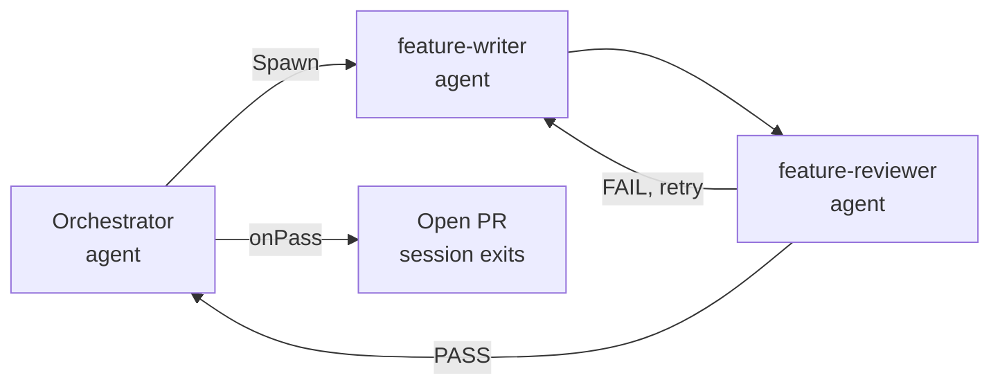

I've been running an AI coding agent on a Raspberry Pi for a while now, and at some point the natural next question was: can it do bigger chunks of work? Not just one-off tasks, but an entire feature set, from spec to merged PRs, with minimal hand-holding from me?

That's what this series is about. Five posts, one experiment, and a workflow that actually works at the end.

## What we were trying to do

The idea is what I'm calling the waterfall agentic workflow. Instead of coding and asking the agent for assistance, you hand it the full product specification upfront — architecture, tech stack, product vision, roadmap — and let it run the whole implementation in one go. The agent generates tasks from that context, creates GitHub issues, implements features, opens PRs, and loops until everything is done.

[Claude Code](https://docs.anthropic.com/en/docs/claude-code/overview) is what makes this possible. It supports [sub-agents](https://docs.anthropic.com/en/docs/claude-code/sub-agents) — a way for one Claude process (the orchestrator) to spawn other Claude processes (writers, reviewers) and coordinate their work. That's the primitive the whole workflow is built on.

## Architecture - Claude Code with Sub Agents

## The workflow we landed on

The above architecture is acomplished with two skills and two agent definitions:

### Skills
1. `/init` — scrapes the repo and generates `CLAUDE.md` with validation commands specific to that repo
2. `/implementation-orchestrator` — runs the orchestrator, spawning writer and reviewer sub-agents per feature, looping on failure, merging on pass

### Agent Definitions

1. `feature-writer` - a sub-agent that writes code based on orchestrator instructions
2. `feature-reviewer` - a sub-agent that reviews code written by the feature-writer and provides feedback or approval

### Additional complementary Skills

1. `/feature-doc-creator` — turns a conversation or short description into a complete, structured feature proposal document the orchestrator can pick up directly
2. `/bug-creator` — turns a short bug description or error snippet into a self-contained bug task document, enriched with repo context, that an agent can solve without further input
3. `/design-doc-decomposer` — reads a full design doc and produces structured feature files

The result from one real run: 7 features, 7 PRs merged into an integration branch, one final PR ready for review, in 90 minutes.

## The five posts

[Part 1 — The waterfall agentic workflow](./01-multi-agents-with-claude-code) covers the initial experiment: what we tried to build, how we structured the context for the agent, the worktree problem, and the pivot to a single sequential agent with full context.

[Part 2 — The writer + reviewer sub-agent loop](./02-multi-agents-with-claude-code) covers the orchestration in detail: how the orchestrator splits work across repos, spawns writers, hands off to reviewers, loops on failure, and merges on pass. Includes the actual terminal output from a real run.

[Part 3 — Design doc to prototype](./03-multi-agents-with-claude-code) covers the full end-to-end workflow: from writing a design doc to 7 merged PRs using three slash commands. Also covers the bug-fixing loop afterwards and one important troubleshooting tip.

[Part 4 — Headless mode on Raspberry Pi](./04-multi-agents-with-claude-code) takes the last remaining human out of the loop. No terminal window, no approvals — a Raspberry Pi watches a folder, and when a feature doc lands, a PR comes out the other side. Covers the `inotifywait` watcher, the systemd setup, headless token generation, and the permission mode tradeoffs.

[Conclusions & Reflections](./05-multi-agents-with-claude-code) is the honest post-mortem. What the workflow actually feels like to run day to day, why I'm the bottleneck and not the agents, the specification gap, and whether this is the end game.

Start with Part 1 if you want to understand why the workflow is designed the way it is. Start with Part 3 if you just want to see what the end state looks like and try it yourself. Read the conclusions post if you want the unfiltered take on what it means to work this way.
