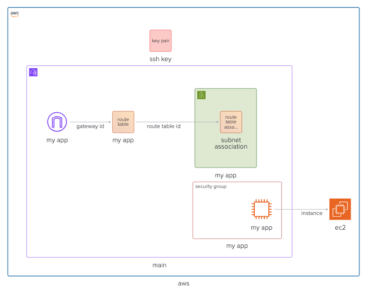
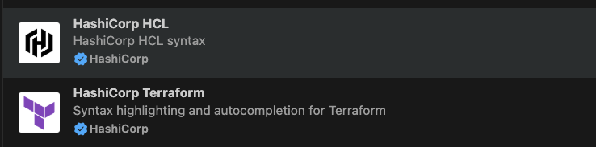

**Previous:** [Infrastructure as Code Journey](./01-infrastructure-as-code-journey)

import { File, Folder, Files } from 'fumadocs-ui/components/files';

Provisioning a single EC2 instance might sound simple, but it already involves several essential AWS building blocks. Terraform makes those pieces clear, consistent, and repeatable. In this guide, we'll set up the networking, security, and configuration needed to launch an EC2 server entirely through code - building a solid foundation for everything that comes next.

By the end of this guide, you will have a working EC2 instance on AWS that you can SSH into. Looking like this:



## Github Repository

This guide full code is available in https://github.com/IaC-Toolbox/iac-toolbox-project/tree/main/v1-ec2-ssh. Feel free to clone it and follow along!

## Recommended VS Code Extensions

Before writing any Terraform code, install these two extensions to get syntax highlighting, auto-completion, and validation directly in your editor:

- [HashiCorp HCL](https://marketplace.visualstudio.com/items?itemName=HashiCorp.HCL) — Syntax highlighting and language support for HashiCorp Configuration Language (HCL)
- [HashiCorp Terraform](https://marketplace.visualstudio.com/items?itemName=HashiCorp.terraform) — Full Terraform language server with auto-complete, hover documentation, and validation



## Setting up AWS to obtain keys and AWS CLI

In order to provision infrastructure to AWS, we first need an access key. The following step by step describes how to setup AWS account using the console - https://console.aws.amazon.com/ to obtain the AWS access keys.

1. Create a new `User` in IAM
2. Create a new policy `AdministratorAccess`
3. Create a new User Group where the `User` has the `AdministratorAccess`
4. Create a API token/Access key
   1. The Access key ID is `AWS_ACCESS_KEY_ID`
   2. The Access key is `AWS_SECRET_ACCESS_KEY`
5. Save the `AWS_SECRET_ACCESS_KEY` secure as it will never be shown again.

```bash
export AWS_ACCESS_KEY_ID=
export AWS_SECRET_ACCESS_KEY=
```

Now the AWS Api keys are ready, next we are going to start provisioning our infra using terraform.

## Provisioning Infra with Terraform

Before diving in, big kudos to Harisson Cramer who published [Using Terraform with EC2 Servers and Docker](https://harrisoncramer.me/setting-up-docker-with-terraform-and-ec2/), which greatly inspired these notes. We are mostly building on top of what was described there.

You will notice that to provision a simple ec2 instance, which is probably the most basic building block of cloud infra, we need to create alot of infrastructure. Here we will provision the following infra:

1. The VPC (Virtual Private Cloud) that will hold our subnet
2. The subnet within that VPC that will hold our EC2
3. The route table. Route table specifies the rules of the IP navigation within our VPC. We will write a very basic one and explain it shortly
4. Define the Internet Gateway that will allow traffic from the internet to our VPC
5. Finally the actual Ec2 instance that will sit inside our VPC in the subnet
6. Some security groups (like firewall) that will define rules of how the ec2 can be accessed

### Configure AWS provider

First things first, since Terraform is cloud agnostic, we will first specify that we want to work with AWS. We will create a `main.tf` and credentials file. First lets create the `.aws-credentials`

```txt
[terraform]
aws_access_key_id=AWS_ACCESS_KEY_ID
aws_secret_access_key=AWS_SECRET_ACCESS_KEY
```

#### Git ignore

Note, the above file should be git ignored. Add the following to your `.gitignore` file:

```
.aws-credentials
```

This is important as you don't want to leak your AWS keys into public repos.

### Defining the AWS Provider

Now, we will define the AWS Provider. The provider tells Terraform which cloud provider to use. Let's define the `main.tf`

```tf
# main.tf

provider "aws" {
  region                   = "us-east-1"
  shared_credentials_files = ["./.aws-credentials"]
  profile                  = "terraform"
}
```

Note, we are loading `.aws-credentials` into `shared_credentials_files`. And `profile` is the profile name inside that file.

### Setting variables

The way terraform works is that we declare the variables to use and then we will assign them and use across the terraform files. For this project, we will create `variables.tf` where we will declare some variables like size of Ec2 instance, SSH key to access it and availability zones

```tf
# variables.tf

variable "availability_zone" {
  description = "Availability zone of resources"
  type        = string
}

variable "instance_ami" {
  description = "ID of the AMI used"
  type        = string
}

variable "instance_type" {
  description = "Type of the instance"
  type        = string
}

variable "ssh_public_key" {
  description = "Public SSH key for logging into EC2 instance"
  type        = string
}
```

Now we need to define what are the actual values of those variables. Let's define `terraform.tfvars`. Note this file should be secret and outside of your version control:

```tfvars
# terraform.tfvars

availability_zone = "us-east-1a"
instance_ami      = "ami-09e67e426f25ce0d7"
instance_type     = "t2.micro"
ssh_public_key    = "ssh-ed25519 actual-public-key email@blabla.com"
```

You can copy the values above as is, except for `ssh_public_key` which you should replace with your actual public ssh key. The `instance_ami` is the Amazon Machine Image (AMI) id for Ubuntu 20.04 in `us-east-1` region. You can find other AMI ids from https://cloud-images.ubuntu.com/locator/ec2/. We will talk about how to create the SSH key pair in the next section.

### Creating VPC

now that we have some boilerplate variables in place, lets start provisioning resources. Remember, we want to create a VPC, with a subnet that will contain Ec2 instance. This Ec2 instance is inside a subnet that needs to be exposed to the network on a public IP. Lets start coding that

Lets create a `network.tf`

```tf
# network.tf

resource "aws_vpc" "main" {
  cidr_block           = "10.0.0.0/16"
  enable_dns_hostnames = true
  enable_dns_support   = true
}
```

We enabled domain name support so that we can add a DNS in the future, but it is not important for now. We’re also telling our VPC to have a CIDR block with suppport for 65,534 hosts, ranging between the IP addresses of 10.0.0.1 to 10.0.255.254. More on how this work in the next section.

Now, we will define Elastic IP address (EIP), which is essentially a way to use fixed public IP address. This is important in dynamic environment where Ec2 instance can change IP address if it gets destroyed and re-created, but the IP address stays the same for external access.

```tf
# network.tf

resource "aws_vpc" "main" {
  cidr_block           = "10.0.0.0/16"
  enable_dns_hostnames = true
  enable_dns_support   = true
}

resource "aws_eip" "my_app" {
  instance = aws_instance.my_app.id
  domain   = "vpc"
}
```

Note that the instance to hold the fixed IP is our `aws_instance` which is our ec2 we will create next.

#### What is CIDR?

This section is just a theory of IP ranges, feel free to skip it if you are just interested in provisioning your infra.

CIDR stands for Classless inter domain router, but we don't have to worry about its meaning. The CIDR is essentially a notation for representing how many of the IP address range are allowed in our subnet. Let's see an example:

```bash
cidr_block           = "10.0.0.0/16"
```

The above CIDR block means that there are we can specify IP ranges from `10.0.0.0` to `10.0.255.255` why is that? This becomes clear when we look at the binary representation of CIDR at https://jodies.de/

each IP address is represented by binary address. Remember, in IP, each sub-domain can range from 0 to 255, which means 256 addresses, which happens to be 2^8 (two power of 8). So in the example above, the number `16` referes to the number of fixed numbers in IP address, which are first 16 bits, so `10.0` are fixed, (first part of `10.0.0.0`), and the `0.0` are dynamic, meaning they can range all the way to `255.255`.

An extreme example is `10.0.0.0/32` which fixes all the numbers, and this leaves us only 1 IP address.

### Creating Subnet

All set for VPC, now let's create subnet in it. For creating a subnet, we have to tell to which VPC it belongs, availability zone, and its CIDR block. we use [cidrsubnet](https://developer.hashicorp.com/terraform/language/functions/cidrsubnet) for calculating the subnet IP range. Lets write `subnet.tf`

```tf
# subnet.tf

resource "aws_subnet" "my_app" {
  cidr_block        = cidrsubnet(aws_vpc.main.cidr_block, 3, 1)
  vpc_id            = aws_vpc.main.id
  availability_zone = var.availability_zone
}
```

We also need to associate this route table with our subnet. The route table essentially tells the traffic rules. So if there is some traffic allowed to go into subnet, it has to be defined in route table, otherwise the subnet has no rule of incomming traffic, and so no traffic!

```tf
# subnet.tf

resource "aws_subnet" "my_app" {
  cidr_block        = cidrsubnet(aws_vpc.main.cidr_block, 3, 1)
  vpc_id            = aws_vpc.main.id
  availability_zone = var.availability_zone
}

resource "aws_route_table" "my_app" {
  vpc_id = aws_vpc.main.id

  route {
    cidr_block = "0.0.0.0/0"
    gateway_id = aws_internet_gateway.my_app.id
  }
}

resource "aws_route_table_association" "subnet-association" {
  subnet_id      = aws_subnet.my_app.id
  route_table_id = aws_route_table.my_app.id
}
```

What did we write above? Essentially we say that there is a route table in our VPC where whatever the incomming IP address, it will be directed into the gateway `aws_internet_gateway.my_app.id`. Note we also have to associate the route table to the subnet in the end.

Finally, we need to define the gateway resource. It only needs to know what VPC it belongs to.

```tf
# gateway.tf

resource "aws_internet_gateway" "my_app" {
  vpc_id = aws_vpc.main.id
}
```

And that is it! We have our network and ready to start creating servers in it, in this case Ec2.

### Creating the EC2 Instance

So we have seen that to access our ec2 instance we will use SSH key. Let's then create a public SSH key. Note we are referring `var.ssh_public_key` from `terraform.tfvars`

```tf
# ec2.tf

resource "aws_key_pair" "ssh-key" {
  key_name   = "ssh-key"
  public_key = var.ssh_public_key
}
```

#### Generating SSH key pair

SSH key pair can be generated on your local machine. If you are on Mac or Linux, you can run the following command in your terminal:

1. Generate an SSH key pair on your Mac:

```bash
ssh-keygen -t ed25519 -C "your_email@example.com"
```

Press Enter to accept the default file path (`~/.ssh/<your-key-name>`) and choose a passphrase if desired. Or just press Enter twice to skip setting a passphrase. SSH key pair is a combination of public and private keys. The public key is meant to be shared with servers you want to access, while the private key should be kept secure on your local machine.

2. Copy the contents of your public key:

```bash
cat ~/.ssh/<your-key-name>.pub
```

Remember our `terraform.tfvars`? Let's update it with actual public ssh key.

```tfvars
# terraform.tfvars
# Replace with your actual public ssh key
ssh_public_key    = "ssh-ed25519 actual-public-key email@blabla.com"
```

#### Provisioning the EC2

And now, the ec2 itself:

```tf
# ec2.tf

resource "aws_key_pair" "ssh-key" {
  key_name   = "ssh-key"
  public_key = var.ssh_public_key
}

resource "aws_instance" "my_app" {
  ami                         = var.instance_ami
  instance_type               = var.instance_type
  availability_zone           = var.availability_zone
  security_groups             = [aws_security_group.my_app.id]
  associate_public_ip_address = true
  subnet_id                   = aws_subnet.my_app.id

  key_name = "ssh-key"
}
```

Finally our subnet is being useful, it is important for the ec2 to know where to run! As you can see the `subnet_id` is a fundamental building block of `aws_instance` resource. Another important consideration is the `security_groups` which define the rules of how one can access our instance (you can't just access it randomly, we need to protect our instance).

### Creating the Security Group

The last piece of infrastructure is the security group. Let's add it. The only rule we want is to allow SSH access via port 22. This is called `ingress`, meaning the traffic allowed to enter the subnet. We will also define the `egress` rule meaning the traffic allowed to leave the subnet. In this case we will just allow to leave everything.

```tf
# security_group.tf

resource "aws_security_group" "my_app" {
  vpc_id = aws_vpc.main.id

  ingress {
    cidr_blocks = [
      "0.0.0.0/0"
    ]
    from_port = 22
    to_port   = 22
    protocol  = "tcp"
  }

  egress {
    from_port   = 0
    to_port     = 0
    protocol    = "-1"
    cidr_blocks = ["0.0.0.0/0"]
  }
}
```

### Output file

For convenience, to know our public IP address, we will create `outputs.tf` that will output the IP address to CLI

```tf
# outputs.tf

output "ec2_ip_address" {
  value       = aws_eip.my_app.public_ip
  description = "The Elastic IP address allocated to the EC2 instance."
}
```

## Running Infra

At this point, your infra should look like follows:

```files
infrastructure
├── ec2.tf
├── gateway.tf
├── main.tf
├── network.tf
├── security_group.tf
├── subnet.tf
├── terraform.tfvars
├── variables.tf
├── .aws-credentials
```

We can create the infra using terraform like follows:

```bash
terraform init
terraform plan
terraform apply --auto-approve
```

You should see output like

```bash

Apply complete! Resources: 9 added, 0 changed, 0 destroyed.

Outputs:

ec2_ip_address = "52.206.93.210" # example IP
```

Finally, lets connect to our instance via ssh:

```bash
ssh ubuntu@52.206.93.210
```

## Destroying Infra

Remember, infra has costs. When you are done experimenting, you can destroy the infra like follows:

```bash
terraform destroy --auto-approve
```

## Conclusion

And that's a wrap! Next you should explore how to run a server (perhaps in the docker container). This was a rather simple example - like a hello world in infrastructure as code. Let's continue iterating and [Provision DNS records with Terraform](./provisioning-dns-records-with-terraform).

---

**Previous:** [Infrastructure as Code Journey](./01-infrastructure-as-code-journey) | **Next:** [Provision DNS Records with Terraform](./03-provision-dns-records-with-terraform)
