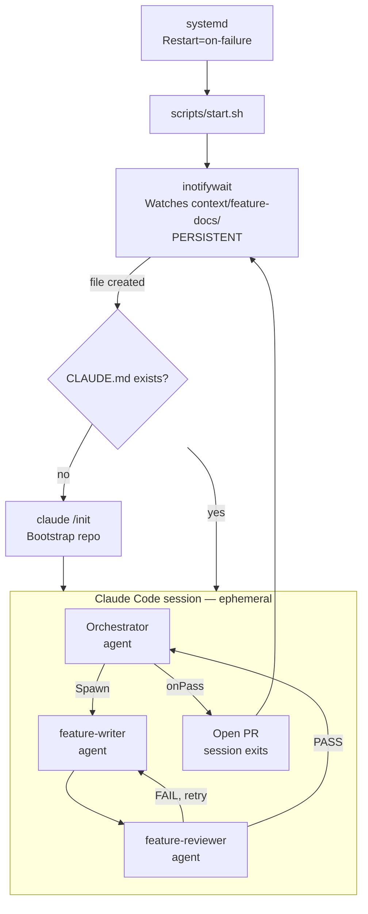
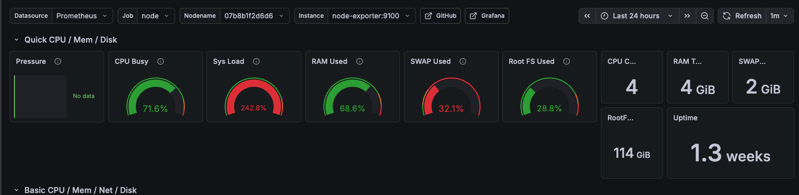

In [Part 1](./01-multi-agents-with-claude-code) we found that a single sequential agent with full context beats parallel agents with fragmented context. In [Part 2](./02-multi-agents-with-claude-code) we added the writer/reviewer loop so mistakes get caught before merging. In [Part 3](./03-multi-agents-with-claude-code) we ran the whole thing from a design doc to 7 merged PRs in 90 minutes.

What is missing in this setup is full autonomy. Currently I still am required to have open Claude Code terminal window to interact and approve actions. This is not the "AI is working while I sleep" type of step. Can we take in one step further, and delegate to claude code fully in headless mode? This is the topic of the current experiment.


## The headless mode workflow - Architecture

We have established that agent works well using skills: `/implementation-orchestrator`. Next step is to deploy this setup on raspberry pi.

There are many steps, so I built a shell script with ansible playbooks available at https://github.com/vvasylkovskyi/claude-coding-bot.

### Detailed Architecture

The proposed architecture is to deploy a watcher process that will spawn claude code to solve the feature docs created using `/feature-doc-creator` skill.




The idea is the following:

1. Deploy the systemd service on raspberry pi
2. Use the `inotifywait` watch mode. This is essentially setting an event-based linux process, that is looking at feature docs folder for new files.
3. When new file appears, the event spawns Claude Code Orchestrator using `/implementation-orchestrator` skill to process the file automatically.

All fully in [Claude Code headless mode](https://docs.anthropic.com/en/docs/claude-code/headless-mode). The result is a github PR.


## Adapting skills for headless mode

First thing is to carefully adapt the [skills](https://github.com/vvasylkovskyi/claude-coding-bot/tree/main/skills). Our [skills](https://github.com/vvasylkovskyi/claude-coding-bot/tree/main/skills) and [agents](https://github.com/vvasylkovskyi/claude-coding-bot/tree/main/agents) had couple of issues:

1. The orchestrator agent has a preflight check and waits for user input. We modified the skill to avoid that, mention explicitly that the agent is in headless mode and should never ask for user input.
2. All of the agents will no longer write into `.claude` folder in the root of the repo. There's an open bug where `--dangerously-skip-permissions` still prompts for writes to `~/.claude/` paths (like skill memory directories). This can block headless skill execution even with the flag set.

## Permission Modes: `--dangerously-skip-permissions` vs `--permission-mode auto`

Claude Code has two main headless-friendly permission modes. This setup uses `--dangerously-skip-permissions`.

### `--dangerously-skip-permissions`

Bypasses all permission prompts and safety checks entirely. Claude executes every tool call - file writes, shell commands, git operations - without pausing. There is no classifier running in the background. What you get is pure autonomy with no guardrails beyond what the OS user account restricts. This is appropriate here because the Pi is an isolated, single-purpose machine running a known, trusted pipeline.

### `--permission-mode auto`

Runs a background safety classifier on every action. Claude still proceeds without prompts, but the classifier can block individual tool calls it deems dangerous (destructive shell commands, credential exfiltration attempts, etc.). If Claude hits 3 consecutive blocks or 20 total in a session, it terminates the process. In headless mode with `-p` there is no UI to recover from — the process just exits. This makes `auto` mode better suited to shared machines or CI pipelines where you can't fully trust every input that triggers the pipeline.

**When to use which:**

|                             | `--dangerously-skip-permissions` | `--permission-mode auto`       |
| --------------------------- | -------------------------------- | ------------------------------ |
| Safety classifier           | ❌ Off                           | ✅ Running                     |
| Prompt injection protection | ❌ None                          | ✅ Partial                     |
| Risk of blocked mid-session | None                             | Yes (on 3 consecutive denials) |
| Best for                    | Isolated, trusted machines       | Shared machines, CI/CD         |

For this Pi setup - single-purpose, air-gapped from sensitive infrastructure, running with `--dangerously-skip-permissions` is the pragmatic choice.


## Preparing the repository

To ensure agent has everything, and by our skill design, I manually initialised the repo, however in the future the one-time script might do that.

```sh
claude --dangerously-skip-permissions -p "/init"
```

## Testing locally first

Before deploying to the Pi, I ran the full headless command locally to confirm everything worked end to end:

```sh
claude --dangerously-skip-permissions -p "/implementation-orchestrator Process this feature doc: context/feature-docs/claude-code-pr-bot-raspberry-pi-deployment.md"
```

The result speaks for itself.

```sh
Warning: claude.ai MCP servers blocked by enterprise policy: claude.ai Gmail, claude.ai Snowflake, claude.ai Github custom, claude.ai Google Calendar, claude.ai Jamf, claude.ai Wiz, claude.ai Lucid, claude.ai Microsoft Learn, claude.ai monday.com
✅ Feature 1/1: Claude Code PR Bot — Raspberry Pi Deployment — PR #1 merged → feature/autopilot-2026-04-28

=== Autopilot Session Complete ===
Mode: features
Repo: /Users/vvasylkovskyi/git/vvasylkovskyi/claude-coding-bot

✅  claude-code-pr-bot-raspberry-pi-deployment → PR #1 merged → feature/autopilot-2026-04-28

Skipped:   0
Completed: 1
Failed:    0

Final PR for your review: https://github.com/vvasylkovskyi/claude-coding-bot/pull/2
```

## Moving to Raspberry Pi: Getting Your Claude Token

Claude Code on the Pi can't complete the browser-based OAuth flow headlessly, so you generate the token on your main machine and ship it over.

### Step 1 - Generate the token on the laptop:

```bash
claude setup-token
```

This prints a token string starting with `sk-ant-...`.

### Step 2 - Passing token via install script

as shown above, or let the script prompt you interactively.

### What happens with it

The token is written to `.claude-env` on the Pi with `chmod 600` (readable only by the `pi` user), and loaded into the systemd service as `CLAUDE_CODE_OAUTH_TOKEN`. It never touches the service unit file itself, which is world-readable.

**Token expiry:**

`claude setup-token` issues a one-year token designed for headless/CI use. Regular `/login` tokens expire after 8–12 hours — don't use those. If the service fails with a 401, re-run `claude setup-token` on your laptop and re-run the install script, or invoke `scripts/deploy.sh` directly from the cloned repo:

```bash
cd ~/claude-pr-bot
CLAUDE_TOKEN=sk-ant-<new-token> ./scripts/deploy.sh
```

## Running the Deploy Script

Now, all is set, I am running the deploy script from my mac to install the playbooks on raspberry pi:

```sh
sh scripts/deploy.sh
```

Before that, I ensured that my `inventory.ini` contains correct values in particular:

- `PI_HOST` - correct IP to my raspberry pi, ensure you are on the same network on both devices
- `ansible_ssh_private_key_file` - path to the private key file for SSH access
- `ansible_user` - the home user on your device (raspberry pi)

### What does it do

Installs all the essentials such as:

- `inotify-tools` - our linux tool for watching new files created - new feature doc
- `claude` - downloads and installs claude code on Raspberry Pi via official install script
- `.claude` - ensures that `.claude` is configured at the home of the device
  - `agents` - includes writer and reviewer agents
  - `skills` - includes `/init` and `/implementation-orchestrator` skills
  - Sets the necessary onboarding flags and the `CLAUDE_CODE_OAUTH_TOKEN`.
- `systemd` - installs the daemon for the `inotifywait` to watch for new feature docs. This part is what ensures that the process is always alive and resilient with autorestart.


## Test it at work

As a final test, I will add some random feature doc inside the specified folder. In my case it is

```sh
/home/{{ ansible_user }}/my-claude-code/context/feature-docs
```

By pasting the full feature doc in there, the daemon should start claude code session using the following command:

```sh
claude --dangerously-skip-permissions -p \
    "/implementation-orchestrator Process this feature doc: @${path}${file}"
```

I dropped exactly this feature doc: `print-readme-testing-headless-claude-code.md`

```markdown
---
title: Print README — testing headless Claude Code
---

## Overview

This is a smoke test feature doc to validate that the headless Claude Code pipeline is working end to end on the Raspberry Pi. The task is intentionally trivial — read the README and print its contents to stdout — so that any failure is clearly a pipeline issue rather than a code complexity issue.

## Task

1. Read the contents of `README.md` at the repo root
2. Print the contents to stdout using `echo` or `cat`
3. Add new line in the end "Testing from Claude"
4. Commit with message `chore: print readme smoke test`

## Acceptance criteria

- `README.md` exists at the repo root
- Contents are printed to stdout during the Claude session
- A commit is created with the message above
- PR is opened to main with title `chore: print readme smoke test`

## Notes

This doc is not meant to produce meaningful code. If the pipeline completes and a PR appears on GitHub, the deployment is working correctly.
```

Next, tailing the journal to see what is going on:

```sh
# Watch live logs
sudo journalctl -u claude-coding-bot -f

Apr 28 15:59:29 raspberry-4b systemd[1]: Started claude-coding-bot.service - Claude Code PR Bot.
Apr 28 15:59:29 raspberry-4b start.sh[2514944]: [pipeline] Watching /home/vvasylkovskyi/my-claude-code/context/feature-docs for new feature docs...
Apr 28 15:59:29 raspberry-4b start.sh[2514950]: Setting up watches.
Apr 28 15:59:29 raspberry-4b start.sh[2514950]: Watches established.
Apr 28 15:59:54 raspberry-4b start.sh[2514951]: [pipeline] Detected: print-readme-testing-headless-claude-code.md — starting pipeline...
Apr 28 15:59:59 raspberry-4b start.sh[2515185]: Warning: no stdin data received in 3s, proceeding without it. If piping from a slow command, redirect stdin explicitly: < /dev/null to skip, or wait longer.
Apr 28 16:03:24 raspberry-4b start.sh[2515185]: 🎉 Final PR opened: https://github.com/vvasylkovskyi/my-app/pull/2
Apr 28 16:03:24 raspberry-4b start.sh[2515185]: === Autopilot Session Complete ===
Apr 28 16:03:24 raspberry-4b start.sh[2515185]: Mode: features
Apr 28 16:03:24 raspberry-4b start.sh[2515185]: Repo: /home/vvasylkovskyi/my-claude-code/repo
Apr 28 16:03:24 raspberry-4b start.sh[2515185]: ✅  print-readme-testing-headless-claude-code → PR #1 merged → feature/autopilot-2026-04-28
Apr 28 16:03:24 raspberry-4b start.sh[2515185]: Skipped:   0
Apr 28 16:03:24 raspberry-4b start.sh[2515185]: Completed: 1
Apr 28 16:03:24 raspberry-4b start.sh[2515185]: Failed:    0
Apr 28 16:03:24 raspberry-4b start.sh[2515185]: Final PR for your review: https://github.com/vvasylkovskyi/my-app/pull/2
```

## Resource usage

One thing to be honest about: a Raspberry Pi is not a particularly powerful machine, and running Claude Code headlessly is not a lightweight task. When the orchestrator spawns the writer and reviewer sub-agents, CPU usage spikes noticeably.



The Pi handles it — the smoke test completed in under four minutes — but this is not a machine that should be running other heavy workloads at the same time. Single-purpose is the right framing.

Optimizations are something to think about for future runs, particularly around whether the writer and reviewer need to run sequentially within a session or whether there is any room to overlap work across sessions. For now the simple sequential approach works and the Pi is not stressed enough to cause failures.

## What the workflow looks like end to end

Put it all together and this is what the full cycle looks like:

1. Write a feature description in a markdown file
2. Drop it into `~/my-claude-code/context/feature-docs/` on the Pi (via `scp`, a shared drive, or any other method)
3. Wait
4. A PR appears on GitHub

That is it. The Pi is always listening. There is nothing to open, nothing to approve, nothing to watch. The work happens while you are doing something else.

This is also the install, if you want to try it:

```bash
curl -fsSL https://raw.githubusercontent.com/vvasylkovskyi/claude-pr-bot/main/install.sh | bash
```

Or with options:

```bash
curl -fsSL https://raw.githubusercontent.com/vvasylkovskyi/claude-pr-bot/main/install.sh | \
  CLAUDE_TOKEN=sk-ant-... PI_HOST=192.168.1.42 FEATURE_DOCS_DIR=/home/pi/my-docs bash
```

## What we learned

The headless setup works. The writer/reviewer loop from Part 2, the validation contracts from Part 3, the slash commands, the single-agent sequential approach from Part 1 — all of it survives the transition to fully autonomous operation without modification to the underlying logic. The only changes were removing the preflight confirmation prompt and keeping writes out of `~/.claude/`.

What this means in practice: the workflow from Parts 1–3 was already autonomous enough. The headless mode is not a fundamentally different thing — it is just removing the last remaining human touchpoint, which was the terminal window. The agent was already doing the thinking. I was just watching.

The natural next question is what the loop looks like when you close the laptop and let the Pi run overnight. That is something I have not fully tested yet. But the smoke test ran clean, the service auto-restarts on failure, and the journal gives you everything you need to debug if something goes wrong.

The next post is the honest post-mortem on all four parts — what the workflow actually feels like to run day to day, where the bottleneck really is, and whether this is the end game.

---

**Next:** [Conclusions & Reflections](./05-multi-agents-with-claude-code)

**The series:**

- [Part 1 — The waterfall agentic workflow](./01-multi-agents-with-claude-code)
- [Part 2 — The writer + reviewer sub-agent loop](./02-multi-agents-with-claude-code)
- [Part 3 — Design doc to prototype: 7 PRs in 90 minutes](./03-multi-agents-with-claude-code)
- [Part 4 — Headless mode on Raspberry Pi](./04-multi-agents-with-claude-code)
- [Conclusions & Reflections](./05-multi-agents-with-claude-code)
