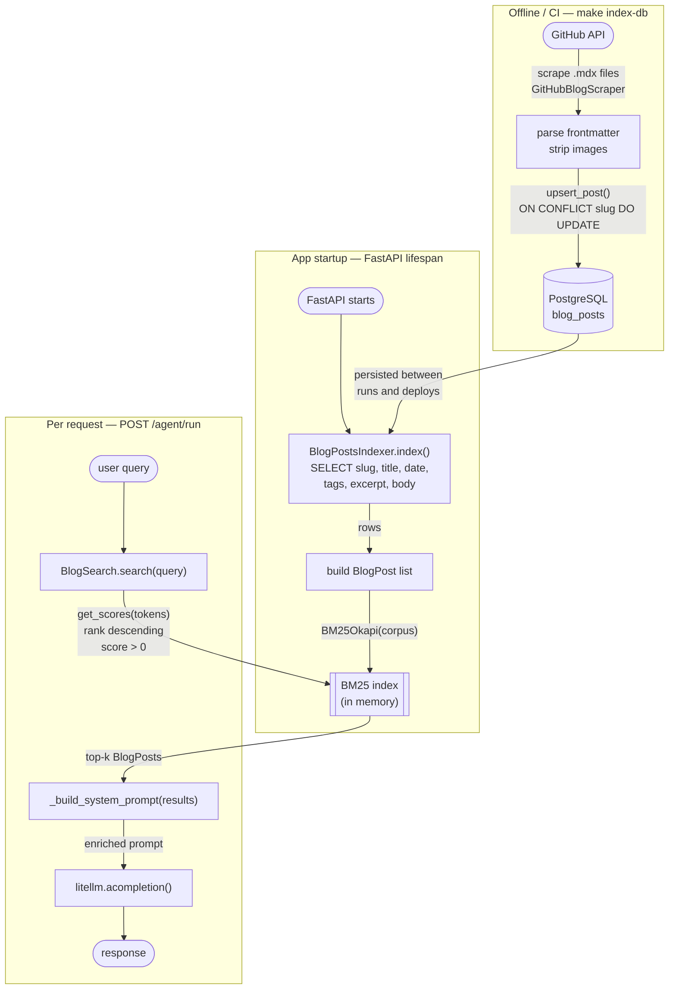
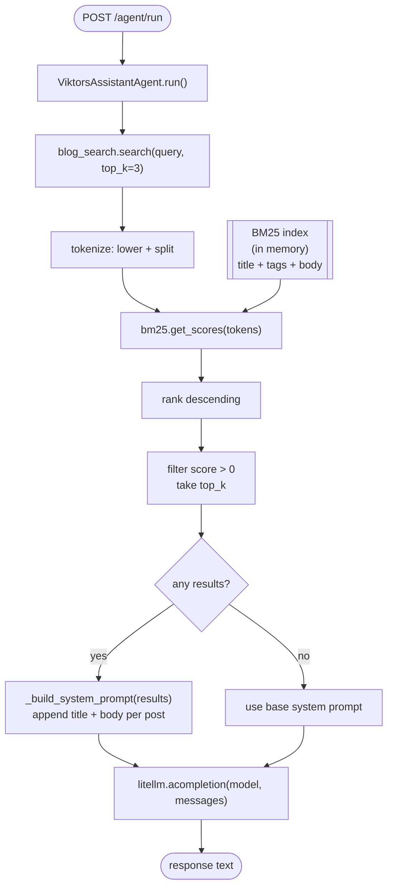

The [previous post](/blog/minimal-ai-knowledge-base-bm25) ended with a working BM25 search over a `data/blog_index.json` file. The [post before that](/blog/github-api-blog-indexer-rate-limit) upgraded the scraper to fetch from the GitHub API instead of a local folder. Together they produced a working system — on a laptop.

Put it in Docker and the JSON file is not there. Run it in CI and the file is not there. Deploy to a server and the file is not there unless you bake it into the image or commit it to the repo. Both of those feel wrong: the file changes when blog posts change, not when code changes.

This is the story of replacing the file with a PostgreSQL table, and what the new architecture looks like end to end.

---

## Why the JSON file breaks in production

The JSON file approach has a hidden assumption: the file exists on the machine running the API. That assumption holds exactly one place — the laptop where `make index` was last run.

Everywhere else it fails silently. The `BlogSearch` class I wrote earlier lazy-loads the file on first search:

```python
def search(self, query: str, top_k: int = 3) -> list[BlogPost]:
    if self._bm25 is None:
        self._load("data/blog_index.json")
    ...
```

If `data/blog_index.json` does not exist, this either raises a `FileNotFoundError` or returns an empty list, depending on how you handle it. Either way, the search is broken and the agent answers from its system prompt alone — silently, with no indication anything is wrong.

The deeper problem is that the JSON file conflates two concerns: **when to scrape** and **where to store**. With a file, you scrape whenever you have the right filesystem in place. With a database, scraping becomes a standalone job that can run anywhere and write to a durable, shared store. The API reads from that store at startup, independently of when the scrape last ran.

**The other problem: CI/CD.** If you want your scraper to run in a GitHub Actions pipeline, it needs somewhere to write its output that survives beyond the runner's lifetime. A file written to the CI workspace disappears the moment the job ends. A database write persists.

---

## The schema

The blog posts table is a straightforward mapping of the fields the scraper already produces:

```sql
CREATE TABLE blog_posts (
    slug       TEXT PRIMARY KEY,
    title      TEXT NOT NULL,
    date       TEXT,
    tags       TEXT[] DEFAULT '{}',
    excerpt    TEXT,
    body       TEXT NOT NULL,
    updated_at TIMESTAMPTZ DEFAULT NOW()
);
```

`slug` is the primary key — it is the filename stem of the MDX file and is stable. `tags` is a PostgreSQL text array. `updated_at` is stamped on every upsert so you can see when a post was last refreshed without querying git history.

The migration is managed by Alembic:

```python
def upgrade() -> None:
    op.create_table(
        "blog_posts",
        sa.Column("slug", sa.Text(), nullable=False),
        sa.Column("title", sa.Text(), nullable=False),
        sa.Column("date", sa.Text(), nullable=True),
        sa.Column("tags", postgresql.ARRAY(sa.Text()), nullable=True, server_default="{}"),
        sa.Column("excerpt", sa.Text(), nullable=True),
        sa.Column("body", sa.Text(), nullable=False),
        sa.Column(
            "updated_at",
            sa.TIMESTAMP(timezone=True),
            nullable=True,
            server_default=sa.text("NOW()"),
        ),
        sa.PrimaryKeyConstraint("slug"),
    )
```

Run `make migrate` and the table exists. Run it again and nothing happens. Alembic tracks which revisions have been applied.

---

## The scraper writes to the database

The `BlogDatabase` class wraps `asyncpg` with a single `upsert_post` method. Every post is inserted; if the slug already exists, all fields are updated:

```python
import asyncpg

class BlogDatabase:
    def __init__(self, database_url: str) -> None:
        self._url = database_url
        self._conn: asyncpg.Connection | None = None

    async def connect(self) -> None:
        self._conn = await asyncpg.connect(self._url)

    async def close(self) -> None:
        if self._conn:
            await self._conn.close()
            self._conn = None

    async def __aenter__(self) -> "BlogDatabase":
        await self.connect()
        return self

    async def __aexit__(self, *_: object) -> None:
        await self.close()

    async def upsert_post(self, post: dict) -> None:
        assert self._conn is not None
        await self._conn.execute(
            """
            INSERT INTO blog_posts (slug, title, date, tags, excerpt, body, updated_at)
            VALUES ($1, $2, $3, $4, $5, $6, NOW())
            ON CONFLICT (slug) DO UPDATE
              SET title      = EXCLUDED.title,
                  date       = EXCLUDED.date,
                  tags       = EXCLUDED.tags,
                  excerpt    = EXCLUDED.excerpt,
                  body       = EXCLUDED.body,
                  updated_at = NOW()
            """,
            post["slug"],
            post["title"],
            post["date"],
            post["tags"],
            post["excerpt"],
            post["body"],
        )
```

`ON CONFLICT (slug) DO UPDATE` is the core of the design. Running the scraper twice on the same content is safe — it is an upsert, not an append. You can re-run after adding a single post and only that post's `updated_at` changes.

The `IndexRunner` orchestrates scraping and writing:

```python
class IndexRunner:
    def __init__(self, scraper: GitHubBlogScraper, database_url: str) -> None:
        self._scraper = scraper
        self._database_url = database_url

    async def run_db(self) -> int:
        posts = self._scraper.scrape()
        async with BlogDatabase(self._database_url) as db:
            for post in posts:
                await db.upsert_post(post)
                print(f"    Upserted: {post['slug']}", flush=True)
        return len(posts)
```

Run the scraper:

```bash
make index-db
# or directly:
cd blog_index && uv run python main.py \
  --remote-url "https://github.com/vvasylkovskyi/vvasylkovskyi.github.io/tree/main/content/blog" \
  --db
```

```
Indexing blog posts into Postgres...
Listing .mdx files in vvasylkovskyi/vvasylkovskyi.github.io/content/blog @ main...
  [rate limit] 4994 requests remaining
Found 58 .mdx files
  Fetching content/blog/00-multi-agents-with-claude-code.mdx...
    Upserted: 00-multi-agents-with-claude-code
  Fetching content/blog/01-infrastructure-as-code-journey.mdx...
    Upserted: 01-infrastructure-as-code-journey
  ...
Indexed 58 posts to Postgres
```

---

## The API reads from the database at startup

With the JSON file, the `BlogSearch` class loaded the file lazily — on the first `search()` call. That meant the first request was slightly slower, and a missing file would fail silently.

With the database, the BM25 index is built eagerly at application startup. The `BlogPostsIndexer` queries all posts and passes them to `BlogSearch`:

```python
from sqlalchemy import text
from sqlalchemy.ext.asyncio import AsyncEngine
from llm_api.search.blog_search import BlogPost, BlogSearch

class BlogPostsIndexer:
    def __init__(self, engine: AsyncEngine) -> None:
        self._engine = engine

    async def index(self) -> BlogSearch:
        async with self._engine.connect() as conn:
            result = await conn.execute(
                text("SELECT slug, title, date, tags, excerpt, body FROM blog_posts")
            )
            rows = result.fetchall()
        posts = [
            BlogPost(
                slug=r.slug,
                title=r.title,
                date=str(r.date),
                tags=list(r.tags or []),
                excerpt=r.excerpt or "",
                body=r.body,
            )
            for r in rows
        ]
        return BlogSearch(posts)
```

`BlogSearch` receives the posts and builds the BM25 index immediately:

```python
class BlogSearch:
    def __init__(self, posts: list[BlogPost]) -> None:
        self._posts = posts
        if posts:
            corpus = [
                (f"{p.title} " + " ".join(p.tags) + " " + p.body).lower().split()
                for p in posts
            ]
            self._bm25: BM25Okapi | None = BM25Okapi(corpus)
        else:
            self._bm25 = None
        logger.info(f"Blog search index loaded: {len(posts)} posts")

    def search(self, query: str, top_k: int = BLOG_SEARCH_TOP_K) -> list[BlogPost]:
        if not self._bm25 or not self._posts:
            return []
        scores = self._bm25.get_scores(query.lower().split())
        ranked = sorted(zip(scores, self._posts), key=lambda x: x[0], reverse=True)
        return [post for score, post in ranked[:top_k] if score > 0]
```

The `AppContext` singleton wires this together in FastAPI's lifespan handler:

```python
@asynccontextmanager
async def lifespan(_: FastAPI) -> AsyncGenerator[None, None]:
    await AppContext.initialize(get_settings())
    yield
    await AppContext.close()
```

```python
class AppContext:
    @classmethod
    async def initialize(cls, app_settings: AppSettings) -> "AppContext":
        if cls._instance is None:
            try:
                blog_search = await BlogPostsIndexer(
                    DatabaseEngineManager.get_engine()
                ).index()
            except Exception:
                logger.exception("Blog post indexing failed — blog search will be unavailable")
                blog_search = None
            cls._instance = cls(app_settings, blog_search)
        return cls._instance
```

Two things worth noting here. First, the index is built once and held in memory for the lifetime of the process — no per-request database queries. Second, if the database is unreachable at startup, the exception is caught and the application starts with `blog_search = None`. Search degrades gracefully to returning nothing; the agent still works, it just has no blog context. This is a deliberate trade-off: a broken database connection should not take down the whole API.

---

## Full architecture

Three separate phases, each independently triggerable:



**Phase 1 (Offline/CI):** The scraper fetches from GitHub, parses MDX, and upserts into Postgres. Runs on demand or on a schedule — completely decoupled from the API process.

**Phase 2 (App startup):** The API reads all rows from `blog_posts`, builds a list of `BlogPost` objects, and constructs the BM25 index in memory. This runs once, takes a fraction of a second for 58 posts, and the result lives in the `AppContext` singleton for the process lifetime.

**Phase 3 (Per request):** Every query goes through `BlogSearch.search()` — a pure in-memory BM25 operation. The top-k posts are injected into the system prompt. No database is touched at request time.

---

## BM25 search and prompt injection in detail



The agent retrieves the `BlogSearch` instance from `AppContext` and calls `search()`. If results come back, they are appended to the system prompt under a `## Relevant blog posts` header. If nothing scores above zero — the query has no token overlap with any post — the system prompt is unchanged:

```python
async def run(self, input_message: str) -> str:
    blog_search = AppContext.get_instance().blog_search
    results = blog_search.search(input_message) if blog_search is not None else []
    if results:
        logger.info(f"Blog search injecting {len(results)} posts: {[p.slug for p in results]}")

    messages = [
        {"role": "system", "content": self._build_system_prompt(results)},
        {"role": "user", "content": input_message},
    ]
    response = await litellm.acompletion(model=self.model, messages=messages)
    return response.choices[0].message.content or ""

def _build_system_prompt(self, results: list[BlogPost]) -> str:
    if not results:
        return self.system_prompt

    context = "\n\n## Relevant blog posts\n"
    for post in results:
        tags = ", ".join(post.tags) if post.tags else ""
        context += f"\n### {post.title} ({post.date})"
        if tags:
            context += f" [{tags}]"
        context += f"\n{post.body}\n"

    return self.system_prompt + context
```

---

## Running it locally

```bash
# Start Postgres
make db-up

# Apply migrations
make migrate

# Scrape GitHub and write to the database
GITHUB_TOKEN=ghp_... GITHUB_REMOTE_URL=https://github.com/vvasylkovskyi/vvasylkovskyi.github.io/tree/main/content/blog make index-db

# Start the API (reads from Postgres on startup)
make run
```

The first three commands are the setup sequence. After that, `make run` is all you need — the index is in the database, the API reads it at startup, and search works on the first request.

---

## What changed from the JSON approach

| | JSON file | PostgreSQL |
|---|---|---|
| Index location | `data/blog_index.json` | `blog_posts` table |
| Works in Docker | Only if file is baked in or mounted | Yes — connect to DB |
| Works in CI | Only if file is committed | Yes — run scraper job |
| Index load | Lazy, on first `search()` call | Eager, at app startup |
| Failure mode | Silent empty results | Exception caught, graceful degradation |
| Re-scrape safety | Overwrites the file | `ON CONFLICT` upsert |
| Observability | None | `updated_at` per row, DB logs |

The code volume is similar. The scraper is unchanged — it still produces the same list of dicts. The difference is what happens to that list: instead of `json.dumps()` to a file path, it goes through `upsert_post()` to Postgres. On the read side, `BlogPostsIndexer` replaces the `pathlib.Path.read_text()` call with a SQLAlchemy `SELECT`.

---

## What this still does not do

**Live index updates.** A new blog post requires re-running `make index-db` and restarting the API (to rebuild the BM25 index from the updated rows). For a personal portfolio this is fine — deploys are infrequent. If you needed live updates, you would either rebuild the BM25 index periodically or expose an internal endpoint that triggers a re-index.

**Chunking.** Each post is indexed as a single document. Long posts dilute their own BM25 scores because the token frequency of any particular term drops as body length grows. Chunking posts into paragraphs and indexing each chunk separately would help for very long content.

**Semantic search.** BM25 still misses synonyms. "How do you monitor LLMs?" does not match a post titled "LLM Traces with Arize Phoenix" unless the word "monitor" appears in the body. For 58 posts written by one person, this is acceptable. For a larger corpus, pgvector with embeddings would be the natural next step — and the database you now have is exactly where you would store the embedding vectors.
