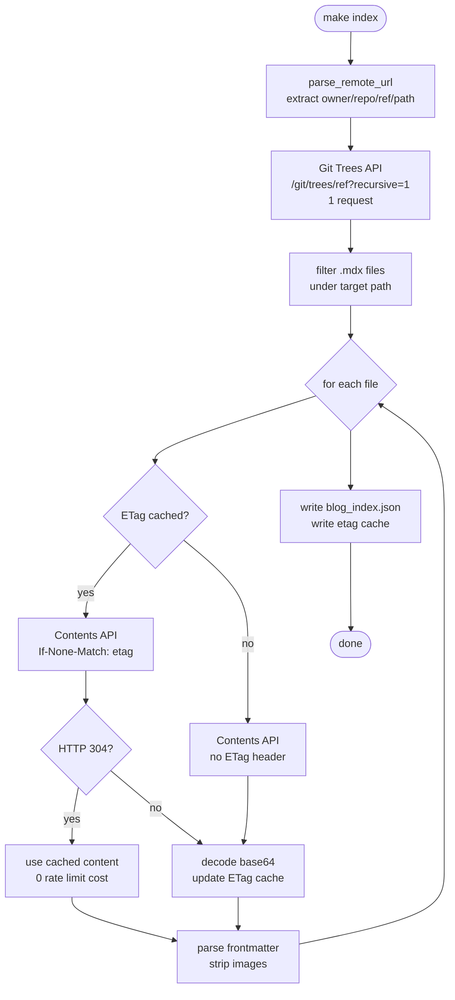

The previous version of my blog indexer read `.mdx` files from a local folder:

```bash
python scripts/build_blog_index.py --posts-dir ../portfolio/content/blog
```

That works on my laptop. It does not work in a Docker container, in CI, or on any machine that does not have my portfolio repo checked out next to the API repo. For a production service, "run it locally first" is not a deployment strategy.

This is the story of replacing that with a single URL.

---

## The new interface

```bash
GITHUB_TOKEN=ghp_... make index
```

Under the hood:

```bash
uv run python scripts/build_blog_index.py \
  --remote-url https://github.com/vvasylkovskyi/vvasylkovskyi.github.io/tree/main/content/blog \
  --output data/blog_index.json
```

One argument. The URL is a standard GitHub tree URL — the same one you copy from your browser when browsing a folder in a repo. The script parses it to extract everything it needs:

```python
from urllib.parse import urlparse

def parse_remote_url(url: str) -> tuple[str, str, str, str]:
    """Return (owner, repo, ref, path) from a GitHub tree URL."""
    parts = urlparse(url).path.strip("/").split("/")
    # https://github.com/vvasylkovskyi/vvasylkovskyi.github.io/tree/main/content/blog
    # parts: ['vvasylkovskyi', 'vvasylkovskyi.github.io', 'tree', 'main', 'content', 'blog']
    if len(parts) < 4 or parts[2] != "tree":
        raise ValueError(f"Expected a GitHub tree URL (...tree/ref/path), got: {url}")
    return parts[0], parts[1], parts[3], "/".join(parts[4:])
    #       owner      repo       ref      path
```

To index a different repo or branch in the future, you change the URL. No config file, no separate flags for owner, repo, ref, and path. The URL carries all of it.

---

## The rate limit problem

GitHub's REST API enforces rate limits per authentication type:

| Auth type | Limit |
| --- | --- |
| Unauthenticated (by IP) | 60 requests / hour |
| Personal access token | 5,000 requests / hour |

My blog has 58 posts. Indexing them requires 1 tree listing call + 58 file content calls = **59 requests**. That fits inside the unauthenticated limit — barely, with one request to spare and zero tolerance for retries. A `GITHUB_TOKEN` is the practical requirement.

Every GitHub API response includes these headers:

```
X-RateLimit-Limit:     5000
X-RateLimit-Remaining: 4994
X-RateLimit-Reset:     1748476800
X-RateLimit-Used:      6
```

`X-RateLimit-Remaining` tells you how many requests you have left. `X-RateLimit-Reset` is a UNIX timestamp of when the window resets. The script reads these after every response and acts on them:

```python
MIN_REMAINING = 10

remaining = int(response.headers.get("X-RateLimit-Remaining", 9999))
reset_at   = int(response.headers.get("X-RateLimit-Reset", 0))

if remaining <= MIN_REMAINING:
    wait = max(0, reset_at - time.time()) + 1
    print(f"Rate limit low ({remaining} remaining). Sleeping {wait:.0f}s until reset.")
    time.sleep(wait)
```

If a 403 or 429 comes back, the script reads `Retry-After` and waits before retrying — up to three attempts:

```python
for attempt in range(MAX_RETRIES):
    response = client.get(url, headers=headers)
    if response.status_code in (403, 429):
        retry_after = int(response.headers.get("Retry-After", 60))
        print(f"Rate limited. Waiting {retry_after}s (attempt {attempt + 1}/{MAX_RETRIES})")
        time.sleep(retry_after)
        continue
    response.raise_for_status()
    break
```

---

## Two API calls, not one

The naive approach to listing all files in a GitHub directory is the Contents API:

```
GET /repos/{owner}/{repo}/contents/{path}
```

That lists the immediate children of one directory. If the blog has subdirectories, you recurse. Each level is one more API call.

The better approach is the Git Trees API with `recursive=1`:

```
GET /repos/{owner}/{repo}/git/trees/{ref}?recursive=1
```

One request. Returns every file in the repository, at any depth, up to 100,000 entries. Filter the result for `.mdx` files under the target path and you have the full file list in a single API call.

```python
def list_mdx_files(client, owner, repo, ref, path, headers) -> list[dict]:
    url = f"https://api.github.com/repos/{owner}/{repo}/git/trees/{ref}?recursive=1"
    response = github_get(client, url, headers)
    tree = response.json()["tree"]

    prefix = path.rstrip("/") + "/"
    return [
        item for item in tree
        if item["type"] == "blob"
        and item["path"].startswith(prefix)
        and item["path"].endswith(".mdx")
    ]
```

For 58 posts, the total API budget is: **1** (tree) + **58** (file contents) = **59 requests**.

---

## The first run

```
$ make index
Building blog search index...
Listing .mdx files in vvasylkovskyi/vvasylkovskyi.github.io/content/blog @ main...
  [rate limit] 4994 requests remaining
Found 58 .mdx files
  Fetching content/blog/00-multi-agents-with-claude-code.mdx...
  [rate limit] 4996 requests remaining
  Fetching content/blog/01-infrastructure-as-code-journey.mdx...
  [rate limit] 4995 requests remaining
  Fetching content/blog/01-multi-agents-with-claude-code.mdx...
  [rate limit] 4994 requests remaining
  ...
  Fetching content/blog/v0-16-conclusion.mdx...
  [rate limit] 4939 requests remaining
Indexed 58 posts to data/blog_index.json (58 fetched, 0 from cache)
```

The counter drops by one per file. 59 requests consumed out of 5,000 for the hour. The index and an ETag cache are written to disk.

---

## ETags and the second run

HTTP has a built-in mechanism for conditional requests. When GitHub returns a file, it includes an `ETag` header — a hash of the content:

```
ETag: "abc123def456"
```

On the next request for the same file, send that value back:

```
If-None-Match: "abc123def456"
```

If the file has not changed, GitHub responds with `HTTP 304 Not Modified` — no body, no content download, and critically: **304 responses do not count against your rate limit**.

The script stores the ETag and content for every fetched file in `data/blog_index_etags.json`:

```json
{
  "content/blog/00-multi-agents-with-claude-code.mdx": {
    "etag": "\"abc123\"",
    "content": "---\ntitle: Multi-Agents with Claude Code\n..."
  }
}
```

On the second run, every file that has not changed returns 304:

```
$ make index
Building blog search index...
Listing .mdx files in vvasylkovskyi/vvasylkovskyi.github.io/content/blog @ main...
  [rate limit] 4993 requests remaining
Found 58 .mdx files
  Fetching content/blog/00-multi-agents-with-claude-code.mdx...
  [rate limit] 4936 requests remaining
    304 cached: content/blog/00-multi-agents-with-claude-code.mdx
  Fetching content/blog/01-infrastructure-as-code-journey.mdx...
  [rate limit] 4936 requests remaining
    304 cached: content/blog/01-infrastructure-as-code-journey.mdx
  ...
  Fetching content/blog/v0-16-conclusion.mdx...
  [rate limit] 4936 requests remaining
    304 cached: content/blog/v0-16-conclusion.mdx
Indexed 58 posts to data/blog_index.json (0 fetched, 58 from cache)
```

The rate limit counter stays at 4936 for the entire run. The tree listing cost 1 request. The 58 file fetches cost nothing. A full re-index when nothing has changed burns **1 request**.

> The rate limit counter stays at 4936 the entire time. 58 files, 0 requests consumed on file content.

---

## The full data flow



After every response — tree call and each file fetch — the script reads `X-RateLimit-Remaining`. If it drops to 10 or below, it sleeps until the reset timestamp before continuing.

---

## Committing the cache

The ETag cache (`data/blog_index_etags.json`) is committed to the repo alongside `data/blog_index.json`. This is intentional. When CI runs `make index`, it starts from the committed cache state, sends `If-None-Match` for every file, gets 304s for anything unchanged, and only downloads new or modified posts. A CI run that rebuilds the index after a new post is published costs: **1** tree call + **1** file fetch for the new post + **57** 304s = **2 real requests**.

Without the committed cache, every CI run would download all 58 files from scratch.

---

## What I would do differently

**Commit `data/blog_index_etags.json` from the start.** I added it as an afterthought. The ETag cache is the thing that makes the second run fast — without it, every rebuild is a fresh download. Commit it from the first run, and every subsequent run benefits.

**Log the request count, not just the remaining.** The output shows `[rate limit] 4994 requests remaining` which is useful. What would be more useful is `[request 2/59]` alongside it — so you can see at a glance how far through the index you are and whether the rate-limit math adds up. Easy to add in a follow-up.

**The URL approach scales to any public repo.** The `--remote-url` interface is not specific to my blog. Point it at any GitHub tree URL and it will index the `.mdx` files there. That was the whole point of parsing the URL rather than having separate flags for owner, repo, ref, and path.
