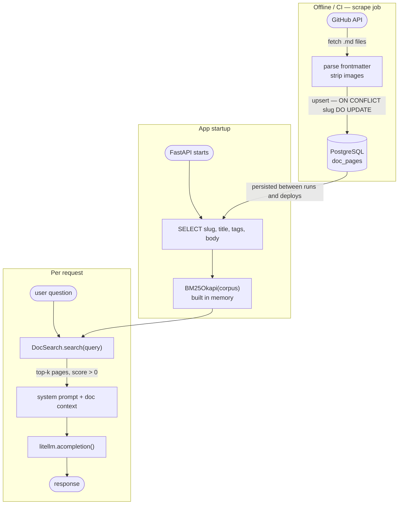
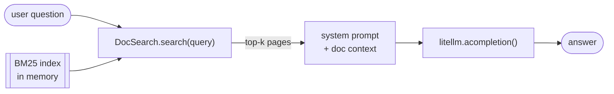

How to reuse your data in markdown files for agents to use? Today I want to share my approach to building a Q&A bot that answers questions grounded in that documentation. Something that does not hallucinate API signatures or misremember configuration options.

The obvious solution is the one that is RAG: embed every page, store vectors, retrieve the closest chunks at query time. That works, but starting from zero to RAG is too big of a leap. When writing about this, I recall not knowing where to start with RAG, and even more, not knowing that most AI systems in production don't use RAG alone, but often combined with traditional search.

This post describes exactly that approach, inspired by [arxiv-paper-curator](https://github.com/jamwithai/arxiv-paper-curator) — a project that uses BM25 to search academic papers without any vector infrastructure.

---

## Overview

We are going to setup the architecture illustrated below, containing the markdown sraping, storing, indexing, retrieving and prompt generation:




## Fetching from the GitHub API

In my use case, I am fetching files from Github API. But whatever is your API, the main thing to rememeber is to ensure you respect rate limits.
```python
def list_md_files(client, owner, repo, ref, path, headers) -> list[dict]:
    url = f"https://api.github.com/repos/{owner}/{repo}/git/trees/{ref}?recursive=1"
    tree = github_get(client, url, headers).json()["tree"]
    prefix = path.rstrip("/") + "/"
    return [
        item for item in tree
        if item["type"] == "blob"
        and item["path"].startswith(prefix)
        and item["path"].endswith(".md")
    ]
```

Most of the backend systems with rate limiting system will provide client the information about remaining requests, and time between each request. In Github, Every GitHub response includes `X-RateLimit-Remaining` and `X-RateLimit-Reset`.

The scraper reads it after every call and sleeps proactively when the count drops low. If a 403 or 429 comes back it waits for `Retry-After` and retries up to three times.

---

## Storing in PostgreSQL

Begin locally with a JSON file. Later move to storing in database. In my use case the blog posts have metadata and large body of text. Since I already have raw representation of a file, I could store in database the github URL reference for storage optimization. Depending on the scale, this might be the right engineering. Storing full body in database is also valid if the storage is not a concern, among other trade-offs, like it always is in engineering.

The schema is straightforward:

```sql
CREATE TABLE doc_pages (
    slug       TEXT PRIMARY KEY,
    title      TEXT NOT NULL,
    section    TEXT,
    tags       TEXT[] DEFAULT '{}',
    excerpt    TEXT,
    body       TEXT NOT NULL,
    updated_at TIMESTAMPTZ DEFAULT NOW()
);
```

Every scrape run uses `ON CONFLICT (slug) DO UPDATE`, so re-running is always safe - it is an upsert, not an append. Only `updated_at` changes for pages whose content has not changed.

```python
async def upsert_page(self, page: dict) -> None:
    await self._conn.execute(
        """
        INSERT INTO doc_pages (slug, title, section, tags, excerpt, body, updated_at)
        VALUES ($1, $2, $3, $4, $5, $6, NOW())
        ON CONFLICT (slug) DO UPDATE
          SET title = EXCLUDED.title, section = EXCLUDED.section,
              tags = EXCLUDED.tags, excerpt = EXCLUDED.excerpt,
              body = EXCLUDED.body, updated_at = NOW()
        """,
        page["slug"], page["title"], page["section"],
        page["tags"], page["excerpt"], page["body"],
    )
```

Run the scraper anywhere - locally, in a GitHub Actions job, on a schedule - and the results persist in the database, ready for the API to read on its next startup.

---

## BM25 search at request time

So what is [BM25](https://zilliz.com/learn/mastering-bm25-a-deep-dive-into-the-algorithm-and-application-in-milvus)? BM25 is a keyword ranking algorithm. Given a query, it scores each document by term frequency weighted against how rare each term is across the corpus. The Python library `rank-bm25` does the implementation.

For a technical documentation set with consistent vocabulary, BM25 often outperforms semantic search on exact matches. If a user asks "what is the rate limit for the search endpoint?", BM25 will rank the page that literally contains those words at the top.

BM25 is also significantly cheaper. Embeddings require an API call (and an API bill) every time you index a new document or update an existing one. BM25 reindexes in memory from the raw text — no external call, no cost.

The third advantage is debuggability. When BM25 returns the wrong result, you can inspect exactly why: check whether the query tokens appear in the document body, look at the term frequencies, adjust the corpus. When a vector search returns the wrong result, you are reasoning about a 1,536-dimensional space you cannot directly inspect. "Why did this chunk score higher than that one?" is hard to answer without running the query through the embedding model and doing cosine similarity math by hand.

That said, BM25 and semantic search are not mutually exclusive. Most production retrieval systems use both. BM25 handles exact matches and known terminology well; embeddings handle paraphrase and synonym queries well. A hybrid system runs both in parallel and merges the ranked results. Starting with BM25 alone is the right call for an early-stage project: it works well for precise technical queries, it is free to operate, and adding embeddings later is a straightforward extension once you know where BM25 falls short.

The full RAG stack requires two external services, an API key, a database to operate, and retrieval latency on every request. BM25 requires none of that.

At startup, `DocsIndexer` queries all rows and builds the index:

```python
class DocsIndexer:
    async def index(self) -> DocSearch:
        async with self._engine.connect() as conn:
            result = await conn.execute(
                text("SELECT slug, title, section, tags, excerpt, body FROM doc_pages")
            )
            rows = result.fetchall()
        pages = [DocPage(**dict(r._mapping)) for r in rows]
        return DocSearch(pages)


class DocSearch:
    def __init__(self, pages: list[DocPage]) -> None:
        self._pages = pages
        corpus = [
            (f"{p.title} {p.section} " + " ".join(p.tags) + " " + p.body).lower().split()
            for p in pages
        ]
        self._bm25 = BM25Okapi(corpus) if pages else None

    def search(self, query: str, top_k: int = 3) -> list[DocPage]:
        if not self._bm25:
            return []
        scores = self._bm25.get_scores(query.lower().split())
        ranked = sorted(zip(scores, self._pages), key=lambda x: x[0], reverse=True)
        return [page for score, page in ranked[:top_k] if score > 0]
```

The index is built once at startup and held in memory. Every `search()` call after that is a pure in-memory BM25 operation — sub-millisecond on a few hundred pages, no I/O, no network.

The corpus concatenates `title + section + tags + body`. Tags are the author's own vocabulary for a page — "authentication", "rate-limits", "webhooks" — and they match the words a user is likely to type when asking about that topic.

---

## Injecting into the LLM prompt



The agent retrieves results and appends the matching pages to the system prompt:

```python
async def run(self, user_message: str) -> str:
    results = self.doc_search.search(user_message, top_k=3)
    messages = [
        {"role": "system", "content": self._build_system_prompt(results)},
        {"role": "user", "content": user_message},
    ]
    response = await litellm.acompletion(model="anthropic/claude-haiku-4-5", messages=messages)
    return response.choices[0].message.content or ""

def _build_system_prompt(self, results: list[DocPage]) -> str:
    if not results:
        return self.base_prompt

    context = "\n\n## Relevant documentation\n"
    for page in results:
        context += f"\n### {page.title}"
        if page.section:
            context += f" — {page.section}"
        context += f"\n{page.body}\n"
    return self.base_prompt + context
```

If the query has no keyword overlap with any documentation page, `search()` returns an empty list and the system prompt is unchanged. The model answers from its background knowledge without inventing documentation content.

---

## Limitations and What this does not do

BM25 misses synonyms. "How do I authenticate?" will not match a page titled "API Keys and Tokens" unless the word "authenticate" appears in the body. For documentation with consistent technical vocabulary this is usually fine. For a user base that asks questions in varied natural language, semantic search with embeddings will do better. The right long-term answer is hybrid retrieval: run both, merge the results, but BM25 alone is the correct place to start.

I learned alot from doing it myself, and share it for other to learn as well. Let me know what you think of that.
