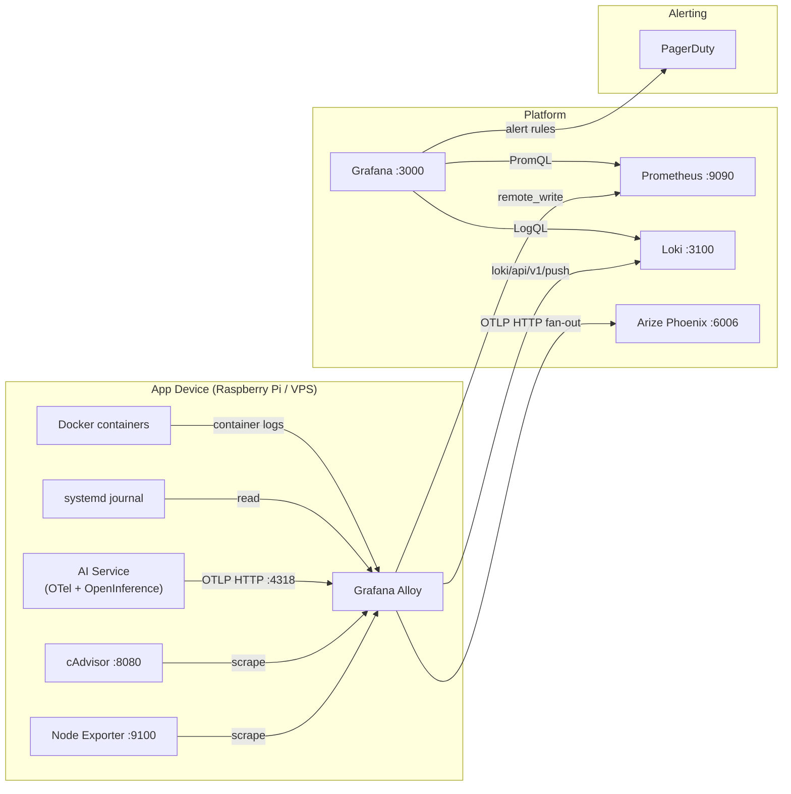
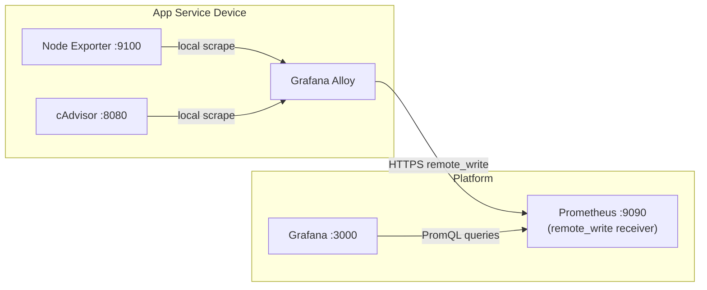
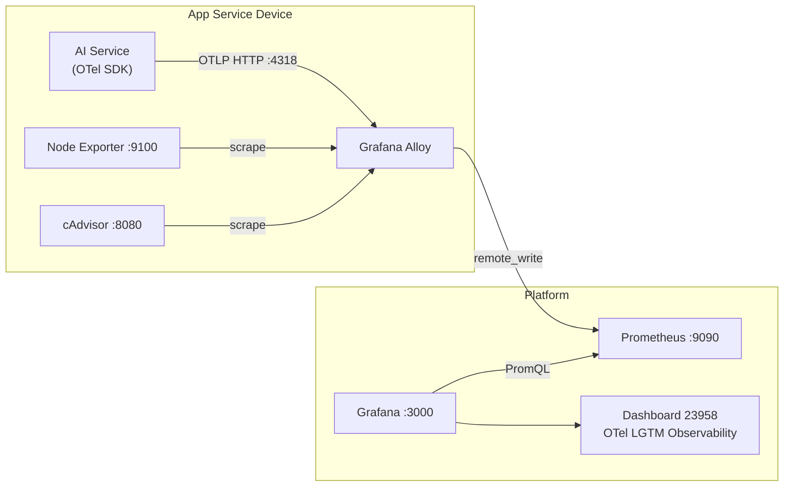
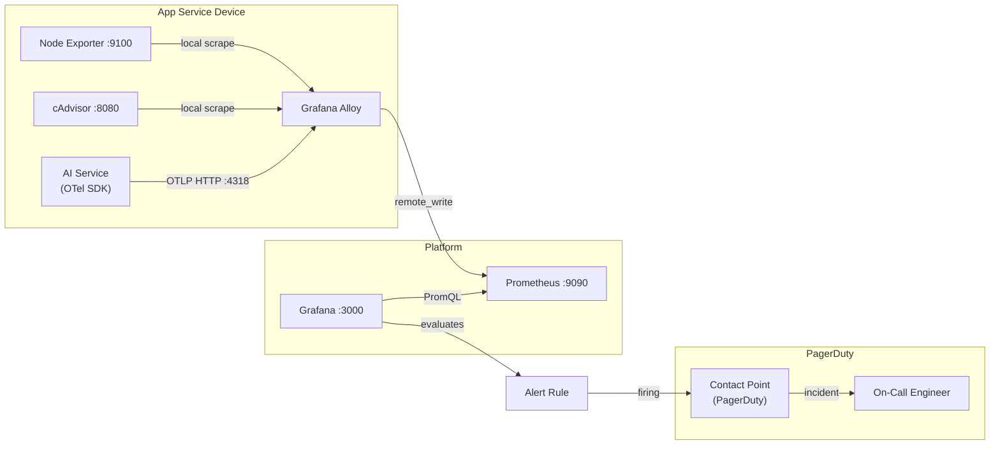
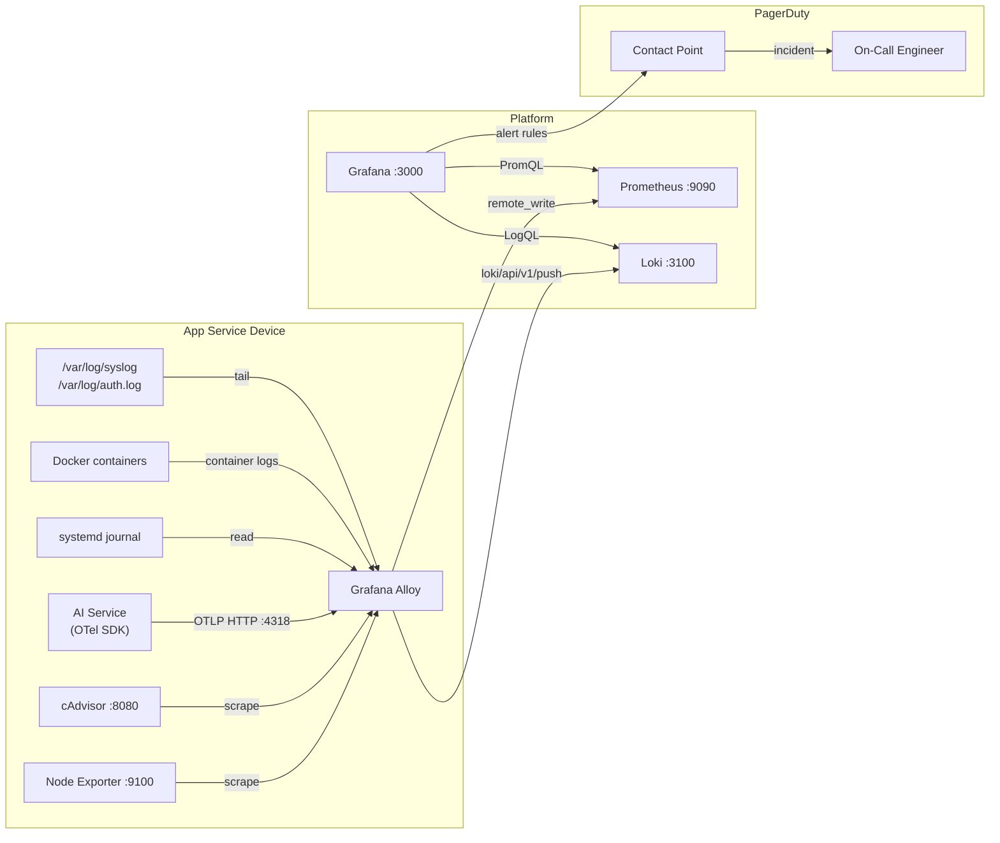
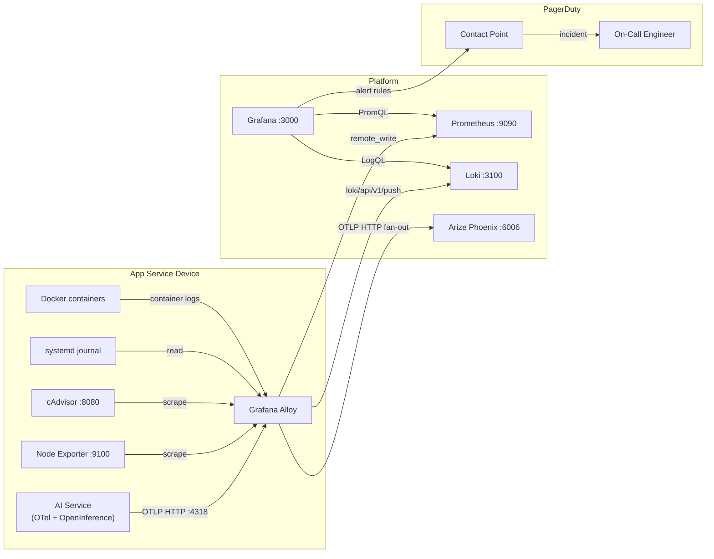

*Companion post to my [LLM Day Lisbon](https://llmday.com/) talk on multi-agent architectures.*

---

I build infrastructure for a living. Terraform, AWS, Ansible, Docker Compose — the plumbing that keeps software running when no one is watching. For the last two years I have also been building AI agents: Claude Code pipelines, LangGraph workflows running across multiple machines at PagerDuty, and a personal framework called OpenClaw for always-on assistants.

People ask me: "how do you actually run these things?" Not the code, not the prompts — the infrastructure. Where do agents live? How do you know when they fail? What happens at 3am when something goes wrong and you are not watching?

The answer is the same stack I have been building for every other service I run. Which is the point of this post.

> I've spent years thinking about how to provision and manage infrastructure reliably. Multi-agent AI is the same problem — just with LLMs as the compute layer.

This is the technical walkthrough. If you came here from my LLM Day Lisbon talk, this is what I could not cover in 20 minutes.

---

## The problem agents share with every other service

A single-agent setup is straightforward. One process, one context window, one LLM call at a time. It breaks predictably when it breaks, and you debug it the same way you debug any script.

Multi-agent systems are different. A single user request might spawn five subagents in parallel, each making tool calls, each writing to shared state, each capable of failing silently in ways that look like success. The top-level agent returns a confident answer assembled from partial results — and you have no idea which step went wrong, how long each took, or what the intermediate prompts looked like.

This is the distributed systems problem, just with LLMs. And distributed systems have had a working solution since the early 2010s: **observability**. You instrument everything, collect the signals, and build the infrastructure that lets you understand what is happening across the whole system in real time.

What is different about agents is not the infrastructure problem — it is that agents need *better* observability than conventional services, not equivalent observability. A service that returns a 500 is failing clearly. An agent that returns a confident but wrong answer is failing in a way that only shows up in the traces.

---

## What I run before I trust anything

Before any agent code gets deployed, this stack is running. It takes roughly half a day to set up the first time; it manages itself after that.



Every component in this diagram runs in Docker Compose. The whole thing lives under `~/.iac-toolbox/`, with one directory per service. Ansible provisions the host and starts the containers. Terraform manages the alert rules, PagerDuty services, and Grafana dashboards. Nothing is clicked through a UI.

---

## The stack, layer by layer

### Host and container metrics

[Grafana Alloy](https://grafana.com/docs/alloy/latest/) is the single collector for everything. It replaces Grafana Agent (deprecated in 2024) and handles metrics, logs, and traces in one binary — which means one Docker container, one config file, one thing to upgrade.

Node Exporter runs as a systemd service on the host (not in Docker — you get wrong process metrics if you containerise it) and exposes CPU, memory, disk, and network per host. cAdvisor runs as a privileged container and exposes the same signals per container. Both are scraped by Alloy and pushed to Prometheus via `remote_write`.

This gives you the baseline you need to answer: is the host healthy? Is any agent container crash-looping? Is memory climbing as an agent processes a long context window?


*Real screenshot: Claude Code running multiple parallel agents on a Raspberry Pi 4B. cAdvisor catches the memory spike before the OOM killer does.*



### Application metrics — HTTP status codes

Host and container metrics tell you the machine is struggling. They do not tell you what the application inside it is actually doing — whether it is returning errors, which endpoints are slow, or whether the error rate is climbing.

That gap is closed by OpenTelemetry. The OTel Python SDK includes auto-instrumentation for FastAPI that requires no changes to your route handlers. It hooks into the ASGI middleware layer and emits one histogram per request — `http.server.request.duration` — labelled with the method, route, and HTTP status code:

```python
from opentelemetry.sdk.metrics import MeterProvider
from opentelemetry.sdk.metrics.export import PeriodicExportingMetricReader
from opentelemetry.exporter.otlp.proto.http.metric_exporter import OTLPMetricExporter
from opentelemetry import metrics
from opentelemetry.instrumentation.fastapi import FastAPIInstrumentor

resource = Resource(attributes={"service.name": "my-agent"})
exporter = OTLPMetricExporter(
    endpoint=f"http://{os.getenv('ALLOY_HOST')}:4318/v1/metrics",
)
reader = PeriodicExportingMetricReader(exporter, export_interval_millis=15_000)
metrics.set_meter_provider(MeterProvider(resource=resource, metric_readers=[reader]))

app = FastAPI()
FastAPIInstrumentor.instrument_app(app)
```

The application pushes metrics to Alloy's OTLP HTTP receiver on port 4318. Alloy converts them from OTel format to Prometheus format and hands them off to the existing `remote_write` pipeline — same Prometheus, same Grafana, no new infrastructure.

The result is request rate, error rate, and latency percentiles (p50/p95/p99) per endpoint, visible in Grafana dashboard 23958. A spike in `http_response_status_code="500"` on your agent's `/run` endpoint is immediately distinguishable from a spike caused by a misconfigured client hitting a non-existent route.




One transport note worth repeating: **use HTTP OTLP (port 4318), not gRPC (port 4317)**. On Mac Docker, the Python gRPC library does its own DNS resolution and frequently fails to resolve `host.docker.internal`, silently dropping exports. HTTP via urllib3 is reliable. This applies to both metrics and traces.

---

### Alert rules and PagerDuty

Metrics without alerting are a dashboard no one watches. Alert rules are provisioned via Terraform using a `threshold_alert` module that wraps Grafana's three-step alert pipeline (query → reduce → threshold) into a readable call site:

```hcl
module "alert_container_oom" {
  source         = "./modules/threshold_alert"
  name           = "ContainerOOMKill"
  expr           = "increase(container_oom_events_total{name=\"${var.service_name}\"}[5m])"
  threshold      = 0
  severity       = "critical"
  node           = local.node_name
  service        = var.service_name
  summary        = "Container ${var.service_name} was OOM killed"
}
```

Firing critical alerts route through Grafana to PagerDuty via Events API v2. The notification policy groups alerts by `alertname`, `instance`, and `service` — a node going offline and an agent container OOM-killing in the same minute produces one incident on the right service, not five separate pages.

The `service` label is the routing key. Each PagerDuty service maps to a team or workload. Platform-level alerts (`NodeDown`, `HighMemoryUsage`) go to the infrastructure service. Agent container alerts go to the agent service. Same alert pipeline, different destinations.




### Logs with Loki

Alloy collects three log sources and ships them to Loki:

- **systemd journal** — all service start/stop events, kernel messages, SSH
- **Docker container logs** — stdout/stderr from every agent container, with log level extracted as a label
- **/var/log files** — syslog, auth.log

The label model mirrors Prometheus. A LogQL query like `{job="docker", container_name="my-agent", level="ERROR"}` returns only error-level lines from that specific agent container. When a PagerDuty alert fires for an OOM kill, the Grafana Explore view links directly to the log lines from that container in that time window — the exception, the stack trace, whatever the agent was doing when it died.

Without Loki, debugging agent failures means `docker logs` into the right container, `grep`-ing through unstructured output, and hoping you guessed the right time window. With Loki, the logs are indexed by label, correlated with the metrics timeline, and queryable in seconds.



### LLM traces with Arize Phoenix

This is where agent infrastructure diverges from conventional service infrastructure.

For a REST API, distributed traces are nice to have. You can often debug latency problems from metrics and logs alone. For an AI agent that makes five LLM calls, three tool calls, and synthesises the results, traces are not nice to have — they are the only way to understand what happened.



[Arize Phoenix](https://phoenix.arize.com/) receives traces from the agent via Alloy. Alloy is the fan-out point — metrics go to Prometheus, traces go to Phoenix. The agent instrumentation is two lines of Python:

```python
from phoenix.otel import register

tracer_provider = register(
    project_name="my-agent",
    auto_instrument=True,
    endpoint=os.getenv("PHOENIX_COLLECTOR_ENDPOINT", "http://alloy-host:4318/v1/traces"),
)
```

`auto_instrument=True` patches the Anthropic (or OpenAI, or Gemini) client automatically. Every LLM call becomes a span with the full prompt, the full response, token counts, and latency. Tool calls are child spans. The complete chain — from the initial user message to the final synthesised response — is visible as a single trace.


*Arize Phoenix trace view: each span is one LLM call. Prompt and response visible inline. Token count and latency at every step.*

Phoenix runs in Docker alongside the rest of the stack. It uses SQLite by default and consumes under 256MB at idle — appropriate for a Raspberry Pi or a small VPS.

---

## What actually runs on top

The observability stack is the substrate. On top of it, three agent tools:

**Claude Code** — subagent pipelines using skills built with the Claude Agent SDK. Each skill is a specialised agent with a scoped tool set. Skills are composed into workflows: a `generate-spec` skill feeds into an `implement-spec` skill feeds into a `verify-implementation` skill. Claude Code is LLM-driven orchestration — the model decides the execution path, not a fixed graph.

**OpenClaw** — my own framework for always-on assistants. These are long-running agents that maintain state across sessions. More opinionated than Claude Code, designed for a specific set of connected tools (Slack, GitHub, Jira). LLM-driven orchestration, session-based state management.

**LangGraph** — deterministic orchestration. At PagerDuty, we run a distributed multi-agent system across multiple machines using LangGraph as the backbone. The graph defines exact execution paths; the LLMs fill in the content at each node. LangGraph is what you reach for when you need reproducible workflows, not emergent behaviour.

The infrastructure requirements are the same for all three: host metrics (are the containers healthy?), application metrics (what is the request rate, error rate?), logs (what did the agent actually log when it failed?), and LLM traces (what did each model call look like?).

The difference is in the trace shape. A Claude Code subagent pipeline produces deep, tree-shaped traces with parallel branches. A LangGraph workflow produces flatter, sequential traces that map to the graph nodes. Phoenix handles both — it stores OpenTelemetry spans regardless of the framework that generated them.

---

## The infrastructure mental model transfer

The single most useful thing I took from years of IaC work into agent systems is this: **every principle that makes infrastructure reliable also makes agents reliable**.

Agents should be managed with code. The Docker Compose definitions, the Alloy configs, the Terraform alert rules — none of it is click-ops. If you cannot reproduce your agent environment from a git checkout, you will not be able to debug it when it fails in production.

Agents need resource limits. `container_spec_memory_limit_bytes` in a Grafana alert does not care whether the container is running a web server or an agent making ten parallel LLM calls. Set limits. Alert when they are approached. An agent with no memory limit will consume whatever the host has.

Agents fail in ways that look like success. A 200 from your OTLP endpoint means Alloy received the trace. It does not mean Phoenix received it (see the auth silent-drop issue in Part 6). A finished LLM call does not mean the answer was correct. Observability is not just about catching failures — it is about catching the cases where the system reports success and lies.

The question "is my agent working?" has the same answer as "is my service working?": you look at the signals. Metrics for the shape of the problem. Logs for the cause. Traces for where in the chain things went wrong.

---

## The complete series

This post is the overview. Each link below goes deeper on one piece of the stack.

| Post | What it covers |
|---|---|
| [Part 1 — Collecting Metrics](./observability-vertical-01-collecting-metrics) | Alloy, Prometheus, Node Exporter, cAdvisor, Grafana |
| [Part 2 — Service Alerts](./observability-vertical-02-service-alerts) | Threshold alert rules via Terraform, the `threshold_alert` module |
| [Part 3 — Alerts into PagerDuty](./observability-vertical-03-alerts-into-pagerduty) | PagerDuty services, Grafana contact points, notification policy routing |
| [Part 4 — Application Metrics](./observability-vertical-04-http-status-codes) | OTel SDK, FastAPI auto-instrumentation, OTLP receiver in Alloy |
| [Part 5 — Logs with Loki](./observability-vertical-05-logs-loki) | Loki, Alloy journal/Docker/file log collection, LogQL |
| [Part 6 — LLM Traces with Arize Phoenix](./observability-vertical-06-traces-ai-arize) | Phoenix deployment, Alloy fan-out, OpenInference auto-instrumentation |

The entire stack runs on a Raspberry Pi 4B with 4GB of RAM. That is not a constraint — it is a feature. If the observability stack is too heavy to run alongside your agents, it will not run.

---

## What I would do differently

**Start with traces earlier.** I added Arize Phoenix after the rest of the stack was stable. In practice, traces are the most useful signal for agent debugging and should be the first thing you wire up, not the last. A broken trace pipeline (misconfigured endpoint, auth silently dropping data, gRPC failing on Mac Docker) is hard to debug after the fact. Wire it up before your agent goes anywhere near production.

**Add Phoenix auth from day one.** Phoenix's auth is off by default. Every prompt and response your agent generates is stored in Phoenix — if Phoenix is behind a public Cloudflare tunnel without auth, so are your prompts. The auth setup is three config changes across three files. Do it when you first deploy, not when you realise you should have.

**Use HTTP OTLP everywhere, not gRPC.** The Python gRPC library does its own DNS resolution and fails silently on Mac Docker when resolving `host.docker.internal`. HTTP OTLP via urllib3 works reliably. This cost me an afternoon I will not get back.

---

*All configs from this post are managed by [iac-toolbox](https://github.com/iac-toolbox). If you are at LLM Day Lisbon and want to talk infrastructure, find me after the talk.*
