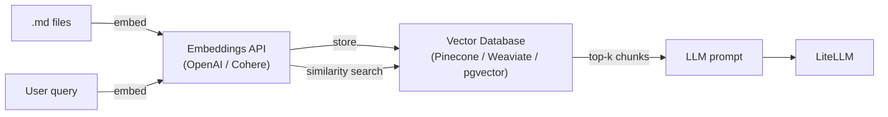
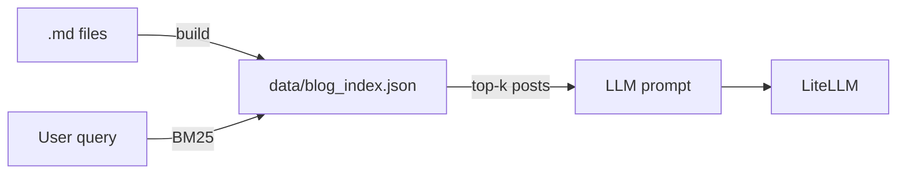
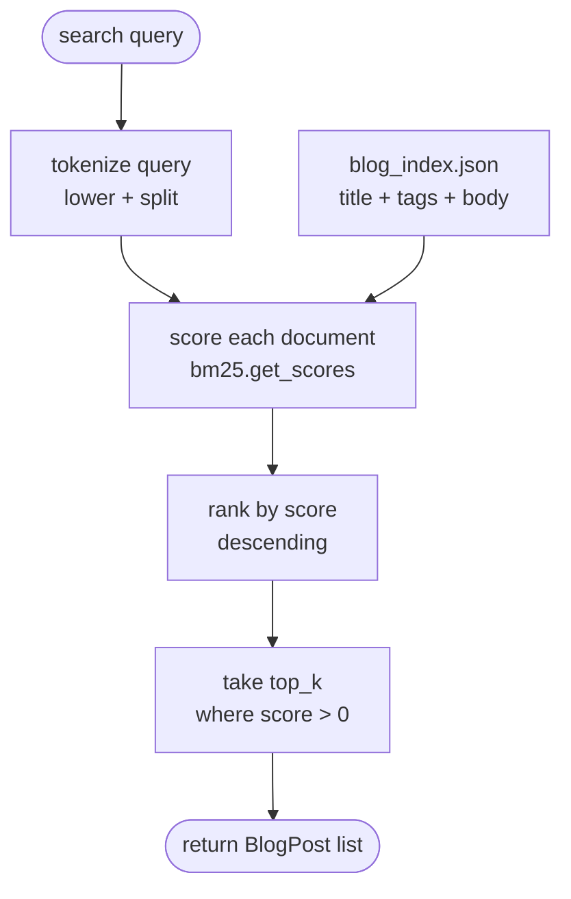
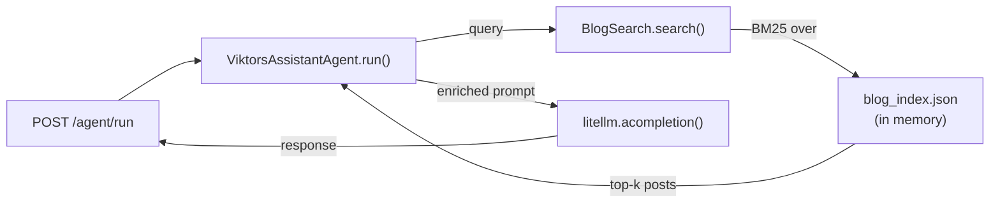

I have a portfolio assistant at [viktorvasylkovskyi.com](https://viktorvasylkovskyi.com). It answers questions from recruiters, collaborators, and the occasional curious person who lands on the site. It knows who I am, what I work on, where I am based.

What it does not know is anything I have actually written. I have 50 blog posts covering transformers, observability, infrastructure, AI agents. The assistant has never read any of them. Ask it about BarkGPT and it gives you the two-sentence summary baked into its system prompt.

The obvious fix is RAG. Build a vector index, embed every post, retrieve the closest chunks at query time, inject them into the prompt. I have built RAG pipelines. They work. They are also significantly more infrastructure than this problem needs.

This is what I built instead.

---

## The problem with RAG for a 50-post corpus

RAG solves a hard problem: semantic retrieval at scale. When you have thousands of documents, keyword search misses synonyms and rephrasing. Embedding-based retrieval finds the conceptually closest chunks even when the words do not match. That matters.

For 50 blog posts written by one person in a consistent voice about a specific set of topics, the scale problem does not exist. If a recruiter asks "tell me about your observability work", the post about Grafana Alloy and Arize Phoenix will match on keywords. The post about training transformers will not. BM25 — a well-understood keyword ranking algorithm — handles this correctly without an embeddings API call, without a vector database, and without a retrieval service that can fail independently of the application.

The full RAG stack looks like this:



That is two external services, an API key for embeddings, a database to manage, and a retrieval step that adds latency on every request. Every piece can fail. Every piece needs monitoring.

The alternative:



One JSON file. No external services. BM25 runs in memory on the same process as the API. The index is a build artifact — generated once, committed to the repo, loaded at startup.

---

## The index

The index is a JSON array where each entry is one blog post:

```json
[
  {
    "slug": "observability-vertical-06-traces-ai-arize",
    "title": "LLM Traces with Arize Phoenix",
    "date": "2025-10-01",
    "tags": ["observability", "llm", "opentelemetry", "phoenix"],
    "excerpt": "For a REST API, distributed traces are nice to have. For an AI agent that makes five LLM calls, they are the only way to understand what happened.",
    "body": "Full markdown body..."
  }
]
```

A build script reads every `.mdx` file in the blog directory, extracts frontmatter with `python-frontmatter`, and writes this file:

```python
import frontmatter
import json
import pathlib

def build_index(posts_dir: str, output: str) -> None:
    posts = []
    for path in sorted(pathlib.Path(posts_dir).glob("**/*.mdx")):
        post = frontmatter.load(path)
        body = post.content
        posts.append({
            "slug": path.stem,
            "title": post.get("title", ""),
            "date": str(post.get("date", "")),
            "tags": post.get("tags", []),
            "excerpt": body[:300].strip(),
            "body": body,
        })
    pathlib.Path(output).write_text(json.dumps(posts, indent=2))
```

Run it once before deploying:

```bash
python scripts/build_blog_index.py \
  --posts-dir ../portfolio/content/blog \
  --output data/blog_index.json
```

The result is a file you can read, diff, and commit. If a post changes, you run the script again. No migration, no re-embedding, no index rebuild that costs money.

---

## The search

BM25 is a ranking function. Given a query and a corpus of documents, it scores each document based on term frequency and inverse document frequency — common words score low, rare words that appear in few documents score high. The Python library `rank-bm25` does the implementation:

```python
from rank_bm25 import BM25Okapi
from dataclasses import dataclass
import json

@dataclass
class BlogPost:
    slug: str
    title: str
    date: str
    tags: list[str]
    excerpt: str
    body: str

class BlogSearch:
    _posts: list[BlogPost] | None = None
    _bm25: BM25Okapi | None = None

    def _load(self, index_path: str) -> None:
        raw = json.loads(pathlib.Path(index_path).read_text())
        self._posts = [BlogPost(**p) for p in raw]
        corpus = [
            (p.title + " " + " ".join(p.tags) + " " + p.body).lower().split()
            for p in self._posts
        ]
        self._bm25 = BM25Okapi(corpus)

    def search(self, query: str, top_k: int = 3) -> list[BlogPost]:
        if self._bm25 is None:
            self._load("data/blog_index.json")

        scores = self._bm25.get_scores(query.lower().split())
        ranked = sorted(zip(scores, self._posts), key=lambda x: x[0], reverse=True)

        # Only return posts with a non-zero score — zero means no term overlap at all
        return [post for score, post in ranked[:top_k] if score > 0]
```

The full execution path on every `search()` call:



The lazy-load branch (left side, `C -- yes`) runs exactly once — the first time `search()` is called. After that `_posts` is populated and every subsequent call goes straight to `C -- no`, skipping all I/O. The index file check (`E`) is what makes it safe to deploy without the file present: the search degrades gracefully to returning nothing rather than crashing.

The right side is where BM25 actually runs. The query is lowercased and split into tokens — the same normalisation applied to the corpus at load time. `bm25.get_scores` returns a score per document in O(n) time. Documents are ranked descending and the `score > 0` filter drops anything with no term overlap at all, which is the behaviour that prevents unrelated queries from injecting noise into the prompt.

The corpus itself is built from `title + tags + body` concatenated per post. Tags are worth including because they are the author's own vocabulary for a post — "observability", "terraform", "pytorch" — and they match the words a reader is likely to use when asking about that topic.

The corpus is tokenised once on first call and cached. Every subsequent request is a pure in-memory operation — no I/O, no network, sub-millisecond on 50 posts.

---

## Wiring it into the agent

The agent that handles portfolio questions is `ViktorsAssistantAgent`. It currently holds everything it knows about me in a static system prompt. After this change, it runs a search before every LLM call and injects whatever it finds:

```python
import litellm
from llm_api.search.blog_search import BlogSearch

blog_search = BlogSearch()

class ViktorsAssistantAgent(BaseAgent):
    system_prompt = """You are Viktor's personal assistant...
    
When relevant blog posts are provided below, prefer the information in them 
over your background knowledge. Quote or summarise from them directly."""

    async def run(self, input_message: str) -> str:
        results = blog_search.search(input_message, top_k=3)

        messages = [{"role": "system", "content": self._build_system_prompt(results)}]
        messages.append({"role": "user", "content": input_message})

        response = await litellm.acompletion(model=self.model, messages=messages)
        return response.choices[0].message.content or ""

    def _build_system_prompt(self, results: list[BlogPost]) -> str:
        base = self.system_prompt
        if not results:
            return base

        context = "\n\n## Relevant blog posts\n"
        for post in results:
            context += f"\n### {post.title} ({post.date}) [{', '.join(post.tags)}]\n"
            context += post.body + "\n"

        return base + context
```

The data flow end to end:



If the query has no keyword overlap with any post — someone asking what my favourite food is — `search()` returns an empty list and the system prompt is unchanged. The agent answers from its background knowledge and does not invent blog content.

---

## What LiteLLM adds here

The LLM call itself is `litellm.acompletion`. That is the whole integration — one async function, standard OpenAI-shaped messages, works with Anthropic or any other provider by changing the model string.

```python
response = await litellm.acompletion(
    model="anthropic/claude-haiku-4-5-20251001",
    messages=messages
)
```

There is no client to initialise, no provider-specific SDK to import, no authentication wiring beyond setting `ANTHROPIC_API_KEY` in the environment. LiteLLM reads it automatically for `anthropic/*` model strings. The agent does not know which provider it is talking to — the model string is a class attribute you can override per subclass.

---

## What this does not do

It is worth being direct about the limitations of BM25 on a small corpus.

**Synonyms and paraphrasing.** If someone asks "how do you monitor your AI systems?" and the post title is "LLM Traces with Arize Phoenix", BM25 will miss the match because "monitor" does not appear in the post. Embeddings would catch it. For 50 posts this is acceptable — the alternative phrasing ("observability", "tracing") is likely present somewhere in the body.

**Ranking across topics.** If the top-3 results include a post that is tangentially related, the LLM is now reading context that may mislead it. Top-k is a blunt instrument. A score threshold helps but does not eliminate the problem.

**Fresh content.** The index is a build artifact. A new post requires running the build script and redeploying. There is no live sync.

These are known trade-offs, not oversights. For a 50-post personal portfolio, the trade-offs are correct. If the corpus grows to 500 posts with users asking complex semantic questions, the calculus changes and embeddings become worth the infrastructure.

---

## What I would do differently

**Build the index first, wire the search second.** I planned the search layer before I had a usable index format. The index format determines what the search can do — whether you have tags, whether you store full body or chunks, whether the date is present for recency ranking. Settle the index schema first.

**Log which posts are injected on each request.** The first time the search returns a wrong result, you will want to know what BM25 actually scored. A single log line — `injected: [slug1, slug2]` — makes debugging immediate. Without it you are guessing from the model's response what context it received.

**Keep the build script idempotent and fast.** It should be safe to run on every deploy without thinking about it. If it takes more than a few seconds for 50 posts, something is wrong.
