A few months ago we started a research spike at PagerDuty: could we build a multi-agent system that investigated incidents the way a human SRE does? Generating hypotheses, checking each one against the evidence, narrowing down to the actual cause? More specifically, could we build it in a way that stayed _reactive_ the whole time, so a user could watch hypotheses arrive as they were investigated and inject new ones mid-run?
The answer, after a few weeks of building, was: yes, you can build that, and here is what it looks like in detail. Then we walked away from it.

This post is about the spike. The architecture, the dead ends, the design decisions — and at the end, why we ended up not shipping any of it. The walk-away is the part I want to be most honest about, because it's the part that's most often missing from engineering write-ups. We learned a lot building this. We learned more by deciding not to take it further.

## Why a single agent stopped working

The first version of our incident investigation tool was a single agent with a large context window and a set of tools — query logs, check metrics, look at recent deploys. It worked, in the sense that it returned useful output. But as we pushed it toward more autonomous, deeper investigation, few specific problems started compounding on each other.

### Context Rot

The Incident Context document we fed the agent was large: JSON blobs of alerts, past incidents, related incidents, change events, runbook content, notes. As we added more sources — service topology, dependency graphs, historical patterns, remediation options — we hit a real phenomenon that's been documented in LLM research: The [context rot](https://arxiv.org/abs/2305.14491). Beyond a certain threshold, model performance degrades as the context grows, not because the information isn't there but because the model struggles to weight it correctly. More data, worse decisions. It created a hard ceiling on how much context we could give a single agent before it started making worse calls than it had with less.

### Instruction Overload

Every new feature meant more instructions. New tools, new guardrails, expanded system prompts. [Research suggests there's an inverse relationship between instruction volume and output quality](https://arxiv.org/abs/2507.11538): as the prompt gets longer, the model's ability to follow any given instruction decreases. In a monolithic agent, adding a new capability competes with every existing capability for the model's attention. We could feel this in practice: agents that worked well at a certain feature set started degrading as we added to it.

### Synchronous execution with a hard ceiling

Our agent ran synchronously with a 120-second timeout. In practice: P50 response was around 10 seconds, P99 was around 45 seconds. Log searches took 30-90 seconds. Past incident recall took 45-60 seconds. A single root cause analysis: formulate hypothesis, search for evidence, evaluate - chained these together and could take several minutes. Sequential hypothesis testing multiplied that. A moderately complex incident with three or four candidate root causes could take 10+ minutes to diagnose, all of it blocking, none of it visible to the user until it was done.

### No interactivity during execution

Users couldn't ask questions or add context while the agent was working. If the on-call engineer knew the service had been deployed 10 minutes before the alert, they couldn't inject that. They had to wait for the agent to finish, then restart with the new context included. For a live incident, this wasn't just inconvenient — it meant the agent was operating without information the human already had.

These weren't individual bugs to fix. They were structural consequences of running everything through a single agent with a single context and a synchronous execution model. The architecture had served us well for initial triage. It couldn't take us where we needed to go.

## The evolution toward multiple agents

If a single agent struggles with large context, the answer is to split context into multiple agents and give each agent a _focused_ subset of the context it actually needs. A coordinator that understands the full incident can delegate to sub-agents that each receive only the context relevant to their specific tasks. Smaller context per agent, better reasoning per agent, and the sub-agents run in parallel.

That was the idea. The question was how to actually build it.

## What we were trying to do

The specific problem we set out to solve looked like this. A user reports an incident. An SRE Agent picks up the context, decides this needs investigation, formulates a few candidate root causes — say, DNS resolution failure, a bad deploy, a downstream dependency timeout — and spawns a sub-agent for each one. Each sub-agent goes off, queries logs, looks at metrics, and reports back with evidence either supporting or disproving its hypothesis. The SRE Agent synthesises across all the findings and picks the strongest root cause candidate.

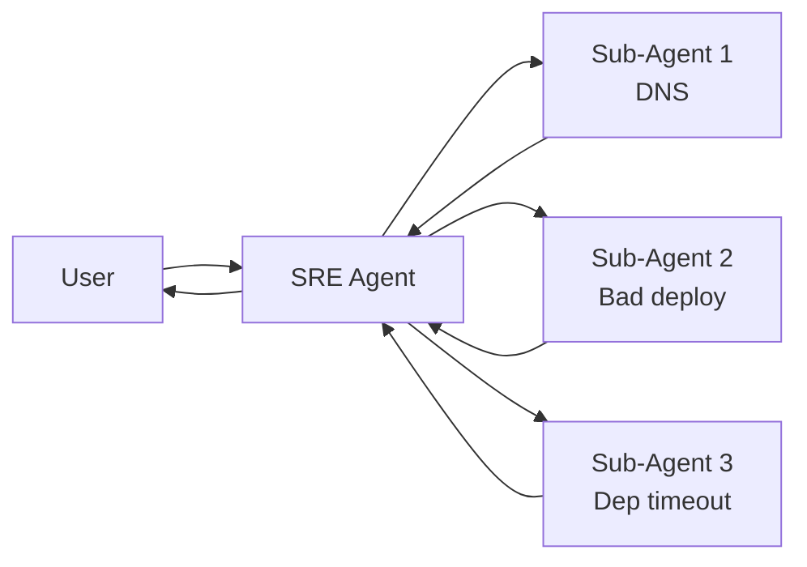

The non trivial part is letting the users watch all this happen in real time. They want to see hypotheses arrive as they're investigated, not five minutes later as a single block. They might want to interrupt and say "skip hypothesis 3, I already checked the database" or "actually, also check the deployment logs from this morning." If something goes wrong they would cancel to stop burning tokens in the background.

That set of requirements is what made this hard.

## Three ways to run sub-agents in parallel

Before getting into what we built, it's worth grounding why we built it the way we did. There are three obvious ways to run N sub-agents and combine their results, and each has a different cost.

### Sequential

```mermaid
gantt
    title Sequential Execution — total time = t1 + t2 + t3
    dateFormat ss
    axisFormat %Ss
    Sub-agent 1 : a1, 00, 3s
    Sub-agent 2 : a2, after a1, 5s
    Sub-agent 3 : a3, after a2, 2s
    Decide  : crit, after a3, 1s
```

Run one sub-agent. Wait for it. Run the next. Wait. Repeat. Total time is the sum of every sub-agent's duration. Simple to implement. No concurrency primitives, no partial state. The cost is latency. A slow hypothesis in the middle blocks everything behind it. If sub-agent 2 takes ten minutes, sub-agent 3 doesn't even start until minute ten.

### Parallel, wait for all

```mermaid
gantt
    title Parallel Execution — total time = max(t1, t2, t3)
    dateFormat ss
    axisFormat %Ss
    Sub-agent 1 :a1, 00, 3s
    Sub-agent 2 :a2, 00, 5s
    Sub-agent 3 :a3, 00, 2s
    Wait for all: crit, 00, 5s
    Decide  : after a2, 1s
```

Dispatch every sub-agent at once synchronously. Block until the slowest one finishes. Synthesise everything together. Total time drops to the duration of the slowest sub-agent, which is much better. But the main agent is completely idle during execution. It can't react to early results, it can't tell the user what's happening, and if a user wants to inject a new hypothesis mid-run, the graph is locked inside the parallel call until everything resolves. If one sub-agent hangs, synthesis is blocked indefinitely.

### Parallel fan-out and concurrent fan-in

```mermaid
gantt
    title Parallel Fan-out — synthesize on each arrival, user input mid-run
    dateFormat ss
    axisFormat %Ss
    Sub-agent 1         : a1, 00, 3s
    Sub-agent 2         : a2, 00, 8s
    Sub-agent 3         : a3, 00, 5s
    Decide (1 of 3) : crit, after a1, 1s
    User injects hyp 4  : milestone, 07, 0s
    Sub-agent 4 spawned : a4, 07, 6s
    Do work (2 of 3) : crit, after a3, 1s
    Do something else (3 of 3) : crit, after a2, 1s
    Think (4 of 4) : crit, after a4, 1s
```

Dispatch all sub-agents at once (concurrently) as an asynchronous batch. Then, each time any one of them completes, the main agent processes the results asynchronously. Those results could be used to update the user, maybe even spawn a new sub-agent in response. Additionally this opens possibilities for more dynamic interactions, such as user input being treated as a first-class event alongside sub-agent results, so a new information can arrive mid-run and join the batch without restart.

_Parallel fan-out and concurrent fan-in_ is what we wanted. The main agent is never idle. The user always has visibility. New work can be injected at any point. The hidden cost is implementation complexity. You need an interrupt-and-resume execution model, a buffer for concurrent arrivals, and a way to prioritise user events over sub-agent results. The rest of this post is essentially the learning of what it took to build that.

## First Attempt: LangChain Deep Agents

The first thing we tried was [LangChain's Deep Agents](https://github.com/langchain-ai/deepagents) framework. Deep Agents give you an orchestrator/planner pattern out of the box — sub-agents are exposed as tools, and the orchestrator decides which tools to call and when. Wiring it up looked like this:

```python
model = init_chat_model(model="gpt-5.4")
tools = make_tools()
agent = create_deep_agent(model, tools=tools, system_prompt=SYSTEM_PROMPT)
```

Each sub-agent was just a tool the orchestrator could invoke. The framework handled dispatch, parallelism, and result aggregation.

In sequential mode, the orchestrator waits for each tool to return before invoking the next. That's the first execution model from above with additive latency and slow hypothesis blocking everything.

In parallel mode, the orchestrator dispatches all tools at once and blocks until every tool returns. That's the second execution model where the main agent is idle the whole time, and there's no hook between individual tool completions.

We came to realise that there was no way, inside Deep Agents, to say "do something each time a single tool finishes, before the others have." The framework only returned control to the orchestrator once the entire batch resolved. Which meant:

- The orchestrator couldn't react to sub-agent 1's result at t=3min while sub-agents 2 and 3 were still running.
- No external event — including user input — could reach the graph while it was blocked inside a parallel tool call.
- The tool set was fixed at the point of dispatch. You couldn't add a feedback mid-run without restarting.

So we pivoted into building it ourselves on raw LangGraph.

## An earlier fork: Custom-made Async Background Agents with LangGraph

Before getting into the LangGraph work, there was a design decision we had to make. When the model spawns a sub-agent asynchronously, that agent becomes detached from the main agent - and it runs in the background. The question then becomes: how do you get results back from a sub-agent to its parent when the sub-agent runs as a background task? Two options we evaluated:

### Kafka as an async medium

The sub-agent publishes a completion event to a topic. The parent agent consumes from that topic. We get durability, replay, and backpressure out of the box. And we would also have to deal with Kafka's new operational dependency.

### Webhooks

The parent includes a callback URL when spawning the sub-agent. When the sub-agent finishes, it POSTs back to that URL. Simple to understand, nothing new to run.

We chose webhooks as the starting point. For a prototype with moderate task volume and no hard durability requirements, Kafka's operational overhead wasn't worth it.

## Back to LangGraph: Building the reactive loop, one problem at a time

The plan was straightforward: spawn sub-agents concurrently, pause the graph somewhere clean, resume it each time a result arrived, let the main agent do some work or thinking, and pause again until the next event. The mechanism for pausing is [LangGraph Interrupt](https://docs.langchain.com/oss/python/langgraph/interrupts) `interrupt()`, and resuming is `Command(resume=...)` with the right `thread_id`. The rest is plumbing.

The plumbing turned out to be most of the work. Here's how it built up.

### Step one: naive concurrent fan-out

The simplest version. Spawn N sub-agents fire-and-forget. Pause the graph. Each time a sub-agent posts its result back, resume the graph with that result.

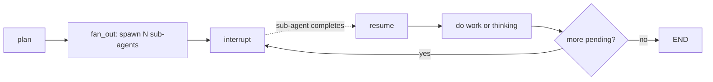

That approach is a solid core, but it breaks the moment two sub-agents finish close together and attempt concurrent resume. The first completion resumed the graph and triggered main agent working loop. While the main agent was still processing, the second completion arrived and tried to resume the same graph. LangGraph either errored or started a fresh execution from scratch, which was worse because now we'd lost the state from the first arrival.

We needed a buffer.

### Step two: add a queue

Put incoming results into a local queue. Then the Main Agent would "drain the queue" in a loop, pulling one result at a time and only resuming the graph after the previous resume has fully completed and the graph has re-interrupted.

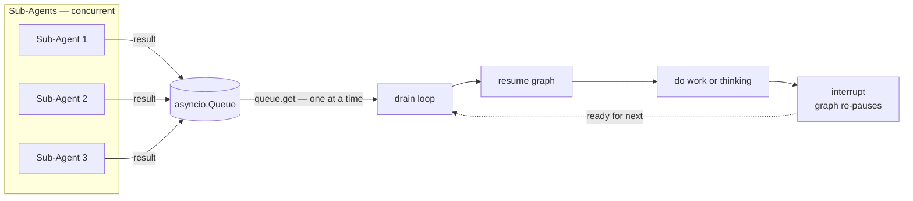

In practice, sub-agents finished at unpredictable times separated by minutes, so the queue was rarely actually occupied. It was insurance for the edge case where two arrivals landed within seconds of each other. But it had to be there, because that edge case was real and corrupted state when it happened.

### Step three: add a lock

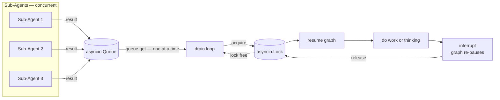

The queue alone wasn't enough. There was a window between "main agent completed" and "graph re-interrupts" where the drain loop could pick up the next item and call `Command(resume=...)` before the graph was genuinely paused. Same race, different shape.

The fix was a lock around the resume call. The drain loop held the lock while resuming, and the graph signalled through a callback when it had actually re-interrupted, releasing the lock. Now the drain loop could never issue a second resume until the first one had fully cycled back to a paused state.

The drain loop ended up looking like this:

```python
class MainAgent:
    async def run(self, message, incident_id, session_id, task_id=None) -> str:
        config: RunnableConfig = {"configurable": {"thread_id": task_id}}
        graph = self._build_graph()

        # Create queue and lock before graph starts —
        # fan_out will fire sub-agents that publish back into the queue
        queues[task_id] = asyncio.Queue()
        graph_locks[task_id] = asyncio.Lock()

        # Runs until first interrupt at accept_event
        await graph.ainvoke(
            AgentState(
                messages=[HumanMessage(content=message)],
            ),
            config,
        )

        # Graph is interrupted. Drain queue until all done.
        final = await self._drain_queue(graph, config, task_id)

        queues.pop(task_id, None)
        graph_locks.pop(task_id, None)
        return final

    async def _drain_queue(self, graph, config, thread_id: str) -> str:
        queue = queues[thread_id]
        lock = graph_locks[thread_id]

        while True:
            resume_data = await queue.get()
            async with lock:
                result = await graph.ainvoke(
                    Command(resume=resume_data),
                    config,
                )
            final = result.get("final", "")
            if final:
                return final
```

This was the spine of the whole architecture. The graph was interrupted. A result arrived in the queue. The drain loop acquired the lock, resumed the graph, let it run through until it interrupted again, then released the lock and went back to waiting on the queue. Concurrent arrivals were serialised. The graph was never resumed twice in flight.

### Step four: user input mid-run

User input is just another actor producing events into the system. The natural thing was to push user messages into the same queue and let the drain loop handle them.

But with a regular FIFO queue this had a problem. Suppose three sub-agent results were already buffered in the queue, and the user typed "also check the deployment logs from this morning." The user's message went in fourth. Or worse: by the time the drain loop got to it, the graph might have already finished and reached `END`. The user's hypothesis would never spawn.

The fix was a priority queue with two priority levels. User input was priority 0 — highest, processed first. Sub-agent results were priority 1. Whenever a user event was sitting in the queue, it jumped the line and got processed before any backlog of sub-agent completions.

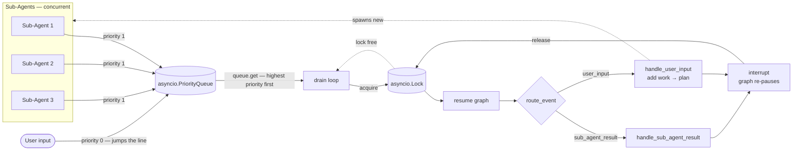

```python
@dataclass(order=True)
class PriorityItem:
    """Lower priority number = higher priority.
    User input = 0, sub-agent results = 1."""
    priority: int
    item: ResumeData = field(compare=False)


class MainAgent:
    async def _on_sub_agent_event(self, event, task_id):
        """Called when a sub-agent publishes a completion event."""
        await queues[task_id].put(
            PriorityItem(
                priority=1,
                item=SubAgentResumeData(
                    text=extract_text(event),
                ),
            )
        )

    async def user_input(self, message: str, task_id: str):
        """Called when the user sends a message into an active task."""
        await queues[task_id].put(
            PriorityItem(
                priority=0,
                item=UserInputResumeData(
                    action="user_message",
                    text=message,
                ),
            )
        )
```

Now when the graph resumed, the next node — `route_event` — looked at what arrived and branched. Sub-agent results went to `handle_sub_agent_result`. User messages went to `handle_user_input`, which added the new work to state, marked it as `pending_spawn`, and re-entered `plan` so the new sub-agent got dispatched immediately.

Six nodes. The whole reactive loop fit in this picture. `accept_event` was where the graph spent most of its life — paused, waiting for the drain loop to deliver the next event from the priority queue.

That was the execution model. Now we needed a transport.

## The architecture, made explicit

By this point we have enabled true async nature for agents execution. But we are still missing some fundamental system engineering details:

- Each sub agent needs identity and relation to the parent agent, both for traceability and control. When a user wants to stop a sub-agent, we need to propagate the event correctly. When an agent fails, we want to have a post-mortem analysis.

- Each sub-agent needs to be able to communicate its status and results back to the parent agent efficiently. This requires a reliable event propagation mechanism that can handle high concurrency and potential failures.

By this point we'd accumulated three layers of machinery, each solving a different problem. The task identity, events queue and trasport layer, and LangGraph reactive loop.

### Layer one: task identity

Every agent run got a UUID for its `task_id`. Every sub-agent carried a `parent_task_id` pointing back to whoever spawned it. The convention we settled on was that the LangGraph thread's `thread_id` was identical to the agent's `task_id`. This sounds trivial yet it was the single most important convention in the system.

It meant that when a sub-agent published a completion event carrying `parent_task_id: task-001`, the parent agent immediately knew which LangGraph thread to resume. No lookup table. No correlation logic. The identifier on the event was the identifier of the graph that needed to wake up.

```
Main Agent (task_id: task-001, thread_id: task-001)
    │
    ├── Sub-Agent 1 (task_id: sub-1, parent_task_id: task-001)
    │     └→ completes → publishes event with parent_task_id: task-001
    │                  → parent agent resumes thread_id: task-001
    ├── Sub-Agent 2 (task_id: sub-2, parent_task_id: task-001)
    └── Sub-Agent 3 (task_id: sub-3, parent_task_id: task-001)
```

`task_id` was what was running. `parent_task_id` was what spawned it.

### Layer two: event queue and transport

Each agent wrapped its logic in a simple lifecycle: `working → completed | failed | canceled`. Inspired on [A2A protocol](https://a2a-protocol.org/latest/). The progress events flowed into a shared event queue. Every event an agent published landed on the right channel automatically. Parent agents subscribed to the same channel to pick up sub-agent completions and resume graphs.

Alongside the PubSub broadcast, every event was also written to a durable event store indexed by `task_id`. PubSub is fire-and-forget was not enough to cover the older messages that later joiner users might miss. The store covered late-joining clients catching up on an in-progress investigation. In production this would need to be a fully durable store (thinking about Kafka persistence or a database) to survive pod restarts and handle crash recovery properly.

Progress reporting from graph nodes flowed through callbacks injected via LangGraph's `configurable` dict, keeping the graph nodes entirely decoupled from transport:

```python
# Callback defined at the agent runner level
async def on_synthesize(analysis: str, is_final: bool):
    await event_queue.publish(f"Synthesis: {analysis[:200]}...")
    await event_store.record(task_id, analysis, is_final)

# Graph node calls it without knowing anything about queues or task IDs
async def synthesize(state: AgentState, config: RunnableConfig) -> dict:
    on_synthesize = config.get("configurable", {}).get("callbacks", {}).get("on_synthesize")
    if on_synthesize:
        await on_synthesize(analysis, is_final)
```

Connecting all the infrastructure would require multiple shared resources that the agents would use to communicate between

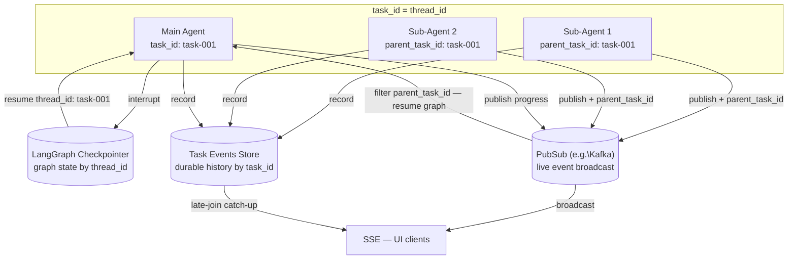

### Layer three: the LangGraph reactive loop

This was what we built in the previous section. The interrupt/resume graph, the priority queue, the lock. It depended entirely on the two layers below it. It used `task_id === thread_id` from layer one to know which graph to resume. It used the PubSub (Kafka or Redis) subscription from layer two to receive completion events.

Strip any of the three layers away and the whole thing fell apart. Strip the identity model and you couldn't route events. Strip the event queue and there was no transport. Strip the LangGraph loop and you were back to wait-for-all parallelism with all the problems it brought.

## The thing that changed the calculus: async sub-agents

While we were heads-down building all of this, LangChain team was working on the same problem from the framework side.

In the final weeks of the spike we came across [LangGraph's async sub-agents](https://docs.langchain.com/oss/python/deepagents/async-subagents) - a native extension where the supervisor launches background tasks and returns immediately, without blocking. For a lot of use cases, this is exactly the right model: the user stays in the loop, the supervisor checks progress when it makes sense, and the complexity of managing concurrent execution stays in the framework rather than your codebase.

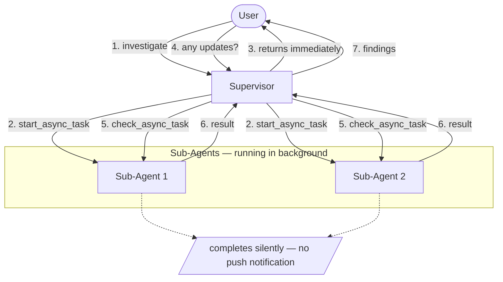

For our specific case it's a partial fit. The diagram above shows the pull based model of interaction: the supervisor calls check_async_task when the user asks or the LLM judges it's time. There's no push notification when a sub-agent finishes. For interactive workflows where a human is driving the conversation, that's a reasonable tradeoff. For automated incident response where we want deterministic synthesis the moment each result arrives, it leaves a gap.

But looking at it honestly, that gap didn't matter as much as we'd assumed. It pointed us toward a simpler question: what's the actual latency requirement here?

## Where we landed

The architecture we shipped is simpler than anything described above: concurrent fan-out with a supervisor polling all sub-agents on a time-based tick. Every cycle, check everything pending, invoke LLM and surface partial results to the user.

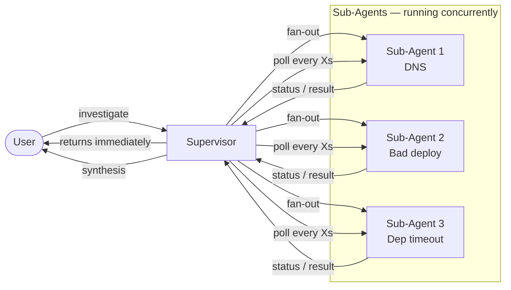

No priority queues. No interrupt/resume cycles. No lock coordination.

Incident investigation isn't a sub-second problem. While sub-agents run for minutes, a few seconds polling cycle is sufficient. So we decided, instead of building something complex to maintain or waiting for the framework to catch up, we just decided to ship something we could trust at 3am.

## Closing thought

The most valuable output of this spike was a clearer understanding of when _not_ to build your own runtime. We started with a real problem. Single agents breaking down under the weight of context rot, instruction overload, and sequential execution. We built a working system that addressed it, and then recognised that the path to shipping it would cost more than it was worth, particularly once we saw the framework converging on the same solution.

For us at PagerDuty, it's the version of "build vs buy" we can confidently decide after actually building one of the options. Building the proof of concept, even just enough to demo it, gave us the actual feel of the trade-off. Such experimentation is at the core of our engineering culture.

That's where this one landed. A POC, some good diagrams, a working repo, a conversation with the LangGraph team, and a lot of clarity about what reactive multi-agent systems actually cost. And because we built it ourselves, we now understand the architectural tradeoffs deeply enough to extend the current framework, anticipate the failure modes, and make an informed call next time, rather than just inheriting someone else's assumptions. For now, that's the right place to be.
