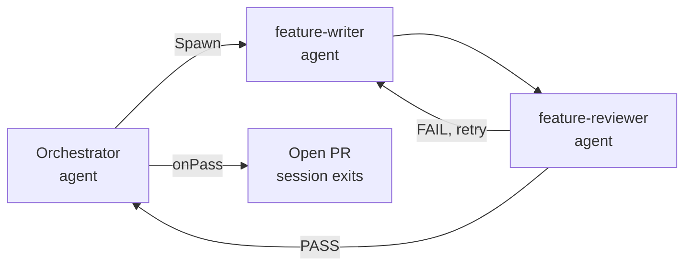
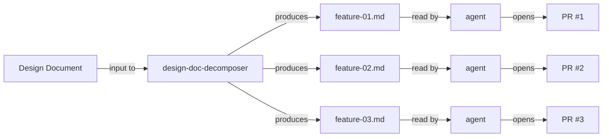
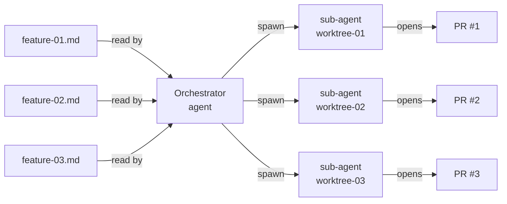
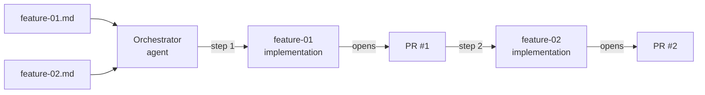
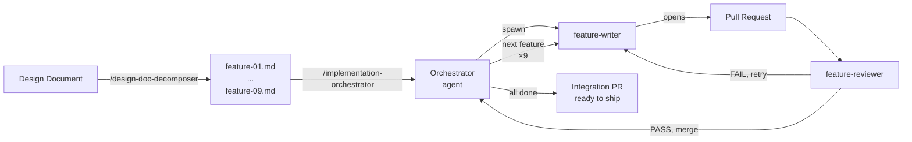

90 minutes. 9 features. 9 reviewed PRs merged into an integration branch, one final PR ready to ship. This is how we got there and what broke first.

I've been running an AI coding agent for a while now, and at some point the natural next question was: can it do bigger chunks of work? Not just one-off tasks, but an entire feature set, from spec to merged PRs, with minimal hand-holding from me?

This post is about the workflow I landed on after a few months of experimenting at PagerDuty. Along the way I made most of the obvious mistakes - parallelising work that needed shared context, trusting an agent to infer rules that weren't written down, isolating sub-agents too much - and the workflow is shaped by those mistakes as much as by the wins.

## What we were trying to do

The idea is what I'm calling the **waterfall agentic workflow**. Instead of coding and asking the agent for assistance, you hand it the full product specification upfront - a well detailed roadmap milestone or a micro service design doc - and let it run the whole implementation in one go. The agent generates tasks from that context, implements features, opens PRs, and loops until everything is done.

[Claude Code](https://docs.anthropic.com/en/docs/claude-code/overview) is what makes this possible. With [sub-agents](https://docs.anthropic.com/en/docs/claude-code/sub-agents) the orchestrator process can spawn other Claude processes (writers, reviewers) and coordinate their work. That's the primitive the whole workflow is built on.

## Architecture — Claude Code with sub-agents



The above architecture is accomplished with a small set of [slash commands](https://docs.anthropic.com/en/docs/claude-code/slash-commands), our [skills](https://code.claude.com/docs/en/skills) and two agent definitions:

### Final Skills that make this possible

1. `/init`: scrapes the repo and generates `CLAUDE.md` with validation commands specific to that repo
2. `/implementation-orchestrator`: runs the orchestrator, spawning writer and reviewer sub-agents per feature, looping on failure, merging on pass
3. `/feature-doc-creator`: turns a conversation or short description into a complete, structured feature proposal document the orchestrator can pick up directly
4. `/bug-creator`: turns a short bug description or error snippet into a self-contained bug task document, enriched with repo context, that an agent can solve without further input
5. `/design-doc-decomposer`: reads a full design doc and produces structured feature files

**Agent definitions**

1. `feature-writer`: a sub-agent that writes code based on orchestrator instructions
2. `feature-reviewer`: a sub-agent that reviews code written by the feature-writer and provides feedback or approval

The rest of this post walks through how the workflow got there: the first experiment that taught us why parallel sub-agents don't work for full-product builds, how the writer/reviewer loop closes the quality gap, what a real run looks like end to end, and what it feels like to actually live with this day to day.

## The first experiment: why it broke

For the complete view of the product to build, I wrote the following artefacts for the agent:

- Workflow — development workflow, how to validate each repository
- Feature Document — the detailed vision of the milestone to implement



The hypothesis: if the agent has all of this context upfront, it can generate features, create sub-tasks, and implement features without me driving each step.

Given full context, the AI felt especially useful for:

**1. Generating feature docs from context.** The new skill `skills/design-doc-decomposer/SKILL.md` reads the full design document, and produces structured, modular feature files. Each feature file contains all the necessary information for the agent to implement the feature. This worked well, not unexpectedly since that is what LLMs are good for — extracting patterns and enriching context.

**2. Running a single agent to execute tasks one by one.** This is where it got interesting, and where the real learnings came from.

### Worktrees that broke the context

Under the hood, the agent spawns sub-agents to work on [git worktrees](https://git-scm.com/docs/git-worktree).



A worktree is a way to check out multiple branches of the same repo simultaneously into separate directories. Each sub-agent gets its own isolated copy of the codebase on its own branch, that we defined in `.claude/worktrees` so they can work in parallel without stepping on each other. This guarantees isolation:

```sh
  (use "git restore --staged <file>..." to unstage)
        new file:   .claude/worktrees/feature-01
        new file:   .claude/worktrees/feature-02
        new file:   .claude/worktrees/feature-03
```

Each feature gets its own worktree and its own sub-agent. And that's exactly the problem.

Worktrees are good for parallelising independent work. But when building a full product from scratch, a single sequential agent works better — because one agent can see the big picture. Isolated sub-agents working from a single ticket don't have enough context to make the right decisions. They don't know what the other agent just built. The parallel approach that's great for independent bug fixes is the wrong tool for a coherent product build.

### The fix

Define a skill which forces the agent to work alone. Instead of spawning parallel sub-agents for every feature, the skill instructs a single agent to work sequentially across all features, maintaining the full picture throughout. We are sacrificing the parallelization speed for quality, which safes human review time in the end.



### Constant human-in-the-loop problem - hitting permission issues

I kept getting issues with permissions and having to approve things manually. There are two ways to bypass this:

- Running `claude --dangerously-skip-permissions` bypassed this and the agent started working well and creating PRs. This might be dangerous on your local machine unless it is properly sandboxed.
- Running `claude --permission-mode auto` ([more on this here](https://www.anthropic.com/engineering/claude-code-auto-mode)) — a safer alternative that reduces approval fatigue.

### The agent doesn't infer what isn't written down

The agent makes mistakes. It implements the code and opens PRs as expected, but the final behaviour doesn't always match what was expected.

The specific failure that cost me several runs: lint failures because the conventions doc didn't explicitly say "run the linter and fix all errors before committing, a non-zero exit is a hard failure." The agent follows instructions literally. If the rule isn't there, the step doesn't happen. This sounds obvious in retrospect, but it took a few failed runs to figure out.

Which raised a different question: what if instead of just a writer, we also had a reviewer? An agent team with a reviewer and a worker?

## Adding a writer/reviewer loop

The obvious fix is a reviewer. An agent that reads the PR, checks it against the requirements, and either approves it for merging or sends it back for fixes. That's where the orchestration in the diagram above comes from — adding a writer/reviewer loop on top of the single-agent foundation. The orchestrator spawns a writer and a reviewer and loops over the cycle until the feature is considered done (PASS of the reviewer).


Two agent definitions in `.claude/agents/`:

```sh
.claude/agents/feature-writer.md
.claude/agents/feature-reviewer.md
```

The orchestrator executes tasks using `/implementation-orchestrator` skill. It reads a feature from a markdown file and orchestrates the writer and reviewer sub-agents.

### What the orchestration actually looks like

#### Step 1 - The orchestrator finds all the features to implement

The orchestrator first figures out which features still need to be implemented:

```sh
⏺ Pre-flight passed.

  Execution plan:
    Mode:               features
    Repo:               your-repository
    Specs folder:       .claude/context/roadmap/features
    Main branch:        main
    Integration branch: feat/big-feature
    Worktree:           .claude/worktrees/session
    Auto-merge:         true
    Max iterations:     3 # how many writer/reviewer iterations

    Specs to run (9 total):
      ...
```

It is important to instruct orchestrator to filter out the already done features. Ticketing system already does it, but if you use markdown files, a simple header will do:

```sh
---
status: completed
completed_date: 2026-04-29
pr_url: https://github.com/PagerDuty/awesome-repo/pull/1
---
```

#### Step 2 - Creates an integration branch

All feature branches will eventually merge into a single integration branch, which becomes the final PR for review. The orchestrator creates this upfront:

```sh
⏺ Bash(cd /Users/awesome-person/git/PagerDuty/git/awesome-repo && git checkout feature/all-features && git pull origin feature/all-features && git checkout -b feat…)
  ⎿  Already on 'feature/all-features'
     Your branch is up to date with 'origin/feature/all-features'.
```


#### Step 3 - Creates task files per feature

For each feature, the orchestrator breaks it into tasks and writes them to `context/roadmap/features/tasks/`. These task files are what the writer sub-agent reads - they're the single source of truth for what needs to be implemented:

```sh
⏺ Write(~/git/awesome-repo/context/roadmap/features/tasks/01-first-feature-tasks.md)
  ⎿  Wrote 14 lines to ../../context/roadmap/features/tasks/01-first-feature-tasks.md
       1 # Tasks: CLI Credential Management
       2
       3 Source: 01-first-feature.md
       4 Repo: awesome-repo
       5 Branch: feature/01-first-feature
       6 Status: pending
       7
       8 ## Tasks
       9
      10 - [ ] 1. Create credentials module — Foo Bar
```

#### Step 4 - Spawns writer sub-agents, parallelising across repos

Since it identified two repos, it can parallelise two writer sub-agents — one per repo. Features within the same repo are still sequential (so the writer maintains context across them), but work across repos can happen simultaneously:

```sh
⏺ Feature 1/9:  — 9 tasks planned. Creating feature branch and invoking writer.

⏺ Bash(cd /Users/awesome-person/git/awesome-repo/.claude/worktrees/session && git checkout -b feat/feature-01)
  ⎿  Switched to a new branch 'feat/feature-01'

⏺ autopilot-workflow:feature-writer(Implement feature 01)
  ⎿  Bash
```

#### Step 5 - Writer finishes, orchestrator spawns reviewer

```sh
Agent "Feature 01 writer" completed

⏺ Feature 01 writer completed. Now spawning the reviewer and checking the PR state.

⏺ Writer completed. Now invoking the reviewer.


```

#### Step 6 - Review PASS: orchestrator merges

```sh
⏺ autopilot-workflow:feature-reviewer
  ⎿ Done (13 tool uses · 33.7k tokens · 1m 23s)
  (ctrl+o to expand)

⏺ Reviewer: PASS. Pushing branch and creating PR. Auto-merge is enabled.

⏺ Bash(git push origin feat/feature-01 2>&1)
  ⎿  remote:
     remote: Create a pull request for 'feat/feature-01' on GitHub by visiting:
     remote:      https://github.com/PagerDuty/awesome-repo/pull/new/feat/feature-01
```

Note auto-merge is acceptable into a feature branch, not main.

#### Step 7 - Review FAIL: orchestrator spawns another writer to fix

```sh
Reviewer: FAIL — Missing public path exclusions for callbacks/link endpoints and test quality issues. Sending feedback to writer for
   iteration 2/3.

⏺ autopilot-workflow:feature-writer(Fix JWT auth middleware review feedback)
  ⎿  Bash
```

Then once the fix writer finishes, the orchestrator pushes the PR again.

#### Step 8 - Loop continues until all features complete

Once the feature is finished, orchestrator maintains the context, and moves on to the next feature. The important bit is the it creates a new worktree from the latest changes, so the new worktree has all the new code.

Then the loop proceeds, creating new tasks list, spawn writer, and repeat the loop for the new feature.

```sh
Feature 3/9

⏺ Update(~/git/awesome-repo/.claude/context/roadmap/features/03-feature.md)
  ⎿  Added 1 line, removed 1 line
      1  ---
      2 -status: draft
      2 +status: in-progress
      3  completed_date:
      4  pr_url:
      5  ---

⏺ Write(~/git/awesome-repo/.claude/context/roadmap/features/tasks/03-feature-tasks.md)
  ⎿  Wrote 19 lines to ../../context/roadmap/features/tasks/03-feature-tasks.md
       1
       2
       3 Source: 03-feature.md
       4 Repo: /Users/awesome-person/git/awesome-repo
       5 Branch: feat/internal-crud-endpoints
       6 Base branch: feat/java-rewrite
       7 Worktree: /Users/awesome-person/git/awesome-repo/.claude/worktrees/session
       8 Status: pending
       9
      10 ## Tasks
     … +14 lines (ctrl+o to expand)

⏺ Bash(git checkout -b feat/03-feature)
  ⎿  Switched to a new branch 'feat/03-feature'

⏺ Feature 3/9 — 8 tasks planned.

⏺ autopilot-workflow:feature-writer
```

### What this pattern enables

The orchestrator → writer → reviewer → merge loop is surprisingly robust. The key properties:

- The orchestrator maintains the overall picture across all features
- Each writer sub-agent only needs to know about one feature
- The reviewer catches mistakes before they land in the integration branch
- Failures re-enter the loop rather than blocking everything

## End to end: design doc to nine merged PRs

With the orchestrator and writer/reviewer loop in place, the natural next step was to push the input even further upstream. Instead of starting from a list of features, what if you started from a design document? That's where the `/design-doc-decomposer` and `/claude-md-generator` slash commands come in. Together with `/implementation-orchestrator`, they form the happy-path workflow.



### Step 1 - Produce roadmap features from the design doc

```sh
/design-doc-decomposer decompose this design doc .claude/context/design-doc/DESIGN_DOC.md.
```

This produces a features list at `.claude/context/roadmap/features`. Each feature is a separate markdown file with enough context for the implementation orchestrator to work from.

### Step 2 - Generate CLAUDE.md

Before the implementation orchestrator runs, the sub-agents need to know how to validate their work. This was the problem we kept hitting in the early experiments - when validation rules aren't explicit, agents skip steps. Every repo has its own programming language, build commands, and conventions. Rather than hardcoding these, the `/init` skill scrapes the repo and generates a `CLAUDE.md` at the root:

```sh
/init
```

For my npm repo, the generated `CLAUDE.md` looked like this:

```sh
# Development Conventions

## Branch Naming

- `feat/<description>` — new features
- `fix/<description>` — bug fixes
- `docs/<description>` — documentation
- `refactor/<description>` — code refactoring
- `issue-<number>-<slug>` — issue-driven work

## Commit Messages

Format: `type: description`

Types: `feat`, `fix`, `docs`, `refactor`, `test`, `chore`

Example: `feat: add ARM64 validation check`

Include `Co-Authored-By: Claude Sonnet 4.5 <noreply@anthropic.com>` for AI-assisted commits.

# Validation Commands

Run in order. Stop and fix before continuing if any command fails.

npm run lint
npm run build

# Testing Checklist

All commands must exit 0. A non-zero exit code is a hard failure — do not commit, do not mark PASS.

- [ ] Branch follows naming convention (`feat/`, `fix/`, `docs/`, `refactor/`, `issue-N-slug`)
- [ ] Commits follow format (`type: description`)
- [ ] No merge conflicts with base branch
- [ ] TypeScript compiles without errors (`tsc --noEmit`)
- [ ] ESLint passes with no errors
- [ ] Build completes successfully (emails export to output/)
```

Very simple and efficient. The key part is that `CLAUDE.md` is the source of truth the sub-agents use for validation, what counts as done, what commands to run, and what a hard failure looks like.

Next, extract the workflow and testing checklist from `CLAUDE.md` into dedicated files the sub-agents can load:

```sh
.claude/context/testing-checklist.md
.claude/context/workflow.md
```

These are what the feature writer and reviewer sub-agents reference when checking their own work.

### Step 3 - Run the implementation orchestrator

```sh
/implementation-orchestrator implement features from .claude/context/roadmap/features.
```

Then sit back. Claude Code handles orchestrating development and review. Expect a mega branch and PRs to review.

### What happened: 1h 30min, 117k tokens, 9 PRs (Sonnet 4.6)

```sh
✶ Osmosing… (1h 22m 5s · ↓ 117.0k tokens)
  ⎿  Tip: Use /clear to start fresh when switching topics and free up context
```

Final output:

```sh
  ---
  🎉 Roadmap Execution Complete

  Mode: features
  Repo: /Users/awesome-person/git/awesome-repo
  Folder: .claude/context/roadmap/features

  Results

  ✅ 01-feature → PR #21 merged → feature/all-features
  ✅ 02-feature → PR #22 merged → feature/all-features
  ✅ 03-feature → PR #23 merged → feature/all-features
  ✅ 04-feature → PR #24 merged → feature/all-features
  ✅ 05-feature → PR #25 merged → feature/all-features
  ✅ 06-feature → PR #26 merged → feature/all-features
  ✅ 07-feature → PR #27 merged → feature/all-features
  ✅ 08-feature → PR #28 merged → feature/all-features
  ✅ 09-feature → PR #29 merged → feature/all-features

  Skipped: 0
  Completed: 9
  Failed: 0

  ---
  Final PR for Your Review

  PR #30 → https://github.com/PagerDuty/awesome-repo/pull/28

  This PR consolidates all 9 features from the feature/all-features integration branch into main. It includes:

  ...

  Next steps:
  ...
```

9 features, 9 PRs merged into the integration branch, one final PR for review. Nobody is perfect, and your design doc was a big piece of work, AI will make mistakes. But as a starting point for a new project, this is genuinely impressive.

### Closing the loop with bug fixes

After testing locally you'll find issues. The workflow for fixing them:

```sh
/bug-creator - there is a bug: <paste error>
```

The bug-creator skill generates a structured bug ticket from a short description. No need to write anything fancy. Then:

```sh
/implementation-orchestrator
```

Same orchestrator, same writer/reviewer loop, now applied to bug tickets instead of feature files.


### What this workflow is good for

The design-doc-to-prototype pattern works best for:

- New repos where you have a clear spec but haven't started yet
- Small to medium repos where the full context fits in a single context window
- Projects where you can write a decent design doc upfront

It's less suited to large existing codebases where the agent needs to understand a lot of existing code to make correct changes. For those, the sequential single-agent approach with careful context scoping is better.

## Conclusion and Reflections

So what did we actually learn from running this in practice?


### I am the bottleneck

The workflow works. But what I didn't fully anticipate is that I am the bottleneck.

The loop right now looks like this: I write a specification, the orchestrator runs, PRs come back, I review them, I notice gaps, I write more specifications. Round and round. The agents are fast. Genuinely faster than I expected. The slow part is me. Writing specs, reviewing output, identifying what's missing, writing more specs.

This is not a complaint. It's just the honest shape of the workflow. The agents don't block on each other. They block on me.

### The specification gap

I notice it is not possible to write everything from the start, at least by myself. There are always gaps. And agents don't fix gaps unless I specify them. They are very literal. If the spec says "implement credential management", and the spec doesn't mention error handling for missing directories, the agent doesn't add it. Not because it can't. Because I didn't ask.

Which is why I created a bug-creator skill, which to be honest is similar to `feature-doc-creator`. Both are just loose specifications for the orchestrator loop to address. One for new work, one for fixing gaps. The workflow ends up being:

1. Write feature spec
2. Run orchestrator
3. Test locally
4. Find gaps
5. Run `/bug-creator` with a short description
6. Run orchestrator again on the bug
7. Repeat

It's not a failure. It's just how software gets built. The difference is I'm writing specs instead of writing code. Which is a meaningful shift, but it's still work.

### A single-agent loop is enough

Having a single agent perform the loop is more than enough for me right now. I feel like a tech lead of a small team.

The orchestrator holds the big picture. The writer does the implementation. The reviewer catches mistakes. I review the final PR. It's a surprisingly clean division of responsibility, and it largely holds up in practice. The places where it breaks down are the places where my spec was underspecified. Which points back to me, not the agents.

### Is this the end game?

Honestly, probably not. But it's a real and useful step.

Some time ago I read somewhere that AI only improves us one level up. It is true for this workflow. From a developer to a lead of a small team. I'm not writing code anymore. I'm writing specs, reviewing PRs, and directing agents. The cognitive work shifted from implementation to specification and review. Both are hard, just differently hard.

The natural next question is: what does the next level up look like? If a developer becomes a tech lead, does a tech lead become an engineering manager? Does that mean writing even higher-level roadmaps and letting agents decompose them into specs? Maybe. The `design-doc-decomposer` skill is already a step in that direction - give it a design doc, get feature specs out.

The limit I keep running into isn't the agents. It's the quality of my own specifications. The better I get at writing clear, complete, testable specs, the better the agents perform. Which means the skill that matters most right now isn't prompt engineering or agent orchestration. It's just being precise about what you want.

That's probably the most honest conclusion from this whole experiment.
