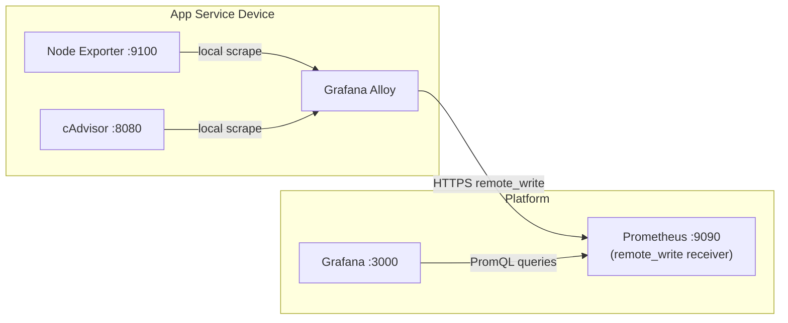

*Series: Building a self-hosted observability stack from scratch*

---

You just shipped something. It's running in production — a VPS, a cheap cloud box, maybe a few containers on a Hetzner instance. And you have no idea what it's actually doing.

Is memory climbing? Is that container silently restarting? Is the disk going to fill up at 3am?

This post walks you through assembling a complete metrics collection stack on a single machine using Docker Compose. No cloud vendor lock-in, no per-seat pricing, no managed service. Just four containers, a config file, and full visibility into your infrastructure.

By the end you'll have:

- **Grafana Alloy** collecting metrics from your host and containers
- **Prometheus** storing them
- **Node Exporter** exposing host metrics (CPU, memory, disk, network)
- **cAdvisor** exposing container metrics
- **Grafana** visualising everything with dashboards

---

## Why this stack

There are hosted options — Grafana Cloud, Datadog, New Relic. They're good products. They're also $X/month per host, with per-metric pricing that surprises you at invoice time.

For a solo founder or small team, this stack runs on a $6/month VPS and you own all the data. The tradeoff is that you manage it. That's what this series is for.

**Grafana Alloy** is the piece worth explaining. It replaced Grafana Agent in 2024 as the unified collector for the Grafana ecosystem. One binary that can scrape Prometheus targets, collect logs (Loki), and receive traces (Tempo). It's the connective tissue of the entire observability stack — in Part 1 we use it for metrics, but the same Alloy instance will handle logs and traces in later parts without adding new infrastructure.





---

## Prerequisites

- Docker and Docker Compose installed
- A Linux host (bare metal or VPS)
- `systemd` available (Node Exporter runs as a host service, not in Docker)
- Ports 3000, 9090, 9100, 8080 available locally

---

## Project structure

Each service gets its own directory and `docker-compose.yml`. They communicate over a shared Docker bridge network called `monitoring` — created by the Alloy compose project and joined as `external` by everything else. Node Exporter is the exception: it runs as a systemd binary on the host, and Alloy reaches it via `host.docker.internal`.

```
~/.iac-toolbox/
├── grafana-alloy/
│   ├── docker-compose.yml
│   └── config.alloy
├── prometheus/
│   ├── docker-compose.yml
│   ├── prometheus.yml
│   └── recording_rules.yml
├── cadvisor/
│   └── docker-compose.yml
└── grafana/
    ├── docker-compose.yml
    └── provisioning/
        └── datasources/
            └── prometheus.yml
```

---

## Node Exporter — on the host, not in Docker

Before the Docker services, install Node Exporter as a systemd binary. Running it inside a container — even with `pid: host` and host path mounts — gives subtly wrong readings because process metrics are still scoped to the container namespace. On the host you get accurate numbers.

Download and install the binary, auto-detecting architecture for ARM64 (Raspberry Pi), AMD64, or ARMv7:

```bash
ARCH=$(uname -m)
case $ARCH in
  aarch64) NE_ARCH="arm64" ;;
  x86_64)  NE_ARCH="amd64" ;;
  *)       NE_ARCH="armv7" ;;
esac

VERSION="1.8.1"
curl -L "https://github.com/prometheus/node_exporter/releases/download/v${VERSION}/node_exporter-${VERSION}.linux-${NE_ARCH}.tar.gz" \
  -o /tmp/node_exporter.tar.gz

tar -xzf /tmp/node_exporter.tar.gz -C /tmp
sudo cp /tmp/node_exporter-${VERSION}.linux-${NE_ARCH}/node_exporter /usr/local/bin/
sudo chmod 755 /usr/local/bin/node_exporter
```

Create the systemd unit at `/etc/systemd/system/node_exporter.service`:

```ini
[Unit]
Description=Prometheus Node Exporter
After=network-online.target
Wants=network-online.target

[Service]
Type=simple
User=pi
ExecStart=/usr/local/bin/node_exporter --web.listen-address=:9100
Restart=always
RestartSec=5s

[Install]
WantedBy=multi-user.target
```

Enable and start it:

```bash
sudo systemctl daemon-reload
sudo systemctl enable --now node_exporter

# Verify it's up
curl -s http://localhost:9100/metrics | head -5
```

Node Exporter is now running on port `9100` on the host. Alloy will reach it from inside Docker via `host.docker.internal:9100`.

---

## The Docker Compose stack

Each service has its own compose file. They all join a shared `monitoring` Docker network — Alloy creates it, the others reference it as `external`.

**Grafana Alloy** (`~/.iac-toolbox/grafana-alloy/docker-compose.yml`):

```yaml
services:
  grafana-alloy:
    image: grafana/alloy:v1.2.1
    container_name: grafana-alloy
    restart: always
    ports:
      - "12345:12345"   # Alloy UI — pipeline graph and component health
    volumes:
      - ./config.alloy:/etc/alloy/config.alloy
    networks:
      - monitoring
    command:
      - run
      - "--server.http.listen-addr=0.0.0.0:12345"
      - "--storage.path=/var/lib/alloy/data"
      - "/etc/alloy/config.alloy"
    extra_hosts:
      - "host.docker.internal:host-gateway"   # lets Alloy reach Node Exporter on the host

networks:
  monitoring:
    name: monitoring
    driver: bridge   # Alloy owns this network
```

**Prometheus** (`~/.iac-toolbox/prometheus/docker-compose.yml`):

```yaml
services:
  prometheus:
    image: prom/prometheus:latest
    container_name: prometheus
    restart: unless-stopped
    ports:
      - "9090:9090"
    volumes:
      - ./prometheus.yml:/etc/prometheus/prometheus.yml:ro
      - ./recording_rules.yml:/etc/prometheus/recording_rules.yml:ro
      - prometheus_data:/prometheus
    command:
      - '--config.file=/etc/prometheus/prometheus.yml'
      - '--storage.tsdb.retention.time=15d'
      - '--storage.tsdb.path=/prometheus'
      - '--web.console.libraries=/usr/share/prometheus/console_libraries'
      - '--web.console.templates=/usr/share/prometheus/consoles'
      - '--web.enable-remote-write-receiver'   # accepts push from Alloy
    networks:
      - monitoring

volumes:
  prometheus_data:

networks:
  monitoring:
    name: monitoring
    external: true   # lifecycle owned by grafana-alloy compose project
```

**cAdvisor** (`~/.iac-toolbox/cadvisor/docker-compose.yml`):

```yaml
services:
  cadvisor:
    image: gcr.io/cadvisor/cadvisor:v0.49.1
    container_name: cadvisor
    restart: always
    privileged: true                      # required for cgroup access
    devices:
      - /dev/kmsg                         # kernel message buffer — needed for OOM detection
    ports:
      - "127.0.0.1:8080:8080"            # localhost only — Alloy reaches it via the network
    volumes:
      - /:/rootfs:ro
      - /var/run:/var/run:ro
      - /sys:/sys:ro
      - /var/lib/docker/:/var/lib/docker:ro
      - /dev/disk/:/dev/disk:ro
    networks:
      - monitoring

networks:
  monitoring:
    external: true
```

**Grafana** (`~/.iac-toolbox/grafana/docker-compose.yml`):

```yaml
services:
  grafana:
    image: grafana/grafana:latest
    container_name: grafana
    restart: unless-stopped
    ports:
      - "3000:3000"
    volumes:
      - grafana_data:/var/lib/grafana
      - ./provisioning:/etc/grafana/provisioning:ro   # auto-provisions datasources
    environment:
      - GF_SECURITY_ADMIN_USER=admin
      - GF_SECURITY_ADMIN_PASSWORD=changeme            # change this
      - GF_SERVER_ROOT_URL=http://localhost:3000
    networks:
      - monitoring

volumes:
  grafana_data:

networks:
  monitoring:
    name: monitoring
    driver: bridge
```

A few things worth noting:

`extra_hosts: host.docker.internal:host-gateway` on Alloy is what lets a container resolve the host machine's IP. Without it, `host.docker.internal` won't resolve inside Linux containers (unlike Docker Desktop on Mac, where it's built in). `privileged: true` on cAdvisor is required to access cgroup data for container metrics, and `/dev/kmsg` is the kernel message buffer — cAdvisor needs it for accurate OOM event detection, and you'll see log warnings without it.

The key Prometheus flag is `--web.enable-remote-write-receiver`. This is what accepts incoming pushes from Alloy at `/api/v1/write`. Without it, Prometheus rejects Alloy's metric payloads silently and you get an empty TSDB.

---

## Configuring Grafana Alloy

Alloy uses its own HCL-like configuration language called River. It reads cleaner than YAML for pipeline definitions. Create `~/.iac-toolbox/grafana-alloy/config.alloy`:

```hcl
// ── Scrape Node Exporter (running on the host as systemd) ────────────────
prometheus.scrape "node_exporter" {
  targets = [{
    __address__ = "host.docker.internal:9100",   // host service, not a container
    instance    = "my-server",                   // shown as host selector in dashboards
    job         = "node_exporter",
  }]
  scrape_interval = "15s"
  forward_to      = [prometheus.relabel.node_exporter_compat.receiver]
}

// ── Scrape cAdvisor (on the monitoring Docker network) ───────────────────
prometheus.scrape "cadvisor" {
  targets = [{
    __address__ = "cadvisor:8080",   // reachable by container name on the network
    instance    = "my-server",
    job         = "cadvisor",
  }]
  scrape_interval = "15s"
  forward_to      = [prometheus.remote_write.platform.receiver]
}

// ── Relabel pass-through (add macOS metric renames here if needed) ────────
// On Linux this block is a no-op — metrics pass through unchanged.
// On macOS, Node Exporter uses different memory metric names than Linux.
// Add rename rules here to map them to the Linux names that dashboard 1860 expects.
prometheus.relabel "node_exporter_compat" {
  forward_to = [prometheus.remote_write.platform.receiver]
}

// ── Push to Prometheus via remote_write ──────────────────────────────────
prometheus.remote_write "platform" {
  endpoint {
    url = "http://prometheus:9090/api/v1/write"
  }
}
```

This is Alloy's pipeline model: scrape targets → optional relabel → remote_write to Prometheus. The `instance` label on each scrape target is what ties metrics to a specific host in Grafana dashboards — it becomes the host dropdown in Node Exporter Full (dashboard 1860). Set it to your hostname or a meaningful identifier.

In later parts, you'll add `loki.write` and `otelcol.receiver` blocks to the same file for logs and traces without touching anything else. The Alloy UI at `http://localhost:12345` shows the live pipeline graph with each component's health — useful for debugging why a target isn't being scraped.

---

## Configuring Prometheus

Prometheus needs to know where to store data and how long to keep it. The scraping of app services is handled by Alloy (push model), so this config is minimal — Prometheus only scrapes itself. Create `~/.iac-toolbox/prometheus/prometheus.yml`:

```yaml
global:
  scrape_interval: 15s
  evaluation_interval: 15s

rule_files:
  - /etc/prometheus/recording_rules.yml   # recording rules for dashboard compatibility

# App service devices push metrics via Grafana Alloy remote_write.
# No static_configs for app services needed — they push via Alloy.
scrape_configs:
  - job_name: 'prometheus'
    static_configs:
      - targets: ['localhost:9090']
```

The `rule_files` entry points to a recording rules file. Create `~/.iac-toolbox/prometheus/recording_rules.yml`:

```yaml
groups:
  - name: compat_rules
    interval: 15s
    rules:
      # Node Exporter on macOS exposes swap_used_bytes but not swap_free_bytes.
      # The Node Exporter Full dashboard needs SwapFree to compute SWAP Used %.
      # This recording rule derives it from the two available metrics.
      # On Linux this rule evaluates to zero (no-op) — harmless to keep.
      - record: node_memory_SwapFree_bytes
        expr: node_memory_SwapTotal_bytes - node_memory_swap_used_bytes
```

In Part 2, Terraform generates alert rule files and mounts them here alongside this file. The path is already wired so Part 2 requires no changes to this config.

---

## Starting the stack

Order matters because of the shared `monitoring` network — Alloy creates it, so it goes first:

```bash
# 1. Start Alloy (creates the monitoring network)
cd ~/.iac-toolbox/grafana-alloy && docker compose up -d

# 2. Start Prometheus (joins the network)
cd ~/.iac-toolbox/prometheus && docker compose up -d

# 3. Start cAdvisor (joins the network)
cd ~/.iac-toolbox/cadvisor && docker compose up -d

# 4. Start Grafana (joins the network)
cd ~/.iac-toolbox/grafana && docker compose up -d

# Check all containers are running
docker ps --format "table {{.Names}}\t{{.Status}}"

# Tail logs if something looks wrong
docker logs -f grafana-alloy
docker logs -f prometheus
```

Verify metrics are flowing end-to-end:

```bash
# Prometheus health check
curl http://localhost:9090/-/healthy

# Node Exporter on the host
curl -s http://localhost:9100/metrics | grep node_cpu_seconds_total | head -3

# Query Prometheus — should return data if Alloy's remote_write is working
curl -s 'http://localhost:9090/api/v1/query?query=node_cpu_seconds_total' \
  | jq '.data.result | length'
```

If that last query returns `0`, open the Alloy UI at `http://localhost:12345` — it shows a pipeline graph with the health of each component. A red `prometheus.remote_write` block means Prometheus is unreachable; a red `prometheus.scrape` block means Alloy can't reach that target.

To verify Prometheus is receiving remote_write pushes specifically:

```bash
curl -s 'http://localhost:9090/api/v1/query?query=prometheus_remote_storage_samples_in_total' \
  | jq '.data.result[0].value[1]'
```

A non-zero value confirms Alloy is successfully pushing metrics.

---

## Setting up Grafana

Open `http://localhost:3000` and log in with `admin` / `changeme`.

**The Prometheus datasource is already wired up.** Grafana reads `provisioning/datasources/prometheus.yml` at startup and creates it automatically. The provisioning file at `~/.iac-toolbox/grafana/provisioning/datasources/prometheus.yml`:

```yaml
apiVersion: 1
datasources:
  - name: Prometheus
    type: prometheus
    url: http://prometheus:9090   # container name — Grafana is on the monitoring network
    isDefault: true
    access: proxy
    editable: false
```

No need to click through Settings → Data sources. If you visit that page you'll see Prometheus is already there with a green "Data source is working" status.

**Import community dashboards:**

Rather than building dashboards from scratch, import the standard community ones:

| Dashboard | ID | What it shows |
|---|---|---|
| Node Exporter Full | `1860` | CPU, memory, disk, network per host |
| Docker Container Metrics | `193` | Per-container CPU, memory, restarts |
| Prometheus Stats | `3662` | Prometheus itself — useful for monitoring your monitoring |

Dashboards → Import → enter the ID → select your Prometheus data source → Import.

You can also import via the API to automate this step:

```bash
# Fetch the dashboard JSON from Grafana.com and import it
DASHBOARD_JSON=$(curl -s https://grafana.com/api/dashboards/1860 | jq '.json')

curl -s -X POST http://localhost:3000/api/dashboards/import \
  -u admin:changeme \
  -H 'Content-Type: application/json' \
  -d "{
    \"dashboard\": $DASHBOARD_JSON,
    \"overwrite\": true,
    \"inputs\": [{
      \"name\": \"DS_PROMETHEUS\",
      \"type\": \"datasource\",
      \"pluginId\": \"prometheus\",
      \"value\": \"Prometheus\"
    }]
  }"
```

---

## What you can see now

Once the dashboards are imported, you have visibility into:

**Host level (Node Exporter)**
- CPU usage and load average per core
- Memory usage, available memory, swap
- Disk usage and I/O per mount point and device
- Network traffic, errors, and drops per interface
- System load and running processes

**Container level (cAdvisor)**
- CPU usage per container
- Memory usage vs limit per container
- Container restart count
- Network I/O per container
- Disk I/O per container

This is your baseline. Everything has a number. When something breaks, you'll be able to look back and see exactly when metrics started deviating.

---

## A note on data retention

`--storage.tsdb.retention.time=30d` keeps 30 days of metrics. For a single host, expect roughly 1-2GB of storage for that window depending on scrape frequency and metric cardinality. If disk space is tight, drop to `15d`. If you want longer history, consider Thanos or Grafana Mimir — but that's well beyond the scope of this series.

---

## What's next

You now have full visibility into your infrastructure. The next question is: **who finds out when something goes wrong?**

Part 2 covers building the alerting layer on top of these metrics — Prometheus alert rules, Alertmanager routing, and wiring it all to on-call notification. The entire alerting configuration is managed with Terraform, including configurable thresholds per environment.

The rule_files path you saw in prometheus.yml is already waiting for it.

---

## The full series

| Part | Topic | Status |
|---|---|---|
| 1 | Collecting metrics — Alloy, Prometheus, Node Exporter, cAdvisor, Grafana | ✅ This post |
| 2 | Alerting layer — Prometheus rules, Alertmanager, PagerDuty via Terraform | Coming soon |
| 3 | Logs — Loki + Alloy | Planned |
| 4 | Traces — Tempo + OpenTelemetry via Alloy | Planned |
| 5 | SLOs — infrastructure SLOs with Sloth, burn rate alerts | Planned |

---

*All configs from this post are available at [github.com/iac-toolbox](https://github.com/iac-toolbox).*
