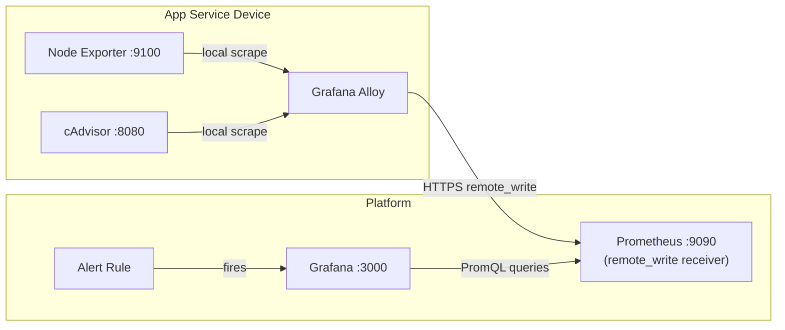
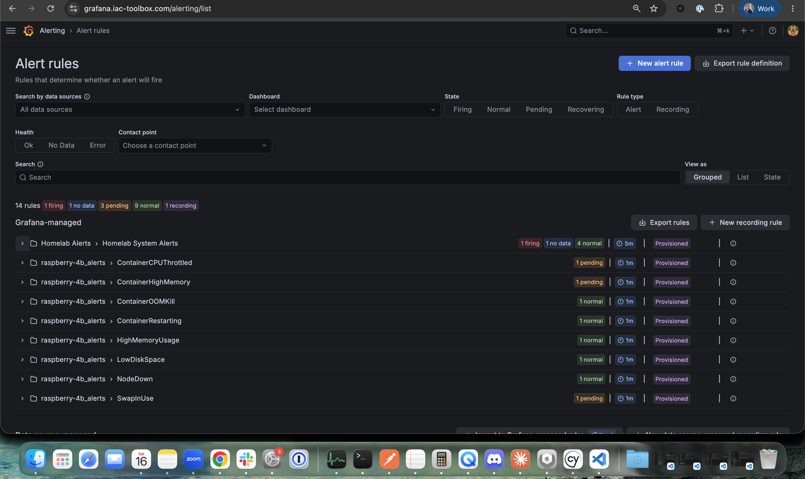
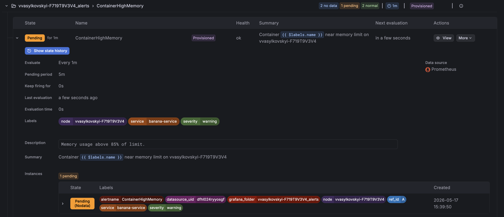

*Series: Building a self-hosted observability stack from scratch*

---

You have metrics flowing from Part 1. Grafana Alloy is scraping Node Exporter and cAdvisor, Prometheus is storing everything, Grafana is displaying it. The next natural question is: **how do you make something happen when those metrics look wrong?**

There is no human being looking at the metrics constantly. We will define alert rules - the conditions that say "this host is unhealthy" — and provision them against Grafana.

One thing to say upfront: alerts per se are not action taken. They are **firing and visible in Grafana's alert state view, but nothing will page you**. The rules evaluate, the state turns red, and that's where it stops. It is a completely passive system. Yet it is an important first step.

Routing those firing alerts to an engineer that will take action is a separate concern covered later.


### What we are Building

We are essentially extending our metrics observability system by adding alert rules as you can see below.



It might feel like a simple addition from infrastructure point of view, but defining what alerts matter is not an easy task, and is different for each business. For instance, the businesses with millions of users cannot afford having a single alert for CPU usage that applies to all services — what is acceptable for one service might be critical for another. In here we will try to cover the basic alerts that supposedly apply to most of the systems and cover the most obvious failure scenarios.

## The minimal viable alert set per service - Metrics

Before writing a single rule, it's worth understanding the two fundamentally different alerting philosophies - because they answer different questions and belong at different stages of your observability maturity.

### Threshold alerts

These fire when a raw metric crosses a known boundary. Disk over 90%, memory over 95%, container restarting twice in five minutes. They are fast, specific, and actionable. They answer: "something looks wrong on this machine, go check." This is what this post covers.

### SLO burn rate alerts

These fire when your error budget is being consumed too quickly, regardless of the underlying cause. They don't care that disk is at 91% — they care that users are experiencing errors at a rate that will exhaust your reliability budget within a given window. They answer: "users are being impacted right now."

For simplicity, we will cover only threshold alerts. We will start with the ones below. They cover the most common real incidents without generating noise:

**For any host (using Node Exporter):**

| Alert | Signal | Severity |
|---|---|---|
| `NodeDown` | Host unreachable for 2+ minutes | critical |
| `LowDiskSpace` | Disk over 90% — failure imminent | critical |
| `SwapInUse` | Memory exhausted, spilling to disk | warning |
| `HighMemoryUsage` | Memory over 95% | critical |

**For any host running containers (using cAdvisor):**

| Alert | Signal | Severity |
|---|---|---|
| `ContainerOOMKill` | A container was killed — data may be lost | critical |
| `ContainerRestarting` | Service in a crash loop | critical |
| `ContainerHighMemory` | Container near its memory limit | warning |
| `ContainerCPUThrottled` | Latency degradation in progress | warning |

We intentionally skip the CPU and temperature alerts for now. They are valuable but tend to generate noise until thresholds are tuned for the specific workload. Once the baseline is stable we will revisit and add them later.

## Provisioning the alerts

Now that we have established the minimal viable alert set, we can move on to provisioning them using Terraform.

## Terraform vs vanilla PromQL — tradeoffs

Before writing rules with terraform, it is worth mention that in Grafana and Prometheus ecosystem, the terraform has never been a first-class citizen. We will see how the terraform rules are verbose and hard to read through - a product of having a system not designed to fire alerts via terraform in the first place. The alternative that might come to attention is to define prometheus alerts using vanilla PromQL.

**This post uses Terraform throughout.** The reasons: thresholds as variables means staging and production can share the same rules with different values, Terraform's state management means `plan` shows you exactly what will change before you apply, and it fits naturally into a codebase where the rest of the infrastructure is already Terraform.

To address the grafana alerts verbosity problem, we will build the `threshold_alert` module. Each alert call site will be optimised for ease of reading and adjustment.

There is yet another alternative which is to create alert via grafana UI, but those are [ClickOps](https://blog.equinix.com/blog/2022/12/01/what-is-clickops-and-how-can-you-prevent-it/), so we will avoid them.

---

## Node labels vs service labels — who owns what

Before writing rules, it is worth being explicit about the two kinds of identifying labels that appear on alerts, because they have different owners and different purposes.

**Node labels** identify the physical or virtual host — the machine running the workload. They are attached to Node Exporter metrics by Alloy at scrape time and are the same across every service that happens to run on that host. A label like `node="raspberry-pi"` means: this alert fired on that specific machine. Node-level alerts — disk full, memory exhausted, host unreachable — are owned by the **platform team**. The platform team provisions the nodes, manages the OS, and is responsible for the health of the underlying infrastructure regardless of what application is running on top.

**Service labels** identify the application — the container or logical workload. They are attached by the development team that owns the service, because only that team knows its name, its environment, and what thresholds make sense for it. A label like `service="payments-api"` means: this alert is about that specific application, not just the node it happens to live on. Container-level alerts — OOM kills, crash loops, memory pressure — are owned by the **development team** that ships the service.

This distinction matters when alerts start routing. A `NodeDown` alert should wake up the on-call platform engineer. A `ContainerOOMKill` for `payments-api` should wake up the payments team. The labels are what make that routing possible.

In practice this maps cleanly onto Terraform ownership: node alert modules are defined in platform infrastructure repositories, service alert modules are defined alongside each service's own Terraform. Both use the same `threshold_alert` module — only the labels differ.

For node-level alerts the platform team sets the `node` label explicitly — they know exactly which host they are targeting. For container-level alerts the development team should not need to know or hardcode the host name. Instead, Terraform infers it at apply time using the `external` data source, reading the hostname of the machine where `terraform apply` runs and exposing it as `local.node_name`. This keeps the service Terraform free of any host-specific knowledge while still producing a correct `node` label on every alert.

The `threshold_alert` module is extended with two new optional variables to carry these labels:

```hcl
# modules/threshold_alert/main.tf

variable "name"           { type = string }
variable "folder_uid"     { type = string }
variable "datasource_uid" { type = string }
variable "expr"           { type = string }
variable "threshold"      { type = number }
variable "comparator"     { type = string; default = "gt" }
variable "for"            { type = string; default = "5m" }
variable "severity"       { type = string; default = "critical" }
variable "summary"        { type = string }
variable "description"    { type = string; default = "" }
variable "no_data_state"  { type = string; default = "NoData" }
variable "node"           { type = string; default = "" }   # set by platform for host-level alerts
variable "service"        { type = string; default = "" }   # set by dev teams for container-level alerts

locals {
  base_labels = { severity = var.severity }
  node_label    = var.node    != "" ? { node    = var.node    } : {}
  service_label = var.service != "" ? { service = var.service } : {}
  labels = merge(local.base_labels, local.node_label, local.service_label)
}

resource "grafana_rule_group" "this" {
  name             = var.name
  folder_uid       = var.folder_uid
  interval_seconds = 60

  rule {
    name      = var.name
    condition = "C"

    data {
      ref_id         = "A"
      relative_time_range { from = 600; to = 0 }
      datasource_uid = var.datasource_uid
      model = jsonencode({ expr = var.expr, refId = "A" })
    }

    data {
      ref_id         = "B"
      datasource_uid = "__expr__"
      relative_time_range { from = 0; to = 0 }
      model = jsonencode({ type = "reduce", refId = "B", expression = "A", reducer = "last" })
    }

    data {
      ref_id         = "C"
      datasource_uid = "__expr__"
      relative_time_range { from = 0; to = 0 }
      model = jsonencode({
        type       = "threshold"
        refId      = "C"
        expression = "B"
        conditions = [{ evaluator = { params = [var.threshold], type = var.comparator }, type = "query" }]
      })
    }

    no_data_state  = var.no_data_state
    exec_err_state = "Alerting"
    for            = var.for

    labels      = local.labels
    annotations = {
      summary     = var.summary
      description = var.description
    }
  }
}
```

---

## Wiring alerts into Grafana via Terraform

### Project structure

```
terraform/
├── main.tf                    # Providers, Grafana folder, alert rules
├── variables.tf
├── terraform.tfvars           # gitignored
└── terraform.tfvars.example
```

No separate rules files — all alert definitions live as Terraform module calls in `main.tf`.

### Providers

We have already configured grafana and prometheus using ansible scripts and docker containers. In this terraform provider, we just have to reference them using the right data sources, grafana url, login and password.

```hcl
terraform {
  required_version = ">= 1.0"
  required_providers {
    grafana = {
      source  = "grafana/grafana"
      version = "~> 3.0"
    }
  }
}

provider "grafana" {
  url  = var.grafana_url
  auth = "${var.grafana_admin_user}:${var.grafana_admin_password}"
}

# Reference the shared Prometheus datasource provisioned in Part 1
data "grafana_data_source" "prometheus" {
  name = "Prometheus"
}

# Infer the node name from the machine running terraform apply.
# Falls back to the NODE_NAME environment variable when set — useful in CI
# where apply runs on a different machine than the monitored host.
data "external" "node_name" {
  program = ["bash", "-c", "echo \"{\\\"name\\\": \\\"${NODE_NAME:-$(hostname)}\\\"}\""]
}

locals {
  node_name = data.external.node_name.result.name
}

```

Grafana works by placing all alerts into a folder. I find it handy to organise alerts by folders, so generally I create a folder per device and service like follows:

```hcl
resource "grafana_folder" "node_alerts" {
  title = "${local.node_name}"
}

resource "grafana_folder" "container_alerts" {
  title = "${var.service_name}"
}
```

### Alert rules — `grafana_rule_group` approach

In Grafana, the `grafana_rule_group` terraform resource is the one to use for alerts. Grafana's alert engine is a general-purpose pipeline, not a purpose-built threshold checker. Hence, it builds alert in three stages:

- Query - fetches the data from the datasource
- Reduce - processes the data to a single value
- Threshold - compares the value against a threshold

So in code it looks like:

```sh
# A — query Prometheus, get a time series
data {
  ref_id = "A"
  model  = jsonencode({ expr = "100 - (avg by(instance) (irate(node_cpu_seconds_total{mode=\"idle\"}[5m])) * 100)" })
}

# B — reduce time series to a single number
data {
  ref_id = "B"
  model  = jsonencode({ type = "reduce", expression = "A", reducer = "last" })
}

# C — compare that number to a threshold
data {
  ref_id = "C"
  model  = jsonencode({ type = "threshold", expression = "B", conditions = [{ evaluator = { params = [90], type = "gt" }}]})
}
```

To keep call sites readable, wrap the boilerplate in a local `threshold_alert` module that we will define:

```hcl
# modules/threshold_alert/main.tf

variable "name"           { type = string }
variable "folder_uid"     { type = string }
variable "datasource_uid" { type = string }
variable "expr"           { type = string }
variable "threshold"      { type = number }
variable "comparator"     { type = string; default = "gt" }
variable "for"            { type = string; default = "5m" }
variable "severity"       { type = string; default = "critical" }
variable "summary"        { type = string }
variable "description"    { type = string; default = "" }
variable "no_data_state"  { type = string; default = "NoData" }
variable "node"           { type = string; default = "" }   # set by platform for host-level alerts
variable "service"        { type = string; default = "" }   # set by dev teams for container-level alerts

locals {
  base_labels = { severity = var.severity }
  node_label    = var.node    != "" ? { node    = var.node    } : {}
  service_label = var.service != "" ? { service = var.service } : {}
  labels = merge(local.base_labels, local.node_label, local.service_label)
}

resource "grafana_rule_group" "this" {
  name             = var.name
  folder_uid       = var.folder_uid
  interval_seconds = 60

  rule {
    name      = var.name
    condition = "C"

    data {
      ref_id         = "A"
      relative_time_range { from = 600; to = 0 }
      datasource_uid = var.datasource_uid
      model = jsonencode({ expr = var.expr, refId = "A" })
    }

    data {
      ref_id         = "B"
      datasource_uid = "__expr__"
      relative_time_range { from = 0; to = 0 }
      model = jsonencode({ type = "reduce", refId = "B", expression = "A", reducer = "last" })
    }

    data {
      ref_id         = "C"
      datasource_uid = "__expr__"
      relative_time_range { from = 0; to = 0 }
      model = jsonencode({
        type       = "threshold"
        refId      = "C"
        expression = "B"
        conditions = [{ evaluator = { params = [var.threshold], type = var.comparator }, type = "query" }]
      })
    }

    no_data_state  = var.no_data_state
    exec_err_state = "Alerting"
    for            = var.for

    labels      = local.labels
    annotations = {
      summary     = var.summary
      description = var.description
    }
  }
}
```

With this module, each alert call site looks like:

```hcl
# Node-level alerts — provisioned by the platform team.
# The `node` label identifies the host; no `service` label is set here.

module "alert_node_down" {
  source         = "./modules/threshold_alert"
  name           = "NodeDown"
  folder_uid     = grafana_folder.node_alerts.uid
  datasource_uid = data.grafana_data_source.prometheus.uid
  expr           = "up{job=\"node_exporter\",instance=\"${local.node_name}\"}"
  threshold      = 1
  comparator     = "lt"
  for            = "2m"
  severity       = "critical"
  no_data_state  = "Alerting"
  node           = local.node_name
  summary        = "Host ${local.node_name} is offline"
  description    = "No scrape data for more than 2 minutes."
}

module "alert_low_disk" {
  source         = "./modules/threshold_alert"
  name           = "LowDiskSpace"
  folder_uid     = grafana_folder.node_alerts.uid
  datasource_uid = data.grafana_data_source.prometheus.uid
  expr           = "(1 - (node_filesystem_avail_bytes{instance=\"${local.node_name}\",fstype!~\"tmpfs|overlay\",mountpoint=\"/\"} / node_filesystem_size_bytes{instance=\"${local.node_name}\",fstype!~\"tmpfs|overlay\",mountpoint=\"/\"})) * 100"
  threshold      = var.disk_critical_threshold
  for            = "5m"
  severity       = "critical"
  node           = local.node_name
  summary        = "Low disk space on ${local.node_name}"
  description    = "Root filesystem above ${var.disk_critical_threshold}%."
}

module "alert_high_memory" {
  source         = "./modules/threshold_alert"
  name           = "HighMemoryUsage"
  folder_uid     = grafana_folder.node_alerts.uid
  datasource_uid = data.grafana_data_source.prometheus.uid
  expr           = "(1 - (node_memory_MemAvailable_bytes{instance=\"${local.node_name}\"} / node_memory_MemTotal_bytes{instance=\"${local.node_name}\"})) * 100"
  threshold      = var.memory_critical_threshold
  for            = "5m"
  severity       = "critical"
  node           = local.node_name
  summary        = "High memory on ${local.node_name}"
  description    = "Memory above ${var.memory_critical_threshold}%."
}

module "alert_swap_in_use" {
  source         = "./modules/threshold_alert"
  name           = "SwapInUse"
  folder_uid     = grafana_folder.node_alerts.uid
  datasource_uid = data.grafana_data_source.prometheus.uid
  expr           = "node_memory_SwapUsed_bytes{instance=\"${local.node_name}\"}"
  threshold      = 0
  for            = "5m"
  severity       = "warning"
  node           = local.node_name
  summary        = "Swap in use on ${local.node_name}"
  description    = "Physical memory may be exhausted."
}
```

### Container alerts

Container alerts use cAdvisor metrics and follow the same module pattern:

```hcl
# Container-level alerts — provisioned by the development team that owns the service.
# The `service` label identifies the application; `node` is inferred at apply time
# so the team does not need to know or hardcode the host name.

module "alert_container_restarting" {
  source         = "./modules/threshold_alert"
  name           = "ContainerRestarting"
  folder_uid     = grafana_folder.container_alerts.uid
  datasource_uid = data.grafana_data_source.prometheus.uid
  expr           = "increase(container_start_time_seconds{name=\"${var.service_name}\",instance=\"${local.node_name}\"}[5m])"
  threshold      = 2
  for            = "1m"
  severity       = "critical"
  node           = local.node_name
  service        = var.service_name
  summary        = "Container ${var.service_name} is restarting on ${local.node_name}"
  description    = "Container has restarted more than twice in 5 minutes — likely in a crash loop."
}

module "alert_container_oom" {
  source         = "./modules/threshold_alert"
  name           = "ContainerOOMKill"
  folder_uid     = grafana_folder.container_alerts.uid
  datasource_uid = data.grafana_data_source.prometheus.uid
  expr           = "increase(container_oom_events_total{name=\"${var.service_name}\",instance=\"${local.node_name}\"}[5m])"
  threshold      = 0
  for            = "0s"
  no_data_state  = "NoData"
  severity       = "critical"
  node           = local.node_name
  service        = var.service_name
  summary        = "Container ${var.service_name} was OOM killed on ${local.node_name}"
  description    = "The kernel OOM killer terminated this container. Memory limit may be too low."
}

module "alert_container_high_memory" {
  source         = "./modules/threshold_alert"
  name           = "ContainerHighMemory"
  folder_uid     = grafana_folder.container_alerts.uid
  datasource_uid = data.grafana_data_source.prometheus.uid
  expr           = "(container_memory_usage_bytes{name=\"${var.service_name}\",instance=\"${local.node_name}\"} / container_spec_memory_limit_bytes{name=\"${var.service_name}\",instance=\"${local.node_name}\"}) * 100 and container_spec_memory_limit_bytes{name=\"${var.service_name}\",instance=\"${local.node_name}\"} > 0"
  threshold      = 85
  for            = "5m"
  severity       = "warning"
  node           = local.node_name
  service        = var.service_name
  summary        = "Container ${var.service_name} near memory limit on ${local.node_name}"
  description    = "Memory usage above 85% of limit."
}

module "alert_container_cpu_throttled" {
  source         = "./modules/threshold_alert"
  name           = "ContainerCPUThrottled"
  folder_uid     = grafana_folder.container_alerts.uid
  datasource_uid = data.grafana_data_source.prometheus.uid
  expr           = "rate(container_cpu_cfs_throttled_seconds_total{name=\"${var.service_name}\",instance=\"${local.node_name}\"}[5m]) / rate(container_cpu_usage_seconds_total{name=\"${var.service_name}\",instance=\"${local.node_name}\"}[5m]) * 100 and rate(container_cpu_usage_seconds_total{name=\"${var.service_name}\",instance=\"${local.node_name}\"} [5m]) > 0"
  threshold      = 25
  for            = "10m"
  severity       = "warning"
  node           = local.node_name
  service        = var.service_name
  summary        = "Container ${var.service_name} CPU-throttled on ${local.node_name}"
  description    = "More than 25% of CPU time is being throttled."
}
```

---


## Variables

`variables.tf` — thresholds are service-specific. A batch processing host and a web server might share the same alert names but use very different thresholds:

```hcl
variable "grafana_url" { type = string }
variable "grafana_admin_user" { type = string; default = "admin" }
variable "grafana_admin_password" { type = string; sensitive = true }

variable "service_name" { type = string }   # e.g. "payments-api", "my-service"

variable "memory_critical_threshold" { type = number; default = 95 }
variable "cpu_critical_threshold"    { type = number; default = 90 }
variable "disk_critical_threshold"   { type = number; default = 90 }
```

`terraform.tfvars.example`:

```hcl
grafana_url            = "http://localhost:3000"
grafana_admin_user     = "admin"
grafana_admin_password = "changeme"

service_name           = "my-service"

# Pi-specific thresholds — tighter than a server because less headroom
memory_critical_threshold = 90
cpu_critical_threshold    = 85
disk_critical_threshold   = 85
```

---

## Applying service alerts and node alerts

Notice we are provisioning alerts per service and per nodes separately, as in practice there can be arbitrary number of services running on nodes.


```bash
cp terraform.tfvars.example terraform.tfvars
terraform init
terraform apply
```

## Verify Alerts in Grafana UI

Open your browser and navigate to your Grafana instance and log in with your credentials

```
https://grafana.iac-toolbox.com
```

### Navigate to Alert Rules

1. Click the **Alerting** icon (bell) in the left sidebar
2. Select **Alert rules** from the menu
3. You should see the **my_service_alerts** folder

Click into the folder to see all 5 alert rules:



### Verify Service and Node labels

Expand an alert rule to see which label it applies to:




## Conclusion
You now have a working alert layer on top of your metrics stack. Grafana is evaluating rules on a 60-second cycle, and any rule that crosses its threshold - a disk filling up, a container crash-looping, memory exhausted - transitions through Normal → Pending → Firing and becomes visible in the alert rules view.

This is a meaningful step. Now Grafana knows about it the moment it crosses 90%. The information exists. It's accurate. It's timestamped.
But it's still passive. Nothing leaves Grafana. No one gets woken up. The alert fires into a UI that nobody is watching.
That's the gap the next post closes.

## What's next

A firing alert is only useful if it reaches someone who can act on it, and yes, it can also be automated. That is what we will cover in the next post. We'll provision the PagerDuty service, configure Grafana contact points, and define the notification policy that routes a firing alert — based on its severity label — to the right person.

Continue reading in [Making Alerts Actionable - Wiring the Alerting Platform with PagerDuty](./observability-vertical-03-alerts-into-pagerduty)
