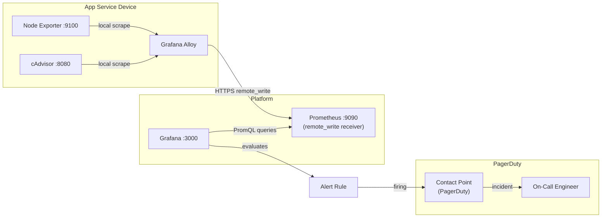
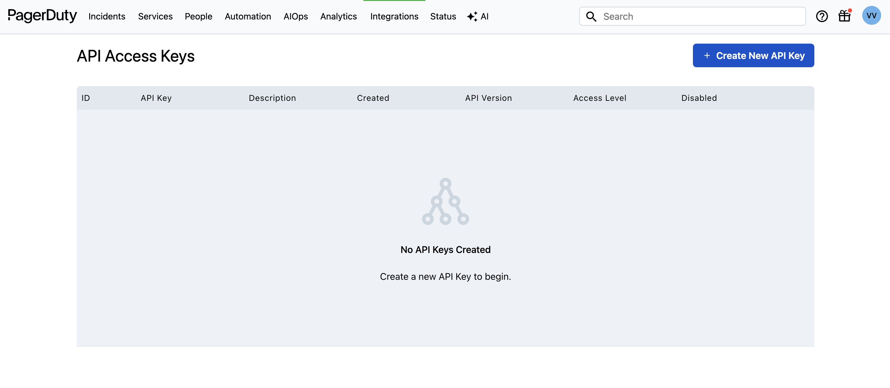
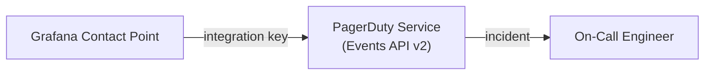
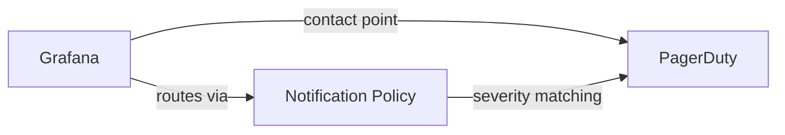
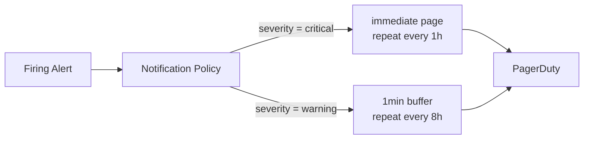
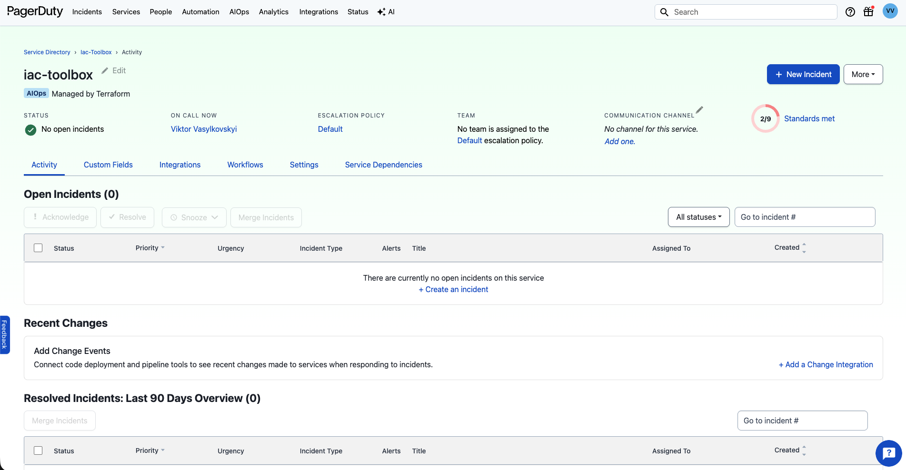

*Series: Building a self-hosted observability stack from scratch*

---

In [Observability Vertical Part 2 - Service Alert Provisioning](./observability-vertical-02-service-alerts) we defined alert rules and provisioned them against Grafana. Here, we are going to move beyond that and ensure that firing alerts actually reach someone who can act on them.

That is the gap this post closes.

A firing alert on its own is just a state change in a database. Without routing infrastructure, it sits there until someone happens to open Grafana. This post wires the exit: PagerDuty service, Grafana contact points, and notification policy — the plumbing that takes a firing alert and turns it into a notification - page (PagerDuty) to the right person on call.

The naive approach is to use Grafana's built-in email notifications, however they are quickly limitating due to their inherent hard limits. Email doesn't wake anyone up at 3am, and there is no incident lifecycle - it fires and forgets. With PagerDuty the phone calls and push notifications that break through do-not-disturb, then acknowledgement tracking comes in handy to track the incident lifecycle. There are also other free featuers such as escalation policies that page the next person automatically if nobody responds. For a solo founder the rotation and escalation features are overkill — but the phone notification and incident lifecycle tracking are valuable from day one. And the free tier covers everything in this post. The free tier covers everything in this post.

This layer is owned by whoever runs the observability platform. It is provisioned once and rarely touched. Conversely, what we built in [Observability Vertical Part 2 - Service Alert Provisioning](./observability-vertical-02-service-alerts), is owned by service teams, who writes alert rules labelled with a severity, and the platform handles the rest.

---

## What we are Building

In this step we are going to add PagerDuty integration into Grafana. [PagerDuty](https://www.pagerduty.com/) is a popular incident management platform that allows you to route alerts to the right on-call engineer. To keep it simple, in my project, there is only one team, and one person on call, so me, so whenever critical alert fires, we will wire it into notification to myself.

Note that this is a first integration that we are going to add that is not open source, it is a hosted SaaS with a free version that we are going to demo here.



For this to work, we need to connect grafana alerts with pagerduty on call policy, which translates in:

  - Enable Grafana to Pagerduty Integration via API key
  - Configure Grafana notification policy to use PagerDuty contact point
  - Configure PagerDuty service and escalation policy (who gets paged and in what order)

## Enable Grafana to Pagerduty Integration via API key

Before running any Terraform, we are need a PagerDuty account and an API token.

Let's head to [pagerduty.com](https://www.pagerduty.com/) and create an account. Then navigate to:

**Integrations → API Access Keys → Create API Key** to get your `pagerduty_token`.




---

## Providers

Now we have the API key, we can start provisioning with terraform. First things first - provider:

```hcl
# main.tf

terraform {
  required_version = ">= 1.0"
  required_providers {
    grafana = {
      source  = "grafana/grafana"
      version = "~> 3.0"
    }
    pagerduty = {
      source  = "PagerDuty/pagerduty"
      version = "~> 3.0"
    }
  }
}

provider "grafana" {
  url  = var.grafana_url
  auth = "${var.grafana_admin_user}:${var.grafana_admin_password}"
}

provider "pagerduty" {
  token          = var.pagerduty_token
  service_region = var.pagerduty_service_region
}

locals {
  pagerduty_enabled = var.pagerduty_token != ""
}
```

Also the variables:

```tf
# variables.tf

variable "pagerduty_token" {
  type        = string
  description = "PagerDuty API token"
}

variable "pagerduty_service_region" {
  type        = string
  description = "PagerDuty service region"
  default     = "eu" # Default US region. Supported value: us.
}
```

I am using eu service region because I am based in Europe. My pagerduty URL look like this: `https://<company_name>.eu.pagerduty.com/`. If you don't have `eu` then you may be in `us`.

---

## Connecting Grafana to PagerDuty

Now we have two services, time to make them work together. There are couple of steps here:

1. Establish integration between Grafana and PagerDuty
2. Configure contact point from Grafana to PagerDuty
3. Configure Grafana notification policy to use PagerDuty contact point

````mermaid
graph LR
    AR["Alert Rule\n(firing)"] -->|triggers| NP["Notification Policy\n(severity routing)"]
    NP -->|critical / warning| CP["Grafana Contact Point"]
    subgraph "PagerDuty"
        PS["PagerDuty Service\n(Events API v2)"]
        EP["Escalation Policy"]
        OC["On-Call Engineer"]
    end
    CP -->|integration key| PS
    PS --> EP
    EP -->|incident| OC
````


### Establish Integration between Grafana and PagerDuty



When a alert is critical enough that it has to flow into PagerDuty, it goes through [Events API v2 API](https://developer.pagerduty.com/docs/events-api-v2-overview). For that to happen, we need to generate an integration key. Conveniently it can be done using terraform. Let's create Pagerduty Terraform Module:

```hcl
# modules/pagerduty/main.tf
# Events API v2 integration — supports severity-based deduplication in PagerDuty
resource "pagerduty_service_integration" "grafana" {
  name    = "Grafana"
  service = var.service
  type    = "events_api_v2_inbound_integration"
}

output "integration_key" {
  value     = pagerduty_service_integration.grafana.integration_key
  sensitive = true
}
```

The above code outputs the integration key. Remember the `var.service` from [Observability Vertical Part 2 - Service Alert Provisioning](./observability-vertical-02-service-alerts)? We want to ensure that alerts carry over the service label, so that we can then route the alert into the right Pagerduty service.

In PagerDuty, incidents are always assigned to a service - it's the organisational unit that owns the problem. When a critical alert fires, an incident is created on that service, and whoever is on-call for it gets notified.


### Configure Contact Point from Grafana to PagerDuty




Now we can use the integration key for our contact point. Contact point defines how Grafana sends notifications to external systems like PagerDuty.

```hcl
resource "grafana_contact_point" "pagerduty" {
  name  = "PagerDuty On-Call"
  pagerduty {
    integration_key = module.pagerduty[0].integration_key
    severity        = "critical"
    # Go template — renders the firing alert names directly in the PagerDuty incident title
    summary = "{{ len .Alerts.Firing }} alert(s) on {{ (index .Alerts.Firing 0).Labels.node }}{{ if (index .Alerts.Firing 0).Labels.service }} [{{ (index .Alerts.Firing 0).Labels.service }}]{{ end }}: {{ range .Alerts.Firing }}{{ .Annotations.summary }}; {{ end }}"
  }
  lifecycle {
    create_before_destroy = true
  }
}
```

The `severity=critical` setting ensures that only critical alerts trigger PagerDuty incidents, reducing noise from less important alerts. Remember our critical alerts are the ones that signal either device/node down, container restarting, or either approaching resources limit like RAM and Disk Space.


The `summary` field is the message that Grafana will send to PagerDuty. The Go template renders the firing alert names directly in the PagerDuty incident title, immediately telling you what's wrong. Examples:

```sh
1 alert(s) on raspberrypi-4b: Host raspberrypi-4b is offline;
2 alert(s) on raspberrypi-4b: Low disk space on raspberrypi-4b; High memory on raspberrypi-4b;
3 alert(s) on raspberrypi-4b: Container my-app is restarting on raspberrypi-4b; Container my-app was OOM killed on raspberrypi-4b; ...
```

The alerts are grouped by the node and service name based on notification policy below.

### Configure Grafana notification policy to use PagerDuty contact point

This is the core of the rules/policy of the platform. Here we define the routing logic that every alert rule in the system flows through.



Remember from the [Observability Vertical Part 2 - Service Alert Provisioning](./observability-vertical-02-service-alerts), we have the following alerts:


| Alert | PromQL Signal | For | Severity |
|---|---|---|---|
| `NodeDown` | `up{job="node"}` drops below 1 | 2m | critical |
| `HighMemoryUsage` | available memory falls below threshold % | 5m | critical |
| `SwapInUse` | `node_memory_SwapUsed_bytes` above 0 | 5m | warning |
| `LowDiskSpace` | root filesystem usage exceeds threshold % | 5m | critical |
| `HighCPUUsage` | average CPU idle drops below threshold % | 5m | warning |
| `HighCPUTemperature` | `node_hwmon_temp_celsius` exceeds 75°C | 5m | critical |
| `ContainerRestarting` | container start count increases more than 2 times in 5m | 1m | critical |
| `ContainerOOMKill` | `container_oom_events_total` increments | 0s | critical |
| `ContainerHighMemory` | container memory usage exceeds 85% of its limit | 5m | warning |
| `ContainerCPUThrottled` | throttled CPU time exceeds 25% of total CPU time | 10m | warning |

So according to the policy above, all of our alerts are going to pass through the ingestion of PagerDuty. Simple.

```hcl
resource "grafana_notification_policy" "main" {
  group_by      = ["alertname", "instance", "service"]
  contact_point = grafana_contact_point.pagerduty[0].name

  # Default: buffer for 30s to group related alerts, repeat every 4h
  group_wait      = "30s"
  group_interval  = "5m"
  repeat_interval = "24h"

  # Critical — immediate page, repeats hourly until resolved
  policy {
    matcher {
      label = "severity"
      match = "="
      value = "critical"
    }
    contact_point   = grafana_contact_point.pagerduty[0].name
    group_wait      = "0s"
    repeat_interval = "24h"
  }

  # Warning — 1 minute buffer to avoid flapping, repeats every 8 hours
  policy {
    matcher {
      label = "severity"
      match = "="
      value = "warning"
    }
    contact_point = grafana_contact_point.pagerduty[0].name
    group_wait      = "1m"
    repeat_interval = "24h"
  }

  depends_on = [
    grafana_contact_point.pagerduty,
  ]
}
```

A few decisions worth understanding:

- `group_by = ["alertname", "instance", "service"]` - without `instance`, alerts from all hosts collapse into a single PagerDuty incident. With it, each host gets its own incident grouping so it's immediately clear which machine is the problem.
- `group_wait = "30s"` at the top level - when a node goes down it often triggers several alerts simultaneously (NodeDown, HighMemory, LowDisk if the disk was filling). The 30-second buffer lets them group into a single notification. The critical policy overrides this to `0s` so a node going offline pages immediately - the grouping still happens, just without the artificial delay.
- `repeat_interval` - since this is our pet project, once a day pager is enough. For more business-critical this can be adjusted to become more frequent.
---


### Service Definition

So far the the setup has been done by a platform team. It is applied once when the stack is set up and rarely touched thereafter.

Next step is to define a service that will actually use the alerting policy and escalation policy. This is the `var.service` definition from before:

```hcl
# Reference the default escalation policy
# Free plan includes one escalation policy — reference it rather than creating a new one
data "pagerduty_escalation_policy" "default" {
  name = "Default"
}

resource "pagerduty_service" "my_service" {
  name = var.service_name
  # Note: avoid spaces in the service name — spaces cause routing issues where
  # alert messages fail to match the PagerDuty service correctly

  auto_resolve_timeout    = 172800  # auto-resolve after 48 hours if no further data arrives
  acknowledgement_timeout = 86400    # re-alert after 24 minutes if acknowledged but not resolved

  # These two timeouts reduce alert fatigue and ensure no incident is silently ignored.
  # Without auto_resolve_timeout, a stale incident from a transient blip stays open indefinitely.
  # Without acknowledgement_timeout, an engineer can acknowledge and forget.

  escalation_policy = data.pagerduty_escalation_policy.default.id
  alert_creation    = "create_alerts_and_incidents"
}
```

The escalation policy attached to the service answers two questions: who gets paged, and what happens if they don't respond? It defines an ordered sequence of users or teams to notify, with configurable delays between each step. On the free plan PagerDuty gives you one escalation policy, so rather than creating one we reference the existing default using a data source.

`alert_creation` controls how PagerDuty handles incoming events from the integration. We want to create alerts and incidents in pagerduty.

## Putting it all together

Throughout this post we have provisioned pieces in isolation. Here is how they connect:

The integration key is the binding pin. It is generated by `pagerduty_service_integration`, which is bound to `pagerduty_service.my_service`. Every event Grafana pushes using that key lands on that specific service, which then applies its escalation policy to decide who gets paged.

Here is the complete Terraform that wires all four pieces together in one place:

```hcl

# ── PagerDuty ─────────────────────────────────────────────────────────────

# Reference the default escalation policy
data "pagerduty_escalation_policy" "default" {
  name = "Default"
}

# The service — all incidents land here
resource "pagerduty_service" "my_service" {
  name                    = var.service_name
  escalation_policy       = data.pagerduty_escalation_policy.default.id
  alert_creation          = "create_alerts_and_incidents"
  auto_resolve_timeout    = 172800  # 48 hours
  acknowledgement_timeout = 86400   # 24 hours
}

# The integration — binds Grafana to the service and produces the key
resource "pagerduty_service_integration" "grafana" {
  name    = "Grafana"
  service = pagerduty_service.my_service.id          # ← bound to the service above
  type    = "events_api_v2_inbound_integration"
}

# ── Grafana ───────────────────────────────────────────────────────────────

# Contact point — uses the integration key to push events into PagerDuty
resource "grafana_contact_point" "pagerduty" {
  name = "PagerDuty On-Call"

  pagerduty {
    integration_key = pagerduty_service_integration.grafana.integration_key  # ← from above
    severity        = "critical"
    summary         = "{{ len .Alerts.Firing }} alert(s): {{ range .Alerts.Firing }}{{ .Labels.alertname }} {{ end }}"
  }

  lifecycle {
    create_before_destroy = true
  }
}

# Notification policy — routes firing alerts to the contact point by severity
resource "grafana_notification_policy" "main" {
  group_by      = ["alertname", "instance"]
  contact_point = grafana_contact_point.pagerduty.name  # ← from above

  group_wait      = "30s"
  group_interval  = "5m"
  repeat_interval = "24h"

  # Critical — immediate page
  policy {
    matcher {
      label = "severity"
      match = "="
      value = "critical"
    }
    contact_point   = grafana_contact_point.pagerduty.name
    group_wait      = "0s"
    repeat_interval = "24h"
  }

  # Warning — buffered, less frequent
  policy {
    matcher {
      label = "severity"
      match = "="
      value = "warning"
    }
    group_wait      = "1m"
    repeat_interval = "24h"
  }

  depends_on = [grafana_contact_point.pagerduty]
}
```

### Making Pagerduty Module

To make abstract the complexity of integrations, we can make a module:

```hcl
variable "service" {
  type        = string
  description = "PagerDuty service ID to attach the integration to"
}

# Events API v2 integration — supports severity-based deduplication in PagerDuty
resource "pagerduty_service_integration" "grafana" {
  name    = "Grafana"
  service = var.service
  type    = "events_api_v2_inbound_integration"
}

output "integration_key" {
  value     = pagerduty_service_integration.grafana.integration_key
  sensitive = true
}
```

### Service Definition Consuming Module

And then the service is left to build the definition only:

```hcl
data "pagerduty_escalation_policy" "default" {
  name = "Default"
}

resource "pagerduty_service" "my_service" {
  name                    = var.service_name
  escalation_policy       = data.pagerduty_escalation_policy.default.id
  alert_creation          = "create_alerts_and_incidents"
  auto_resolve_timeout    = 172800
  acknowledgement_timeout = 86400
}

module "pagerduty" {
  source  = "./modules/pagerduty"
  service = pagerduty_service.my_service.id
}
```

### Grafana Contact Policy

The grafana will forward the alerts to the PagerDuty integration using the integration key provided by the module.

```hcl
# Contact point — uses the integration key produced by the module
resource "grafana_contact_point" "pagerduty" {
  name = "PagerDuty On-Call"

  pagerduty {
    integration_key = module.pagerduty.integration_key  # ← output from the module
    severity        = "critical"
    summary         = "{{ len .Alerts.Firing }} alert(s): {{ range .Alerts.Firing }}{{ .Labels.alertname }} {{ end }}"
  }

  lifecycle {
    create_before_destroy = true
  }
}

# Notification policy — routes firing alerts to the contact point
resource "grafana_notification_policy" "main" {
  group_by      = ["alertname", "instance"]
  contact_point = grafana_contact_point.pagerduty.name  # ← name of the contact point above

  group_wait      = "30s"
  group_interval  = "5m"
  repeat_interval = "24h"

  policy {
    matcher {
      label = "severity"
      match = "="
      value = "critical"
    }
    contact_point   = grafana_contact_point.pagerduty.name
    group_wait      = "0s"
    repeat_interval = "24h"
  }

  policy {
    matcher {
      label = "severity"
      match = "="
      value = "warning"
    }
    group_wait      = "1m"
    repeat_interval = "24h"
  }

  depends_on = [grafana_contact_point.pagerduty]
}
```

So the full dependency chain in one view:

```sh
pagerduty_service.infra.id
        ↓
module "pagerduty" (produces integration_key)
        ↓
grafana_contact_point.pagerduty (consumes integration_key)
        ↓
grafana_notification_policy.main (consumes contact_point.name)
```

### Testing

Check that the Service has been created


