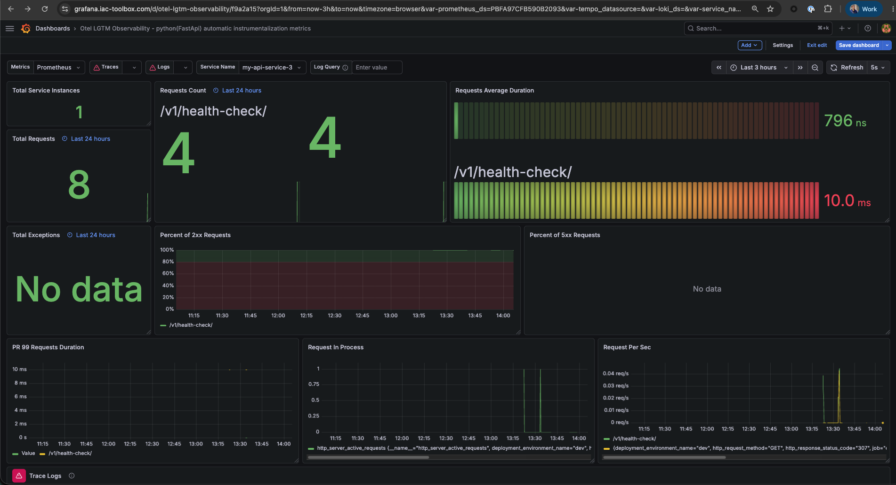
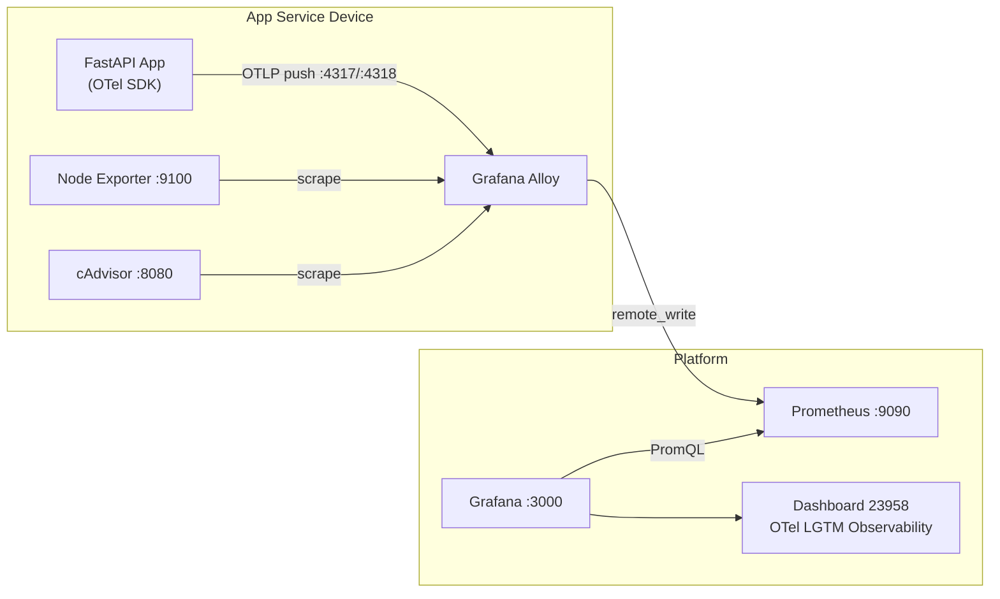

*Series: Building a self-hosted observability stack from scratch*

---

Parts 1 through 3 gave you full visibility into your infrastructure and a working alert pipeline that pages you when something goes wrong. You can see when a host is low on disk, when a container is crash-looping, and when Grafana decides to wake you up about it via PagerDuty.

But there is a gap. Everything you are observing is infrastructure. You know the container is running. You do not know what the application inside it is actually doing.

Is it returning 500s? Are p99 latencies climbing? Is one endpoint responsible for all the errors? Node Exporter and cAdvisor cannot answer those questions — they see processes and cgroups, not HTTP requests.

This post closes that gap. We will instrument a FastAPI application with the OpenTelemetry SDK, configure Alloy to receive the telemetry it pushes, and import a community Grafana dashboard that visualises request rate, error rate, and latency percentiles broken down by endpoint and status code.

By the end you will have application-level observability sitting alongside the infrastructure observability from the earlier parts — same Alloy instance, same Prometheus, same Grafana.




---

## What is OpenTelemetry and why use it

[OpenTelemetry (OTel)](https://opentelemetry.io/) is an open-source observability framework maintained by the Cloud Native Computing Foundation (CNCF). It provides a single, vendor-neutral SDK for collecting three types of telemetry signals from your application: metrics, logs, and traces. Before OTel, every observability vendor shipped its own agent and its own SDK — you were effectively locked in at the instrumentation layer. If you wanted to switch from Datadog to Grafana, you had to re-instrument your application. OTel solves this by standardising how telemetry is collected and exported, decoupling instrumentation from the backend you send it to.

For this stack, OTel is the right choice for two specific reasons. First, the Python FastAPI SDK includes auto-instrumentation — you add a few lines of setup code and it automatically captures every HTTP request without touching your route handlers. Second, OTel defines OTLP (the OpenTelemetry Protocol), a standard transport that Grafana Alloy already speaks natively. That means the telemetry your application emits flows into the same Alloy pipeline you already built for infrastructure metrics, without adding any new infrastructure components.

The result is a coherent observability stack where one collector (Alloy), one TSDB (Prometheus), and one dashboard tool (Grafana) cover both your hosts and your application code.

---

## What we are building

The infrastructure stack from Parts 1 and 2 used a pull model: Alloy scraped Node Exporter and cAdvisor on a fixed interval. Application metrics use a push model: the application itself pushes telemetry to Alloy whenever something happens. This is OpenTelemetry's preferred transport — OTLP, the OpenTelemetry Protocol.



Three things change from the previous parts:

1. **Alloy** gets an OTLP receiver — two new ports, two new config blocks
2. **The application** gets OTel auto-instrumentation — a few lines of Python
3. **Grafana** gets a new dashboard — community ID 23958, imported the same way as the Node Exporter dashboard in Part 1

Nothing else in the stack changes. The same Prometheus stores everything. The same Grafana displays it.

---

## Prerequisites

- Parts 1 and 2 complete — Alloy, Prometheus, and Grafana are running
- A Python FastAPI application (or any OTel-compatible service — the Alloy and Prometheus changes are language-agnostic)
- Docker and Docker Compose

---

## Step 1 — Add an OTLP receiver to Alloy

Alloy currently scrapes two targets. Adding an OTLP receiver means Alloy also listens on two ports and accepts incoming telemetry pushes.

### defaults/main.yml (if using Ansible)

If you are managing Alloy through the Ansible role from the iac-toolbox, add these two defaults:

```yaml
# OTLP receiver ports — used by instrumented services to push telemetry
otlp_grpc_port: 4317   # gRPC endpoint (preferred for performance)
otlp_http_port: 4318   # HTTP/Protobuf endpoint (easier to test with curl)
```

### docker-compose.yml

Expose the two OTLP ports alongside the existing Alloy UI port:

```yaml
services:
  grafana-alloy:
    image: grafana/alloy:v1.2.1
    container_name: grafana-alloy
    restart: always
    ports:
      - "12345:12345"   # Alloy UI
      - "4317:4317"     # OTLP gRPC
      - "4318:4318"     # OTLP HTTP
    volumes:
      - ./config.alloy:/etc/alloy/config.alloy
    networks:
      - monitoring
    command:
      - run
      - "--server.http.listen-addr=0.0.0.0:12345"
      - "--storage.path=/var/lib/alloy/data"
      - "/etc/alloy/config.alloy"
    extra_hosts:
      - "host.docker.internal:host-gateway"

networks:
  monitoring:
    name: monitoring
    driver: bridge
```

### config.alloy

Append two new blocks to the existing config file after the `prometheus.relabel` block. The first block opens the OTLP listener. The second converts incoming OTel metrics to Prometheus format and hands them off to the existing `remote_write` pipeline you already have from Part 1.

```hcl
// ── OTLP receiver: accept telemetry from instrumented services ───────────────
// Apps push metrics via OTel SDK using:
//   endpoint = "http://<alloy-host>:4317"  (gRPC)
//   endpoint = "http://<alloy-host>:4318"  (HTTP)
otelcol.receiver.otlp "default" {
  grpc {
    endpoint = "0.0.0.0:4317"
  }
  http {
    endpoint = "0.0.0.0:4318"
  }

  output {
    // Forward only metrics — no Loki or Tempo configured yet
    metrics = [otelcol.exporter.prometheus.default.input]
  }
}

// Convert OTel metric format to Prometheus and push to the existing remote_write
// resource_to_telemetry_conversion copies resource attributes (including service.name)
// onto every metric as a Prometheus label — without it, service_name won't appear
// on the metrics and dashboard filtering by service will not work.
otelcol.exporter.prometheus "default" {
  forward_to                       = [prometheus.remote_write.platform.receiver]
  resource_to_telemetry_conversion = true
}
```

The full `config.alloy` now looks like this — the top half is unchanged from Part 1, the OTLP blocks are new at the bottom:

```hcl
// ── Scrape Node Exporter ─────────────────────────────────────────────────────
prometheus.scrape "node_exporter" {
  targets = [{
    __address__ = "host.docker.internal:9100",
    instance    = "my-server",
    job         = "node_exporter",
  }]
  scrape_interval = "15s"
  forward_to      = [prometheus.relabel.node_exporter_compat.receiver]
}

// ── Scrape cAdvisor ──────────────────────────────────────────────────────────
prometheus.scrape "cadvisor" {
  targets = [{
    __address__ = "cadvisor:8080",
    instance    = "my-server",
    job         = "cadvisor",
  }]
  scrape_interval = "15s"
  forward_to      = [prometheus.remote_write.platform.receiver]
}

// ── Relabel pass-through ─────────────────────────────────────────────────────
prometheus.relabel "node_exporter_compat" {
  forward_to = [prometheus.remote_write.platform.receiver]
}

// ── Push to Prometheus ───────────────────────────────────────────────────────
prometheus.remote_write "platform" {
  endpoint {
    url = "http://prometheus:9090/api/v1/write"
  }
}

// ── OTLP receiver ────────────────────────────────────────────────────────────
otelcol.receiver.otlp "default" {
  grpc {
    endpoint = "0.0.0.0:4317"
  }
  http {
    endpoint = "0.0.0.0:4318"
  }
  output {
    metrics = [otelcol.exporter.prometheus.default.input]
  }
}

// ── OTel → Prometheus conversion ─────────────────────────────────────────────
otelcol.exporter.prometheus "default" {
  forward_to                       = [prometheus.remote_write.platform.receiver]
  resource_to_telemetry_conversion = true
}
```

Redeploy Alloy to pick up the new config and ports:

```bash
cd ~/.iac-toolbox/grafana-alloy && docker compose up -d --force-recreate
```

Verify the OTLP HTTP endpoint is live:

```bash
curl -v http://localhost:4318/v1/metrics \
  -H "Content-Type: application/json" \
  -d '{"resourceMetrics": []}'
# Expected: 200 OK (not connection refused)
```

A `200` response confirms the endpoint is up. An empty payload is valid — Alloy accepts it and returns immediately.

---

## Step 2 — Instrument the application

The OTel Python SDK has an auto-instrumentation package for FastAPI that requires no changes to your application logic. It hooks into the ASGI middleware layer and records every incoming request as a metric.

### Install the packages

```bash
pip install \
  opentelemetry-sdk \
  opentelemetry-exporter-otlp-proto-grpc \
  opentelemetry-instrumentation-fastapi \
  opentelemetry-instrumentation-httpx  # optional: instrument outbound HTTP calls too
```

### Instrument your application

Add the following block at the top of your application entry point, before the FastAPI app is created:

```python
from opentelemetry import metrics
from opentelemetry.sdk.metrics import MeterProvider
from opentelemetry.sdk.metrics.export import PeriodicExportingMetricReader
from opentelemetry.exporter.otlp.proto.grpc.metric_exporter import OTLPMetricExporter
from opentelemetry.sdk.resources import Resource
from opentelemetry.instrumentation.fastapi import FastAPIInstrumentor

# The service name is the label that scopes all your alerts and dashboards.
# Must match OTEL_SERVICE_NAME if you set it via environment variable.
resource = Resource(attributes={"service.name": "my-api"})

exporter = OTLPMetricExporter(
    endpoint="http://alloy-host:4317",  # replace with your Alloy host
    insecure=True,
)

reader = PeriodicExportingMetricReader(exporter, export_interval_millis=15_000)
provider = MeterProvider(resource=resource, metric_readers=[reader])
metrics.set_meter_provider(provider)

# Auto-instrument FastAPI — hooks into ASGI middleware, no route changes needed
app = FastAPI()
FastAPIInstrumentor.instrument_app(app)
```

That is the entire instrumentation. No manual metric recording, no decorators on route handlers. The auto-instrumentation emits one histogram per request — `http.server.request.duration` — labelled with the method, route, and status code.

### Configuring the endpoint via environment variables

Hard-coding the Alloy host in your application code is fine for local development, but in production you will want to inject it at runtime. The OTel SDK respects the standard environment variables:

```bash
OTEL_SERVICE_NAME=my-api
OTEL_EXPORTER_OTLP_ENDPOINT=http://alloy-host:4317
OTEL_EXPORTER_OTLP_INSECURE=true
```

When these are set you can simplify the instrumentation to:

```python
from opentelemetry.sdk.metrics import MeterProvider
from opentelemetry.sdk.metrics.export import PeriodicExportingMetricReader
from opentelemetry.exporter.otlp.proto.grpc.metric_exporter import OTLPMetricExporter
from opentelemetry import metrics
from opentelemetry.instrumentation.fastapi import FastAPIInstrumentor

# SDK reads OTEL_EXPORTER_OTLP_ENDPOINT and OTEL_SERVICE_NAME from the environment
reader = PeriodicExportingMetricReader(OTLPMetricExporter())
metrics.set_meter_provider(MeterProvider(metric_readers=[reader]))

app = FastAPI()
FastAPIInstrumentor.instrument_app(app)
```

In Docker Compose, set the variables in the service definition:

```yaml
services:
  my-api:
    image: my-api:latest
    environment:
      - OTEL_SERVICE_NAME=my-api
      - OTEL_EXPORTER_OTLP_ENDPOINT=http://grafana-alloy:4317
      - OTEL_EXPORTER_OTLP_INSECURE=true
    networks:
      - monitoring   # must be on the same network as Alloy
```

The service name `my-api` is what ties everything together downstream: it becomes the `service_name` label in Prometheus, the host selector in the dashboard, and the scope for alert rules in Part 5.

---

## A note on metric names

When Alloy converts OTel metrics to Prometheus format, it follows the OTel semantic conventions for naming. The translation is mechanical and worth knowing before you write any PromQL:

| OTel name | Prometheus name after Alloy conversion |
|---|---|
| `http.server.request.duration` | `http_server_request_duration_seconds` |
| `http.response.status_code` label | `http_response_status_code` label |
| `service.name` label | `service_name` label |
| `http.request.method` label | `http_request_method` label |
| `url.scheme` label | `url_scheme` label |

Dots become underscores. The `_seconds` suffix is appended to duration histograms automatically because OTel histograms carry a unit (`s`) that Alloy preserves. If you write PromQL against these metrics directly — for dashboards or alert rules — use the Prometheus names, not the OTel names.

---

## Step 3 — Verify metrics are arriving in Prometheus

Before importing a dashboard, confirm the pipeline is working end-to-end.

Make a few requests to your application, then query Prometheus directly:

```bash
# Check the histogram metric exists
curl -s 'http://localhost:9090/api/v1/query?query=http_server_request_duration_seconds_count' \
  | jq '.data.result | length'
# Expected: a non-zero number

# Check it is scoped to your service
curl -s 'http://localhost:9090/api/v1/query?query=http_server_request_duration_seconds_count{service_name="my-api"}' \
  | jq '.data.result[0].metric'
# Expected: labels including service_name, http_response_status_code, http_request_method
```

If the first query returns `0`, open the Alloy UI at `http://localhost:12345`. Look for the `otelcol.receiver.otlp.default` component — it will show whether it is receiving data and whether the downstream exporter is healthy. A red component means something in the pipeline is broken; the component's detail view shows the error.

A quick smoke test with `curl` to confirm Alloy is receiving and forwarding:

```bash
# This pushes a minimal valid OTLP payload — enough to confirm the endpoint is live
curl -s -X POST http://localhost:4318/v1/metrics \
  -H "Content-Type: application/json" \
  -d '{
    "resourceMetrics": [{
      "resource": {
        "attributes": [{"key": "service.name", "value": {"stringValue": "smoke-test"}}]
      },
      "scopeMetrics": []
    }]
  }'
# Expected: {} with HTTP 200
```

---

## Step 4 — Import the OTel LGTM Observability dashboard

Dashboard 23958 — "OTel LGTM Observability - Python (FastAPI) automatic instrumentation metrics" — is built specifically for the auto-instrumentation conventions that the OTel FastAPI SDK emits. It visualises:

- **Request rate** — requests per second, broken down by endpoint and method
- **Error rate** — 4xx and 5xx rates over time, with status code breakdown
- **Latency percentiles** — p50, p95, p99 by endpoint
- **Active requests** — in-flight requests at any point in time

It also has placeholder panels for Loki (logs) and Tempo (traces) that will light up when those signals are added in later parts of this series. For now they show no data — that is expected.

One thing worth knowing upfront: the dashboard expects three datasources to be configured — Prometheus, Loki, and Tempo. Loki and Tempo don't exist yet. The import will still succeed and the Prometheus panels will work; the Loki and Tempo panels will show "datasource not found" until those parts of the stack are in place.

### Import via the Grafana UI

Dashboards → Import → enter `23958` → map `DS_PROMETHEUS` to your Prometheus datasource → Import. You can leave Loki and Tempo unmapped for now.

### Import via the API (automatable)

```bash
# Fetch the dashboard JSON from Grafana.com
DASHBOARD_JSON=$(curl -s https://grafana.com/api/dashboards/23958 | jq '.json')

# Import it into Grafana — Loki and Tempo inputs are provided but won't resolve yet
curl -s -X POST http://localhost:3000/api/dashboards/import \
  -u admin:changeme \
  -H 'Content-Type: application/json' \
  -d "{
    \"dashboard\": $DASHBOARD_JSON,
    \"overwrite\": true,
    \"inputs\": [
      {
        \"name\": \"DS_PROMETHEUS\",
        \"type\": \"datasource\",
        \"pluginId\": \"prometheus\",
        \"value\": \"Prometheus\"
      },
      {
        \"name\": \"DS_LOKI\",
        \"type\": \"datasource\",
        \"pluginId\": \"loki\",
        \"value\": \"Loki\"
      },
      {
        \"name\": \"DS_TEMPO\",
        \"type\": \"datasource\",
        \"pluginId\": \"tempo\",
        \"value\": \"Tempo\"
      }
    ]
  }"
```

### Import via Ansible (if using the grafana role)

Add these tasks to `roles/grafana/tasks/main.yml` after the existing dashboard import block.

Dashboard 23958 was written for an older version of the OTel Python SDK that used different metric and label names. The current SDK emits `http_server_request_duration_seconds` and `http_route`, but the dashboard queries `http_server_duration_milliseconds` and `http_target`. A patch step fixes this at import time using Ansible's `regex_replace` filter — no manual dashboard editing required.

```yaml
- name: Get OTel FastAPI dashboard JSON from Grafana.com API
  uri:
    url: "https://grafana.com/api/dashboards/23958"
    method: GET
    return_content: true
  register: fastapi_otel_dashboard_json

- name: Patch dashboard metric names for OTel Python semantic conventions
  set_fact:
    fastapi_otel_dashboard_patched: >-
      {{
        fastapi_otel_dashboard_json.json.json
        | to_json
        | regex_replace('http_server_duration_milliseconds', 'http_server_request_duration_seconds')
        | regex_replace('http_target', 'http_route')
        | regex_replace('http_server_response_size_bytes', 'http_server_response_body_size_bytes')
        | from_json
      }}

- name: Import patched FastAPI OTel dashboard
  uri:
    url: "https://{{ grafana.domain }}/api/dashboards/import"
    method: POST
    user: "{{ grafana.admin_user }}"
    password: "{{ grafana.admin_password }}"
    body_format: json
    body:
      dashboard: "{{ fastapi_otel_dashboard_patched }}"
      overwrite: true
      inputs:
        - name: "DS_PROMETHEUS"
          type: "datasource"
          pluginId: "prometheus"
          value: "Prometheus"
        - name: "DS_LOKI"
          type: "datasource"
          pluginId: "loki"
          value: "Loki"
        - name: "DS_TEMPO"
          type: "datasource"
          pluginId: "tempo"
          value: "Tempo"
    force_basic_auth: true
    status_code: 200
  register: fastapi_otel_dashboard_imported

- name: Display FastAPI OTel dashboard import message
  debug:
    msg: "FastAPI OTel dashboard imported at: https://{{ grafana.domain }}{{ fastapi_otel_dashboard_imported.json.importedUrl }}"
  when: fastapi_otel_dashboard_imported is changed
```

The three patches applied:

| Dashboard query (old) | Actual metric name (new SDK) |
|---|---|
| `http_server_duration_milliseconds` | `http_server_request_duration_seconds` |
| `http_target` | `http_route` |
| `http_server_response_size_bytes` | `http_server_response_body_size_bytes` |

The Loki and Tempo datasource inputs are included now even though those services don't exist yet — this way the import task doesn't need to change when those parts of the stack are added later. Grafana accepts unknown datasource references gracefully and just shows empty panels until the datasource is provisioned.

---

## What you can see now

Once the dashboard is imported and your application is running with instrumentation, you have application-level visibility that was not possible with infrastructure metrics alone:

**Request rate** — you can see exactly how many requests per second are hitting each endpoint. Combined with the container CPU metrics from Part 1, you now have both the load and the resource cost in the same Grafana instance.

**Error rate** — 4xx and 5xx responses are broken out by status code. A spike in `500`s is immediately visible. A sustained rate of `404`s might indicate a broken client deploy or a misconfigured API path. Neither of these would have appeared in Node Exporter or cAdvisor data.

**Latency percentiles** — p50 tells you what most users experience. p99 tells you what the worst 1% experience. An endpoint that is fast at p50 but slow at p99 is usually hitting a lock, a slow database query, or a downstream service with occasional timeouts. You can see this now.

**Per-endpoint breakdown** — the dashboard groups all of the above by URL path. If one endpoint is responsible for all your errors, it shows up immediately.

---

## The complete picture so far

```
Infrastructure metrics (Parts 1–2)        Application metrics (Part 4)
─────────────────────────────────────────────────────────────────────────
Node Exporter → Alloy → Prometheus         OTel SDK → Alloy → Prometheus
  CPU, memory, disk, network                 request rate, error rate,
  per host                                   latency percentiles, per endpoint

cAdvisor → Alloy → Prometheus
  container CPU, memory, restarts
  per container
```

Same Alloy. Same Prometheus. Same Grafana. The stack extends horizontally — each new signal type adds a receiver or a scrape target, not a new infrastructure component.

---

## A note on the OTLP ports and security

Ports 4317 and 4318 are unauthenticated. This is consistent with how Node Exporter and cAdvisor operate in this setup — both are also unauthenticated on the internal network. The assumption is that these ports are not reachable from outside your private network.

If you are running behind a Cloudflare Tunnel (as described in the iac-toolbox setup), the tunnel does not route these ports externally. Application services pushing to Alloy must be on the same Docker network (`monitoring`) or on the same host.

If you have multiple hosts, the application on Host B pushing metrics to Alloy on Host A needs network-level access to port 4317 or 4318 on Host A. In that case, constrain the port binding to your internal network interface:

```yaml
ports:
  - "10.0.0.1:4317:4317"   # bind to internal IP only, not 0.0.0.0
  - "10.0.0.1:4318:4318"
```

---

## What's next

The dashboard gives you visibility into what your application is doing. The next natural question is the same one from Part 2 for infrastructure: **how do you make something happen when those application metrics look wrong?**

Part 5 takes the HTTP status code metrics you are now collecting and defines per-service alert rules for the most actionable 4xx and 5xx codes — wired through the same PagerDuty pipeline from Part 3. A `500` rate above threshold will page you just like a node going offline does.

The same `threshold_alert` Terraform module from Part 2 handles the alert definitions. The PromQL expressions target `http_server_request_duration_seconds_count` scoped to your `service_name` label. The `for` durations are tuned per code: 2 minutes for server errors, 5 minutes for client errors that might be transient.

---

## The full series

| Part | Topic | Status |
|---|---|---|
| 1 | Collecting metrics — Alloy, Prometheus, Node Exporter, cAdvisor, Grafana | ✅ Published |
| 2 | Alerting layer — threshold alert rules, Grafana via Terraform | ✅ Published |
| 3 | Making alerts actionable — PagerDuty, contact points, notification policy | ✅ Published |
| 4 | Application metrics — OTel SDK, OTLP receiver in Alloy, OTel LGTM dashboard (ID: 23958) | ✅ This post |
| 5 | HTTP status code alerts — per-service 4xx/5xx alert rules via Terraform | Coming soon |
| 6 | Logs — Loki + Alloy | Planned |
| 7 | Traces — Tempo + OpenTelemetry via Alloy | Planned |
| 8 | SLOs — burn rate alerts with Sloth | Planned |

---

*All configs from this post are available at [github.com/iac-toolbox](https://github.com/iac-toolbox).*
