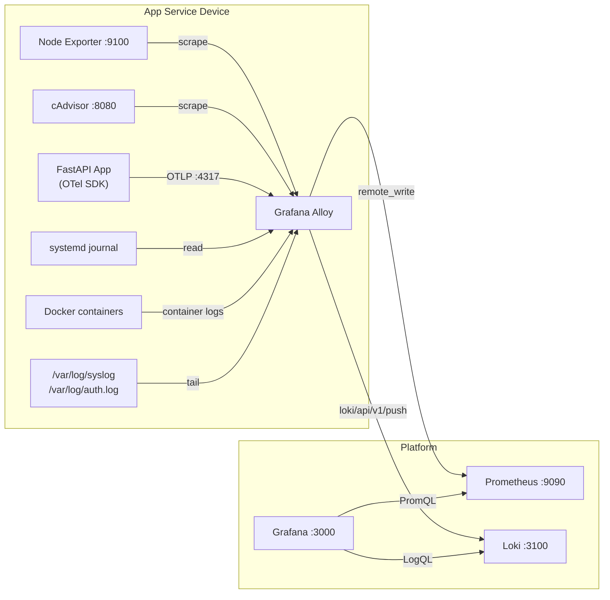

*Series: Building a self-hosted observability stack from scratch*

---

Parts 1 through 4 gave you a complete picture of your infrastructure and application performance. You know when a host is low on disk, when a container is restarting, and what your FastAPI application's request rate looks like at p99. All of that is metrics — numbers sampled at regular intervals.

But when something actually goes wrong and the alert wakes you up at 3am, the first thing you reach for is not a graph. It is the logs. What did the application actually say? What sequence of events led to the crash? Why did the container restart?

Without logs, you are looking at the symptom — the spike in error rate, the memory exhaustion — but not the cause. You have to `docker logs` into each container individually, grep through `/var/log/syslog` by hand, and piece together a timeline from multiple disconnected sources.

This post adds the third observability pillar to the stack: structured log aggregation with Loki. By the end you will have every log stream on your host — systemd journal, Docker container output, and system files — flowing into a single queryable store, visible alongside your metrics in the same Grafana instance.

---

## Why Loki

[Loki](https://grafana.com/oss/loki/) is Grafana Labs' log aggregation system, designed to be the Prometheus of logs. Where Prometheus stores metric time series, Loki stores log streams. The two share the same label model, which means correlating a spike in your error rate metric with the log lines that explain it is a first-class operation in Grafana — you click a log line and it takes you to the metrics at that timestamp, and vice versa.

Loki is deliberately not a full-text search engine. It does not index log content. Instead it indexes only the labels attached to each log stream — things like `job`, `host`, `container_name`. Queries filter by label first, then scan the matching log lines for content. This design trades query flexibility for dramatically lower storage and memory requirements compared to systems like Elasticsearch. For a self-hosted setup on a Raspberry Pi or a small VPS, that tradeoff is exactly right.

Grafana Alloy already handles the collection side. The same Alloy instance you deployed in Part 1 for metrics gains log scraping capabilities with a few new config blocks — no additional collector binary to manage.

---

## What we are building



Three things change from Part 4:

1. **Loki** — a new Docker Compose service joins the `monitoring` network
2. **Alloy** — gains log collection blocks for journal, Docker, and file sources
3. **Grafana** — gets a Loki datasource provisioned alongside the existing Prometheus datasource

The Alloy instance from Part 1 handles everything. No new collector to deploy.

---

## Prerequisites

- Parts 1 and 2 complete — Alloy, Prometheus, and Grafana are running
- Docker and Docker Compose
- `systemd` running on the host (for journal scraping)
- The host user running Alloy has permission to read `/var/log/` and the Docker socket

---

## Project structure

Loki gets its own directory under `~/.iac-toolbox/`, following the same pattern as Prometheus and Grafana:

```
~/.iac-toolbox/
├── grafana-alloy/
│   ├── docker-compose.yml
│   └── config.alloy            ← add Loki scraping blocks here
├── prometheus/
│   └── ...
├── cadvisor/
│   └── ...
├── grafana/
│   ├── docker-compose.yml
│   └── provisioning/
│       └── datasources/
│           └── datasources.yml  ← add Loki datasource here
└── loki/                        ← new
    ├── docker-compose.yml
    └── loki-config.yml
```

---

## Step 1 — Deploy Loki

Loki runs as a single Docker container in monolithic mode — one process handling ingest, querying, and compaction. This is the right mode for a single-host setup. Distributed mode (separate ingestor, querier, compactor) is for multi-host deployments processing hundreds of GB of logs per day.

### docker-compose.yml

```yaml
services:
  loki:
    image: grafana/loki:latest
    container_name: loki
    restart: unless-stopped
    ports:
      - "3100:3100"
    volumes:
      - ./loki-config.yml:/etc/loki/config.yaml:ro
      - loki_data:/loki
    command: -config.file=/etc/loki/config.yaml
    networks:
      - monitoring
    mem_limit: 512m

volumes:
  loki_data:

networks:
  monitoring:
    name: monitoring
    external: true
```

Loki joins the same `monitoring` network used by every other service. The `loki_data` volume persists the log chunks, index, and WAL across container restarts — without it, every restart loses all ingested logs.

The `mem_limit: 512m` is conservative but appropriate for a Raspberry Pi or small VPS. Loki's monolithic mode is efficient — it ingests, indexes, and stores entirely by label, so memory usage scales with the number of active log streams rather than with log volume.

### loki-config.yml

```yaml
auth_enabled: false

server:
  http_listen_port: 3100

common:
  ring:
    kvstore:
      store: inmemory
  replication_factor: 1
  path_prefix: /loki

schema_config:
  configs:
    - from: 2024-01-01
      store: tsdb
      object_store: filesystem
      schema: v13
      index:
        prefix: index_
        period: 24h

storage_config:
  tsdb_shipper:
    active_index_directory: /loki/index
    cache_location: /loki/cache
  filesystem:
    directory: /loki/chunks

ingester:
  chunk_idle_period: 5m
  chunk_retain_period: 30s
  max_chunk_age: 1h
  wal:
    dir: /loki/wal

limits_config:
  reject_old_samples: true
  reject_old_samples_max_age: 168h
  ingestion_rate_mb: 16
  ingestion_burst_size_mb: 32
  retention_period: 168h

compactor:
  working_directory: /loki/compactor
  retention_enabled: true
  retention_delete_delay: 2h
  retention_delete_worker_count: 150
  delete_request_store: filesystem
```

A few decisions worth explaining:

`auth_enabled: false` is appropriate for a private, single-tenant deployment. Enabling auth requires a tenant ID on every push and query — unnecessary complexity when only Alloy and Grafana are talking to Loki.

`schema: v13` with `store: tsdb` is the current recommended schema. TSDB is significantly more efficient than the older `boltdb-shipper` schema for both write throughput and query performance. Use it for any new deployment.

`retention_period: 168h` keeps 7 days of logs. Unlike Prometheus, Loki's retention is enforced by the compactor rather than by a TSDB setting. The compactor runs periodically (`retention_delete_delay: 2h`) and removes chunks that have aged past the retention window. For 7 days of logs on a typical host, expect roughly 500MB–2GB of storage depending on log verbosity.

`reject_old_samples: true` with `reject_old_samples_max_age: 168h` prevents Loki from accepting log lines timestamped more than 7 days in the past. Without this, a misconfigured scraper could backfill stale logs and confuse your retention accounting.

### Start Loki

```bash
cd ~/.iac-toolbox/loki && docker compose up -d

# Verify Loki is ready — returns "ready" when ingest and query are both healthy
curl http://localhost:3100/ready
```

Wait for the `ready` response before proceeding. On first start, Loki initialises the WAL and index directories — this takes a few seconds.

---

## Step 2 — Configure Alloy to collect logs

The Alloy config from Parts 1 and 4 handled metrics (Node Exporter, cAdvisor) and application telemetry (OTLP). Log collection adds six new blocks to the same `config.alloy` file.

### What Alloy will collect

Three log sources cover everything relevant on a typical host:

| Source | What it captures | Alloy component |
|---|---|---|
| systemd journal | All system services, kernel messages, SSH | `loki.source.journal` |
| Docker container logs | stdout/stderr from every container | `loki.source.docker` |
| `/var/log` files | syslog, auth.log | `loki.source.file` |

Alloy's Docker log scraping uses the Docker socket to discover and tail container logs automatically. When a new container starts, Alloy picks it up without any config change. When a container stops, Alloy stops tailing it. This is the same discovery mechanism that cAdvisor uses for metrics — dynamic, no static container list required.

### Append to config.alloy

Add the following to the end of your existing `~/.iac-toolbox/grafana-alloy/config.alloy`, after the OTLP blocks from Part 4:

```hcl
// ── Loki log collection ──────────────────────────────────────────────────────

// Scrape systemd journal
// Captures all service logs, kernel messages, and boot events
loki.source.journal "systemd" {
  max_age    = "24h"
  forward_to = [loki.write.local.receiver]
  labels = {
    job  = "systemd",
    host = constants.hostname,
  }
}

// Discover Docker containers via the Docker socket
discovery.docker "containers" {
  host = "unix:///var/run/docker.sock"
}

// Filter and relabel discovered containers
discovery.relabel "containers" {
  targets = discovery.docker.containers.targets

  // Drop infrastructure containers — we don't want Loki logging about itself
  // These containers generate high-volume internal logs that add noise without value
  rule {
    source_labels = ["__meta_docker_container_name"]
    regex         = "/(loki|alloy|grafana|prometheus|buildx.*)$"
    action        = "drop"
  }

  // Extract container name without the leading slash Docker adds
  rule {
    source_labels = ["__meta_docker_container_name"]
    regex         = "/(.*)"
    target_label  = "container_name"
  }

  // Preserve the log stream (stdout vs stderr) as a label
  rule {
    source_labels = ["__meta_docker_container_log_stream"]
    target_label  = "stream"
  }
}

// Scrape Docker container logs — only non-infrastructure containers
loki.source.docker "containers" {
  host       = "unix:///var/run/docker.sock"
  targets    = discovery.relabel.containers.output
  forward_to = [loki.process.app_logs.receiver]
  labels = {
    job  = "docker",
    host = constants.hostname,
  }
}

// Parse log levels from application logs (Python/uvicorn format)
// Adds a `level` label extracted from lines like "INFO: request complete"
loki.process "app_logs" {
  forward_to = [loki.write.local.receiver]

  stage.regex {
    expression = "^(?P<level>INFO|WARNING|ERROR|CRITICAL|DEBUG):\\s+.*"
  }

  stage.labels {
    values = {
      level = "level",
    }
  }
}

// Tail /var/log files for system-level events
local.file_match "system_logs" {
  path_targets = [
    {
      __address__ = "localhost",
      __path__    = "/var/log/syslog",
      job         = "syslog",
      host        = constants.hostname,
    },
    {
      __address__ = "localhost",
      __path__    = "/var/log/auth.log",
      job         = "auth",
      host        = constants.hostname,
    },
  ]
}

loki.source.file "system_logs" {
  targets    = local.file_match.system_logs.targets
  forward_to = [loki.write.local.receiver]
}

// Send all logs to Loki
loki.write "local" {
  endpoint {
    url = "http://loki:3100/loki/api/v1/push"
  }
}
```

`constants.hostname` is Alloy's built-in variable that resolves to the machine's hostname. It is the equivalent of setting `instance` on a Prometheus scrape target — it lets you filter logs by host in Grafana when you are running Alloy on multiple machines.

The `discovery.relabel "containers"` block deserves attention. The drop rule filters out Loki, Alloy, Grafana, and Prometheus containers from Docker log collection. These infrastructure containers generate high-volume internal logs — Alloy's own pipeline health, Prometheus scrape events, Grafana query logs — that are almost never relevant to application debugging. Excluding them keeps your log volume down and your queries fast.

The `loki.process "app_logs"` block extracts a `level` label from Python/uvicorn-style log lines. Without it, all Docker container logs land in Loki without severity information and you cannot filter to errors only. With it, you can write a LogQL query like `{job="docker"} |= level="ERROR"` to see only error-level lines across all your application containers.

If your application uses a different logging format (JSON, for example), replace the `stage.regex` block with a `stage.json` block that extracts the level field from the JSON structure.

### Redeploy Alloy

```bash
cd ~/.iac-toolbox/grafana-alloy && docker compose up -d --force-recreate

# Check Alloy parsed the config without errors
docker logs grafana-alloy 2>&1 | grep -E "level=error|level=warn" | head -20
```

Open the Alloy UI at `http://localhost:12345`. You should now see the new Loki components in the pipeline graph alongside the existing Prometheus scrape components.

---

## Step 3 — Add the Loki datasource to Grafana

Grafana reads datasource provisioning files at startup. Update `~/.iac-toolbox/grafana/provisioning/datasources/datasources.yml` to add Loki alongside the existing Prometheus entry:

```yaml
apiVersion: 1
datasources:
  - name: Prometheus
    type: prometheus
    url: http://prometheus:9090
    isDefault: true
    access: proxy
    editable: false
  - name: Loki
    type: loki
    url: http://loki:3100
    access: proxy
    editable: false
```

Both datasources reference containers by name — they are on the same `monitoring` Docker network, so DNS resolution works automatically.

Restart Grafana to apply the new datasource:

```bash
cd ~/.iac-toolbox/grafana && docker compose restart
```

Verify via the API that both datasources are healthy:

```bash
curl -s http://localhost:3000/api/datasources \
  -u admin:changeme \
  | jq '.[].name'
# Expected: "Prometheus" and "Loki"
```

---

## Step 4 — Verify logs are flowing

Before opening Grafana, confirm the pipeline end-to-end from the command line.

### Check Loki is receiving data

```bash
# Query Loki's label values endpoint — returns all active job labels
# If Alloy is pushing logs, you should see "systemd", "docker", "syslog", "auth"
curl -s 'http://localhost:3100/loki/api/v1/label/job/values' \
  | jq '.data'
```

```bash
# Fetch the last 5 systemd log lines to confirm ingest is working
curl -s -G 'http://localhost:3100/loki/api/v1/query_range' \
  --data-urlencode 'query={job="systemd"}' \
  --data-urlencode 'limit=5' \
  --data-urlencode "start=$(date -d '5 minutes ago' +%s)000000000" \
  --data-urlencode "end=$(date +%s)000000000" \
  | jq '.data.result[0].values[0][1]'
```

If either command returns empty results, check the Alloy UI at `http://localhost:12345`. Look for the `loki.write.local` component — its detail view shows whether pushes are succeeding and what error, if any, is being returned by Loki.

### Common issues

**Alloy cannot access the Docker socket**

```
msg="error creating docker client" err="permission denied while trying to connect to the Docker daemon socket"
```

Alloy's container needs access to the host Docker socket. In the docker-compose.yml for Alloy, add:

```yaml
volumes:
  - ./config.alloy:/etc/alloy/config.alloy
  - /var/run/docker.sock:/var/run/docker.sock:ro  # add this
```

**Alloy cannot read /var/log files**

Alloy's container runs as a non-root user by default. The `/var/log/auth.log` file is typically root-readable only. Either mount the log files into the container with appropriate permissions, or add `user: root` to the Alloy service definition — though running as root is worth avoiding if possible.

**Loki rejects samples with "out of order" error**

This happens when Alloy restarts and tries to push log lines with timestamps older than the last ingested line in a stream. Loki's `reject_old_samples_max_age: 168h` allows 7 days of backfill, but within a stream it enforces monotonic timestamps. Adding `max_age = "1h"` to the journal source limits how far back Alloy reads on startup.

---

## Step 5 — Exploring logs in Grafana

Open Grafana at `http://localhost:3000` and navigate to **Explore** (the compass icon in the left sidebar). Select **Loki** as the datasource.

### LogQL basics

Loki's query language is LogQL. Its structure mirrors PromQL: you always start with a label selector, then optionally filter or parse the log content.

**Find all logs from a specific container:**

```sh
{job="docker", container_name="my-api"}
```

**Find all error-level lines from any Docker container:**

```sh
{job="docker"} | label_format level="level" | level = "ERROR"
```

**Find authentication failures from auth.log:**

```sh
{job="auth"} |= "Failed password"
```

**Count error lines per minute across all Docker containers:**

```sh
sum(rate({job="docker", level="ERROR"}[1m])) by (container_name)
```

The last query returns a metric — a rate over a log stream. This is LogQL's metric query mode, and it is how you put log-derived data on a Grafana time series panel. An error rate panel powered by Loki sits naturally next to the HTTP error rate panel powered by Prometheus OTel metrics from Part 4.

### Correlating logs with metrics

Grafana's split-screen Explore view is the most useful feature for incident investigation. Open two panels side-by-side — one querying Prometheus for the error rate metric, one querying Loki for the corresponding log lines — and set both to the same time window. When the metric spikes, the logs from that exact window are one panel away.

From any Grafana dashboard panel, clicking a data point and selecting **Logs** will open an Explore panel with a pre-filtered Loki query scoped to that time window and host. This is the correlation flow that makes the Loki-Prometheus pairing significantly more useful than either system alone.

---

## What you can see now

With Loki running and Alloy configured, you have three log streams available in Grafana:

**systemd journal (`job="systemd"`)** captures every service start, stop, crash, and kernel event. When a container OOM-kills and triggers the `ContainerOOMKill` alert from Part 2, the journal contains the exact timestamp of the kernel OOM event and which process was killed. Combined with the cAdvisor memory metric that was climbing before the kill, you have the full picture without touching the host.

**Docker container logs (`job="docker"`)** surface the application's own stdout and stderr. A `500` error rate spike in the OTel dashboard from Part 4 pairs with `{job="docker", container_name="my-api", level="ERROR"}` log lines that contain the actual exception and stack trace. The `level` label extracted by the `loki.process` block means you can filter to errors specifically rather than wading through all request logs.

**System files (`job="syslog"`, `job="auth"`)** cover events that do not go through systemd or Docker — cron job output, kernel networking events, and SSH authentication. Auth log monitoring is particularly useful: `{job="auth"} |= "Failed password"` gives you a real-time view of brute-force attempts against your host.

---

## A note on log volume

Unlike metrics, log volume is not fixed. A busy application container can generate hundreds of megabytes of logs per day. Before deploying, it is worth checking what your containers are actually emitting:

```bash
# Check raw log output rate per container over the last hour
docker stats --no-stream --format "{{.Name}}: {{.BlockIO}}"
```

The `ingestion_rate_mb: 16` and `ingestion_burst_size_mb: 32` settings in `loki-config.yml` are soft rate limits per tenant. With `auth_enabled: false`, there is only one tenant, so these limits apply to total ingestion. If your containers are chatty, raise these values — or add a `stage.drop` block in `loki.process` to filter out high-volume, low-value lines before they reach Loki.

For example, to drop uvicorn health check logs that add volume without insight:

```hcl
loki.process "app_logs" {
  forward_to = [loki.write.local.receiver]

  // Drop health check endpoint logs — high volume, zero signal value
  stage.drop {
    expression = "GET /health"
    drop_counter_reason = "health_check"
  }

  stage.regex {
    expression = "^(?P<level>INFO|WARNING|ERROR|CRITICAL|DEBUG):\\s+.*"
  }

  stage.labels {
    values = { level = "level" }
  }
}
```

---

## The complete observability picture

```
Infrastructure metrics (Parts 1–2)       Application metrics (Part 4)
─────────────────────────────────────────────────────────────────────────
Node Exporter → Alloy → Prometheus        OTel SDK → Alloy → Prometheus
  CPU, memory, disk, network                request rate, error rate,
  per host                                  latency percentiles, per endpoint

cAdvisor → Alloy → Prometheus
  container CPU, memory, restarts

                        Logs (Part 5)
─────────────────────────────────────────────────────────────────────────
systemd journal → Alloy → Loki
  all service events, kernel messages

Docker containers → Alloy → Loki
  application stdout/stderr, parsed log levels

/var/log files → Alloy → Loki
  syslog, auth events
```

Same Alloy. Same Grafana. Metrics and logs correlated in a single UI. The pipeline extends without adding new infrastructure — each new signal type adds config blocks to Alloy, not new collector processes.

---

## What's next

You now have all three classic observability pillars in place: metrics, alerts, and logs. The fourth pillar — distributed traces — closes the last gap.

Metrics tell you a request was slow. Logs tell you it errored. Traces tell you *where* in the call chain the latency came from and which downstream service was responsible. Part 6 adds Tempo and OpenTelemetry trace export to the same Alloy instance you have already been building, completing the LGTM stack (Loki, Grafana, Tempo, Mimir/Prometheus).

---

## The full series

| Part | Topic | Status |
|---|---|---|
| 1 | Collecting metrics — Alloy, Prometheus, Node Exporter, cAdvisor, Grafana | ✅ Published |
| 2 | Alerting layer — threshold alert rules, Grafana via Terraform | ✅ Published |
| 3 | Making alerts actionable — PagerDuty, contact points, notification policy | ✅ Published |
| 4 | Application metrics — OTel SDK, OTLP receiver in Alloy, OTel LGTM dashboard | ✅ Published |
| 5 | Logs — Loki, Alloy journal/Docker/file collection, LogQL | ✅ This post |
| 6 | Traces — Tempo + OpenTelemetry via Alloy | Planned |
| 7 | SLOs — burn rate alerts with Sloth | Planned |

---

*All configs from this post are available at [github.com/iac-toolbox](https://github.com/iac-toolbox).*
