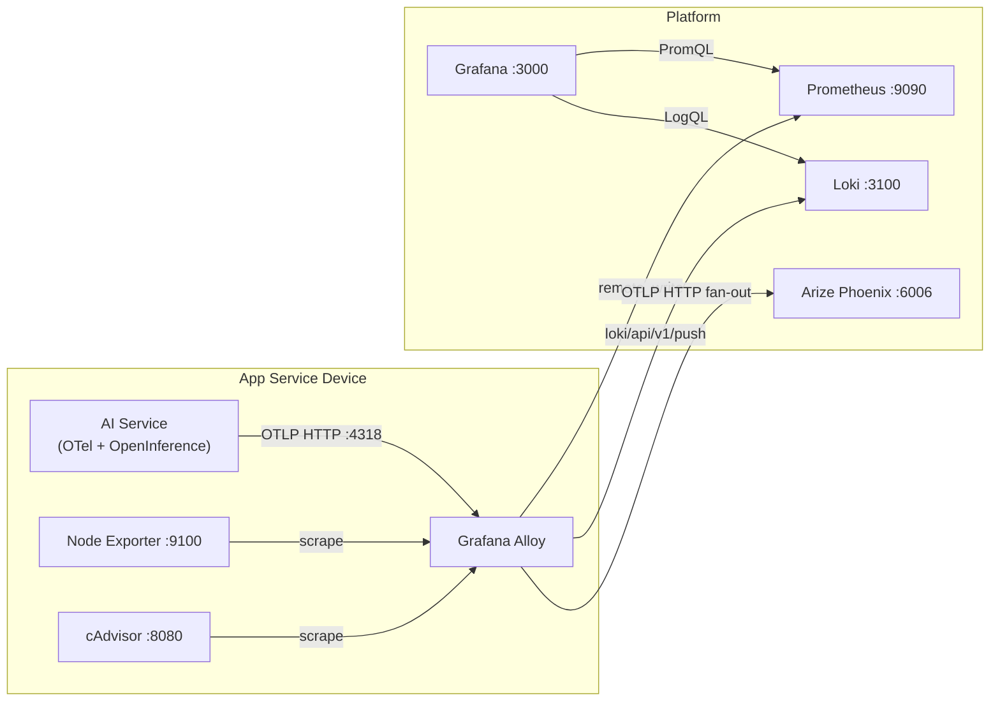
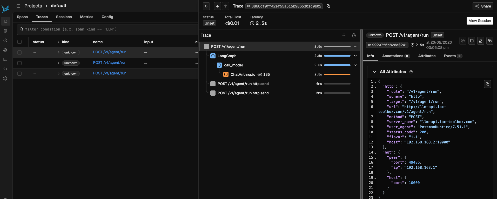

*Series: Building a self-hosted observability stack from scratch*

---

Parts 1 through 5 gave you the complete three-pillar picture: infrastructure metrics, application metrics, and logs. You know when a host is struggling, when a container is crash-looping, and when your FastAPI application's error rate climbs. You can even pull up the log lines that explain the spike.

But there is one class of application where all of that is still not enough: AI services.

A traditional API endpoint is a straight line — request comes in, some business logic runs, response goes out. When it breaks, the logs tell you why. An AI service is a graph. A single user request might spawn a chain of LLM calls, each with its own prompt, tool calls that hit external APIs, retries when a tool times out, and a final synthesis step that tries to make sense of it all. The error rate metric tells you it failed. The log tells you which exception was thrown. But neither tells you *which step in the chain was responsible*, how long each LLM call took, what the prompt looked like when it went wrong, or whether the tool call to your weather API was the thing that timed out.

That is what distributed tracing is for. And for AI specifically, it is not a nice-to-have — it is the only way to understand what your application is actually doing.

This post adds [Arize Phoenix](https://phoenix.arize.com/) to the stack: a purpose-built LLM observability platform that captures OpenTelemetry traces from your AI application and surfaces them in a UI designed for prompt debugging, chain inspection, and evaluation. The same Grafana Alloy instance from Parts 1 and 4 fans out incoming traces to Phoenix — no changes to your application's instrumentation endpoint required.

---

## Why Arize Phoenix for LLM traces

General-purpose trace backends like Tempo (which this series will cover separately for application traces) work well for microservice architectures where spans represent database queries, HTTP calls, and service boundaries. They answer "where did the latency come from?" for a conventional request flow.

LLM traces have a different shape. The spans you care about are LLM calls with token counts, prompts, and completions. Tool calls that invoke external APIs. Retrieval steps that pull documents from a vector store. Evaluation steps that score the output. The context window that was passed to the model. Tempo will store all of this, but it has no understanding of it — you see raw spans with no awareness that `input.value` contains a prompt or that `llm.token_count.total` is a cost signal.

Phoenix understands this natively. It speaks the OpenTelemetry semantic conventions for LLM tracing — the same conventions the OpenInference instrumentation libraries emit. Out of the box you get:

- Full prompt and response capture per LLM call, displayed inline in the trace
- Token usage and latency per span, aggregated across the full chain
- Tool call inspection — what was passed in, what was returned
- Session grouping — multiple traces from the same conversation thread
- Evaluation scoring — attach pass/fail labels to traces for quality monitoring

For a self-hosted setup, Phoenix is also the right choice for a resource-constrained host. It runs as a single Docker container with SQLite as the default storage backend, consumes under 256MB of RAM at idle, and the Phoenix UI is fast even with thousands of traces stored locally. You are not running an Elasticsearch cluster to get LLM observability.

---

## What we are building



Two things change from Part 5:

1. **Arize Phoenix** — a new Docker Compose service joins the platform
2. **Alloy** — gains an OTLP HTTP trace exporter that fans out to Phoenix alongside the existing Prometheus and Loki exporters

Your application pushes OTLP to Alloy on port 4318 (HTTP). Alloy becomes the fan-out point: metrics go to Prometheus, traces go to Phoenix. Your application never needs to know the difference.

One important note on transport: **use HTTP OTLP (port 4318), not gRPC (port 4317), for everything in this stack.** On Mac Docker specifically, the Python gRPC library does its own DNS resolution and frequently fails to resolve `host.docker.internal` correctly, causing silent export failures. HTTP OTLP via `urllib3` is reliable. This applies to both metrics and traces.

---

## Prerequisites

- Parts 1 and 4 complete — Alloy, Prometheus, Grafana, and the OTLP receiver are running
- A Python AI service instrumented with OpenTelemetry (if you followed Part 4, you already have the SDK wired up)
- Docker and Docker Compose

---

## Project structure

Phoenix gets its own directory under `~/.iac-toolbox/`, following the same pattern as every other service in this stack:

```
~/.iac-toolbox/
├── grafana-alloy/
│   ├── docker-compose.yml
│   └── config.alloy            ← add Phoenix trace exporter here
├── prometheus/
├── loki/
├── grafana/
└── arize-phoenix/              ← new
    ├── docker-compose.yml
    └── (phoenix_storage volume managed by Docker)
```

---

## Step 1 — Deploy Arize Phoenix

### docker-compose.yml

```yaml
# Managed by iac-toolbox. Do not edit manually.
services:
  phoenix:
    image: arizephoenix/phoenix:latest
    restart: unless-stopped
    ports:
      - "6006:6006"     # Phoenix UI
      - "14317:4317"    # OTLP gRPC — host 14317 → container 4317 (Alloy owns 4317)
      - "14318:4318"    # OTLP HTTP — host 14318 → container 4318 (Alloy owns 4318)
    volumes:
      - phoenix_data:/phoenix_storage
    environment:
      PHOENIX_WORKING_DIR: /phoenix_storage
      # Auth is disabled here for simplicity.
      # If you enable PHOENIX_ENABLE_AUTH, you must pass the API key
      # as a header in both the Alloy exporter and the app's register() call.
      # See the troubleshooting section below.

volumes:
  phoenix_data:
```

The `phoenix_data` volume persists traces across container restarts. Without it, every restart clears all stored traces — on a host that reboots occasionally this would make Phoenix useless for anything beyond a live tail of recent activity.

A note on `PHOENIX_ENABLE_AUTH`: if you enable it, Phoenix requires a bearer token on all OTLP requests. The `200 OK` responses you see in your app logs will still appear — Cloudflare's tunnel returns them — but Phoenix silently drops unauthenticated traces. If you enable auth, you must pass the API key as a header everywhere traces are sent (see the troubleshooting section).

### Start Phoenix

```bash
cd ~/.iac-toolbox/arize-phoenix && docker compose up -d

# Verify Phoenix is up
curl -s -o /dev/null -w "%{http_code}" http://localhost:6006/healthz
```

---

## Step 2 — Wire Alloy to fan out traces to Phoenix

Update `~/.iac-toolbox/grafana-alloy/config.alloy`. The key changes from Part 4 are:

- The OTLP receiver now binds to `0.0.0.0` (not `host.docker.internal`) — receivers are listeners, not destinations
- Traces are fanned out to Phoenix via `otelcol.exporter.otlphttp`
- The exporter uses `otlphttp` (not `otlp`) because Phoenix sits behind a Cloudflare tunnel that terminates TLS and speaks HTTP/1.1, not raw gRPC

```hcl
// ── OTLP receiver: accept telemetry from instrumented services ───────────────
otelcol.receiver.otlp "default" {
  grpc {
    endpoint = "0.0.0.0:4317"
  }
  http {
    endpoint = "0.0.0.0:4318"
  }

  output {
    metrics = [otelcol.exporter.prometheus.default.input]
    traces  = [otelcol.exporter.otlphttp.phoenix.input]
  }
}

// ── Phoenix trace exporter ───────────────────────────────────────────────────
// Uses otlphttp (not otlp) — the Cloudflare tunnel in front of Phoenix
// speaks HTTP/1.1, not gRPC. Using otelcol.exporter.otlp here produces
// a 403 or 502 because the tunnel cannot upgrade to HTTP/2 for gRPC.
otelcol.exporter.otlphttp "phoenix" {
  client {
    endpoint = "https://arize.iac-toolbox.com"
  }
}

// ── OTel → Prometheus conversion ─────────────────────────────────────────────
otelcol.exporter.prometheus "default" {
  forward_to                       = [prometheus.remote_write.platform.receiver]
  resource_to_telemetry_conversion = true
}
```

### Redeploy Alloy

```bash
cd ~/.iac-toolbox/grafana-alloy && docker compose up -d --force-recreate

docker logs grafana-alloy 2>&1 | grep -E "level=error|level=warn" | head -20
```

---

## Step 3 — Instrument your AI service

### Install the packages

```bash
pip install \
  opentelemetry-sdk \
  opentelemetry-exporter-otlp-proto-http \
  arize-phoenix-otel \
  openinference-instrumentation-anthropic   # or your LLM provider
```

Note `opentelemetry-exporter-otlp-proto-http` — not the gRPC variant. On Mac Docker, gRPC OTLP has DNS resolution issues with `host.docker.internal`. The HTTP exporter is reliable.

### Application instrumentation

```python
import os
import logging

from fastapi import FastAPI
from fastapi.middleware.cors import CORSMiddleware
from opentelemetry import metrics
from opentelemetry.sdk.metrics import MeterProvider
from opentelemetry.sdk.metrics.export import PeriodicExportingMetricReader
from opentelemetry.exporter.otlp.proto.http.metric_exporter import OTLPMetricExporter
from opentelemetry.sdk.resources import Resource
from opentelemetry.instrumentation.fastapi import FastAPIInstrumentor
from phoenix.otel import register

# Traces — Phoenix's register() sets up the TracerProvider and auto-instruments
# your LLM provider. Point it at Alloy's HTTP OTLP endpoint.
tracer_provider = register(
    project_name="default",
    auto_instrument=True,
    endpoint=os.getenv("PHOENIX_COLLECTOR_ENDPOINT", "http://localhost:4318/v1/traces"),
)

# Metrics — HTTP exporter on port 4318, /v1/metrics path required for HTTP OTLP
resource = Resource(attributes={"service.name": "my-ai-service"})
exporter = OTLPMetricExporter(
    endpoint=f"http://{os.getenv('ALLOY_HOST')}:4318/v1/metrics",
)
reader = PeriodicExportingMetricReader(exporter, export_interval_millis=15_000)
provider = MeterProvider(resource=resource, metric_readers=[reader])
metrics.set_meter_provider(provider)

app = FastAPI()
FastAPIInstrumentor.instrument_app(app)

app.add_middleware(
    CORSMiddleware,
    allow_origins=["*"],
    allow_credentials=True,
    allow_methods=["*"],
    allow_headers=["*"],
)
```

### Docker Compose environment

```yaml
services:
  my-ai-service:
    environment:
      - ALLOY_HOST=host.docker.internal
      - PHOENIX_COLLECTOR_ENDPOINT=http://host.docker.internal:4318/v1/traces
```

Both metrics and traces point at `host.docker.internal:4318` — Alloy's HTTP OTLP port, reachable from inside a Docker container on Mac. Alloy then fans out metrics to Prometheus and traces to Phoenix.

---

## Step 4 — Verify traces are flowing

Make a few requests to your AI service, then confirm the pipeline end to end.




### Check the app is exporting

Enable debug logging temporarily to see every export attempt:

```python
import logging
logging.basicConfig(level=logging.DEBUG)
logging.getLogger("urllib3").setLevel(logging.DEBUG)
```

You should see lines like:

```
DEBUG:urllib3.connectionpool:http://host.docker.internal:4318 "POST /v1/traces HTTP/1.1" 200 ...
DEBUG:urllib3.connectionpool:http://host.docker.internal:4318 "POST /v1/metrics HTTP/1.1" 200 2
```

Both `200` responses confirm Alloy is receiving the data.

### Check Alloy is forwarding to Phoenix

```bash
docker logs grafana-alloy 2>&1 | grep -i "phoenix\|otlp\|error" | tail -20
```

No errors here means Alloy is successfully forwarding to `arize.iac-toolbox.com`.

### Check Phoenix received the traces

```bash
docker logs arize-phoenix-phoenix-1 2>&1 | tail -30
```

Open `https://arize.iac-toolbox.com` and navigate to the `default` project. Traces should appear after your first instrumented request.

---

## Troubleshooting

This section documents the issues encountered getting this stack working end to end on Mac Docker. Each one has a non-obvious root cause.

### gRPC OTLP silently fails on Mac Docker

**Symptom:** No errors in app logs, no data in Grafana or Phoenix.

**Cause:** The Python gRPC library does its own DNS resolution and frequently fails to resolve `host.docker.internal` on Mac Docker, dropping exports silently.

**Fix:** Use HTTP OTLP everywhere.

Metrics:
```python
# Wrong
from opentelemetry.exporter.otlp.proto.grpc.metric_exporter import OTLPMetricExporter
exporter = OTLPMetricExporter(endpoint="http://host.docker.internal:4317", insecure=True)

# Correct
from opentelemetry.exporter.otlp.proto.http.metric_exporter import OTLPMetricExporter
exporter = OTLPMetricExporter(endpoint="http://host.docker.internal:4318/v1/metrics")
```

Note that the HTTP exporter requires the full `/v1/metrics` path and does not take `insecure=True`.

### OTLP receiver must bind to 0.0.0.0, not host.docker.internal

**Symptom:** App cannot connect to Alloy on port 4318.

**Cause:** `host.docker.internal` in a receiver `endpoint` tells Alloy to bind only on that interface, not all interfaces.

**Fix:**
```hcl
otelcol.receiver.otlp "default" {
  grpc { endpoint = "0.0.0.0:4317" }
  http { endpoint = "0.0.0.0:4318" }
}
```

`host.docker.internal` is a destination hostname (for outbound connections from Alloy to the Mac host). It should never appear in a receiver binding.

### Alloy exporter to Phoenix must use otlphttp, not otlp

**Symptom:** Alloy logs show `403 Forbidden` or `502 Bad Gateway` when forwarding traces to Phoenix.

**Cause:** `otelcol.exporter.otlp` uses gRPC (HTTP/2). A Cloudflare tunnel in front of Phoenix speaks HTTP/1.1 by default and cannot handle raw gRPC — it returns a 403 HTML error page, which Alloy logs as a permanent failure and drops the traces.

**Fix:** Use `otelcol.exporter.otlphttp` instead:
```hcl
otelcol.exporter.otlphttp "phoenix" {
  client {
    endpoint = "https://arize.iac-toolbox.com"
  }
}
```

And reference it as `otelcol.exporter.otlphttp.phoenix.input` in the receiver output block.

### Phoenix auth silently drops traces

**Symptom:** App logs show `200 OK` on every trace POST, Phoenix UI shows nothing.

**Cause:** `PHOENIX_ENABLE_AUTH: true` requires a bearer token on all OTLP requests. The `200` comes from Cloudflare's tunnel, not Phoenix — Phoenix rejects the unauthenticated request silently.

**Fix:** Either disable auth for local development, or pass the API key as a header in both the app and the Alloy exporter:

App:
```python
tracer_provider = register(
    project_name="default",
    auto_instrument=True,
    endpoint=os.getenv("PHOENIX_COLLECTOR_ENDPOINT"),
    headers={"Authorization": f"Bearer {os.getenv('PHOENIX_API_KEY')}"},
)
```

Alloy:
```hcl
otelcol.exporter.otlphttp "phoenix" {
  client {
    endpoint = "https://arize.iac-toolbox.com"
    headers  = { "Authorization" = "Bearer " + env("PHOENIX_API_KEY") }
  }
}
```

And inject `PHOENIX_API_KEY` into the Alloy container via its Docker Compose `environment` block.

---

### Phoenix container has no shell

**Symptom:** `docker exec -it arize-phoenix-phoenix-1 /bin/bash` fails with "no such file".

**Cause:** Phoenix uses a distroless image with no shell or utilities.

**Fix:** Debug from the host instead:
```bash
# Check Phoenix logs
docker logs arize-phoenix-phoenix-1 2>&1 | tail -30

# Test the OTLP HTTP port directly from the host
curl -v -X POST http://localhost:14318/v1/traces \
  -H "Content-Type: application/x-protobuf" \
  --data-binary "\x00"
# Expect: connection reset (Phoenix speaks HTTP/2 on this port)

# Test the gRPC port
curl -v http://localhost:14317 --http2-prior-knowledge
# Expect: HTTP/2 200 with content-type: application/grpc
```

---

## Conclusion and next steps

With this part in place, the three-pillar observability stack is complete. Infrastructure and application metrics flow through Alloy to Prometheus and surface in Grafana. Logs ship via Alloy to Loki. And now every LLM call your AI service makes produces an OpenTelemetry trace that lands in Arize Phoenix — prompt, tool calls, token counts, and all.

The current setup runs Phoenix without authentication. That is fine for a private, Cloudflare-tunnelled deployment where you control access at the network edge, but it means anyone who knows your Phoenix URL can read your traces — including every prompt and response your application produced. The natural next step is enabling Phoenix's built-in bearer-token auth, which touches three places in the stack.

### Next step: adding authentication to Arize Phoenix

> **Status: not yet implemented.** The notes below document the plan; the current deployment runs without auth.

#### 1 — Enable auth in the Phoenix container

Phoenix ships with optional bearer-token authentication gated behind two environment variables. Update the Ansible-managed `docker-compose.yml` template for the `arize-phoenix` service:

```yml
# Managed by iac-toolbox. Do not edit manually.
services:
  phoenix:
    image: arizephoenix/phoenix:{{ arize_phoenix_config.version }}
    restart: unless-stopped
    ports:
      - "{{ arize_phoenix_config.ui_port }}:6006"
      # Alloy already binds host port 4317. Phoenix's internal OTLP port
      # (4317) is mapped to a different host port to avoid conflict.
      - "{{ arize_phoenix_config.otlp_grpc_host_port }}:4317"
      - "{{ arize_phoenix_config.otlp_http_host_port }}:4318"
    volumes:
      - phoenix_data:/phoenix_storage
    environment:
      PHOENIX_WORKING_DIR: /phoenix_storage
      # PHOENIX_ENABLE_AUTH: True
      # PHOENIX_SECRET: "{{ arize_phoenix_config.secret }}"
```

Uncomment the two `PHOENIX_ENABLE_AUTH` and `PHOENIX_SECRET` lines and supply a strong random value for `arize_phoenix_config.secret` in the Ansible vault. Once auth is active, Phoenix will reject any OTLP request that does not carry a valid `Authorization: Bearer <token>` header — including exhibiting the silent-drop behaviour described in the troubleshooting section above.

#### 2 — Pass the token through Alloy

Alloy is the component that actually pushes traces to Phoenix over OTLP HTTP, so it needs to attach the header. Update the Jinja-templated Alloy config:

```jinja
// ── OTLP receiver: accept telemetry from instrumented services ───────────────
// Apps push metrics via OTel SDK using:
//   endpoint = "http://<alloy-host>:4317"  (gRPC)
//   endpoint = "http://<alloy-host>:4318"  (HTTP)
otelcol.receiver.otlp "default" {
  grpc {
    endpoint = "0.0.0.0:{{ otlp_grpc_port }}"
  }
  http {
    endpoint = "0.0.0.0:{{ otlp_http_port }}"
  }

  output {
    // Forward only metrics — no Loki or Tempo configured yet
    metrics = [otelcol.exporter.prometheus.default.input]

    traces  = [otelcol.exporter.otlphttp.phoenix.input]

  }
}


otelcol.exporter.otlphttp "phoenix" {
  client {
    // Uses the host-mapped port (14317), NOT 4317 — Alloy owns 4317.
    endpoint = "https://{{ arize_phoenix.domain }}"
    // headers = { "Authorization" = "Bearer " + env("PHOENIX_API_KEY") }
  }
}

```

Uncomment the `headers` line and inject `PHOENIX_API_KEY` into the Alloy container via its Docker Compose `environment` block. The value must match the API key Phoenix generates after auth is enabled (visible in the Phoenix UI under Settings → API Keys).

#### 3 — Inject the token into the AI service container

The AI service currently sends traces to Alloy, not directly to Phoenix, so in this architecture the app does not need the Phoenix API key at all — Alloy holds the credential. That changes only if you ever point the app's OTLP endpoint directly at Phoenix instead of via Alloy.

The Docker Compose service template is ready for it regardless:

```yaml
services:
  server:
    container_name: slm-llama-cpp-poc
    image: ${DOCKER_IMAGE:-slm-llama-cpp-poc:local}
    build:
      context: .
      dockerfile: Dockerfile
    environment:
      - ALLOY_HOST=host.docker.internal
      - PHOENIX_COLLECTOR_ENDPOINT=http://host.docker.internal:4318/v1/traces
      - ANTHROPIC_API_KEY=${ANTHROPIC_API_KEY}
      - PHOENIX_API_KEY=${PHOENIX_API_KEY}
    ports:
      - "10000:10000"
```

`PHOENIX_API_KEY` is included so that if you switch to a direct-to-Phoenix export path — or if you call the Phoenix REST API from the app for evaluations — the credential is already available without a config change.

---

Parts 1–6 now cover infrastructure metrics, application metrics, logs, and LLM traces. The next part in the series will add distributed tracing for non-AI services with Tempo, completing the full picture for conventional microservice workloads as well.
