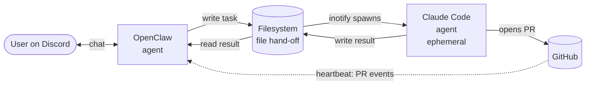
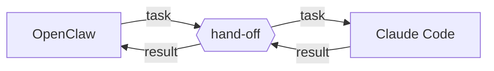
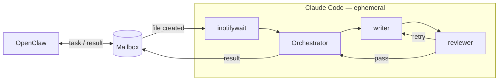
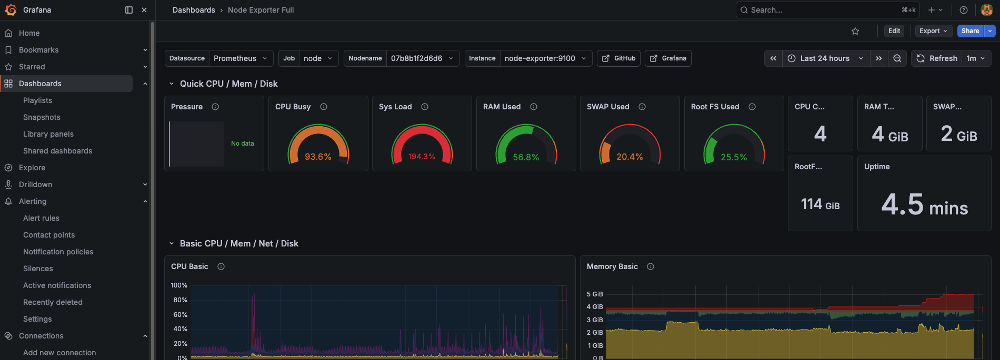

A few months ago I finished setting up my Raspberry Pi with metrics, alerting, domain access, and secrets, and ended up with a pretty neat device that did nothing. Around the same time OpenClaw started showing up in my feed — a bot with access to an LLM that could sit on a small device and do work for you. The pitch was good enough that I gave it a weekend.

A weekend turned into months of configurations hell and confusion. The thing I underestimated was how big the gap is between "an LLM bot responds on Discord" and "an LLM bot does real engineering work for me." A bot that can chat is easy. A bot that can take a Discord message, decide it needs to write code, write that code, run tests, open a PR, and tell me about it that is a different category of system.

## An LLM bot does real engineering work for me..

That shift surfaces three problems that the cosy "ask the LLM a question" framing hides. Given my experience in building agents, I wanted to avoid the [context rots](https://arxiv.org/abs/2305.14491) and [instruction overload](https://arxiv.org/abs/2507.11538) problems from the start. Additionally, I had been pretty comfortable using Claude Code for coding tasks. So OpenClaw had to come-in for something else.

If you have are agents builder, you will recognise that building a multi agent system is the answer to the problems above. The killer feature of OpenClaw for me is the chat integrations which comes at a low cost so it felt really compelling.

The separation becomes clear:

- OpenClaw handles user interaction
- Claude Code handles writing code.

Unsurpisingly this is a setup that has been proven in the past by this tweet https://x.com/elvissun/status/2025920521871716562, which has been an inspiration and drove me to reproduce the setup.
{/*
## Making Agents Talk Problem

Multi agents architectures provide solutions to the context problem but also bring complexity. Once you have two agents on the same machine, you need a hand-off. The assistant has to give the coder a task. The coder has to give the assistant a result. This sounds trivial. It is not. Both agents are LLM-driven processes that take minutes to run, emit large amounts of output, and occasionally die mid-thought. Whatever channel sits between them has to survive all of that.

## The Autonomous Part

The whole thing has to stay alive without me. I am not in a terminal watching this. The Pi is in another room. If a service dies, I find out because Discord goes quiet, which means by the time I notice it has already been broken for hours. Anything I build has to assume "no human in the loop" as the default state, not the exception.

The setup in this post is what I landed on after taking those three problems seriously. Spoiler: the interesting work was not in the LLM prompts. It was in the boring infrastructure underneath them.
 */}

## Building Coding Assistant

Here is the shape of it, before getting into the why:



Two agents, one file hand-off between them. OpenClaw is the long-lived assistant on Discord. Claude Code is spawned per task, does the work, opens a PR, exits. The filesystem is just a folder — OpenClaw drops a task in, Claude Code picks it up, drops the result back. OpenClaw also listens for PR events from GitHub as a heartbeat, so it can confirm the work actually landed and not just that Claude Code said it did.

The rest of the post is the why and the how.

## Three protocols, one survivor

The job is straightforward to describe. OpenClaw understands the user request from Discord, decides this needs real code written, and hands the work off to Claude Code, which produces a PR. OpenClaw watches for completion and reports back.



The whole problem is the box in the middle.

The hard part is the hand-off. I tried three using a shared [tmux](https://github.com/tmux/tmux/wiki) session and a filesystem via handoff file, and with an [ACP (Agent Communication Protocol)](https://agentclientprotocol.com/get-started/introduction):


1. **ACP (Agent Communication Protocol).** The "right" way. Sessions, capabilities, structured messages, the whole thing. I had this working in Part 4 with Codex. It worked. It also fell over under load, hit timeouts, and depended on a pairing dance that broke every time the Pi rebooted.
2. **A shared tmux session.** Skip the protocol entirely, drive a real terminal that the worker lives inside. Capture the pane to read output. It works. It is also extremely fragile — anything that touches the terminal state (a stray newline, an ANSI escape, a pager that opens) corrupts the channel.
3. **A filesystem mailbox.** OpenClaw writes a JSON file. `inotifywait` sees the file. A systemd service launches Claude Code with `-p` against that file. Claude Code writes the result to another JSON file. Done.

I have spent weeks trying to fine-tune the ACP and Tmux, until I found `inotifywait`. The rest of this post is how that is wired up and why the others didn't work for me.

## OpenClaw under systemd

Although all of the documentations of OpenClaw and Claude Code omit that, there is a hidden truth about agents - they are system processes. Which means, they will die eventually, silently - unless you deamonise them.

We will handle it using a `systemd` file. The relevant guarantees from systemd:

- `Restart=on-failure` — the process comes back if it crashes
- `systemctl --user enable` makes it survive reboot

Think about `systemd` like a docker container, but it lives on your bare metal. A typical systemd file looks like that:

```sh
[Unit]
Description=OpenClaw Bot
After=network.target
StartLimitIntervalSec=0

[Service]
Type=simple
User={{ bot_user }}
WorkingDirectory={{ bot_home }}
EnvironmentFile={{ env_file }}
Environment=REPO_DIR={{ repo_dir }}
Environment=FEATURE_DOCS_DIR={{ feature_docs_dir }}
ExecStart={{ bot_home }}/scripts/start.sh
Restart=on-failure
RestartSec=10

[Install]
WantedBy=multi-user.target
```

Start it with

```sh

systemctl --user daemon-reload
systemctl --user enable --now openclaw-gateway.service
journalctl --user -u openclaw-gateway -f
```

And see the logs

```sh
systemctl --user status openclaw-gateway.service
● openclaw-gateway.service - OpenClaw Gateway
     Loaded: loaded (/home/vvasylkovskyi/.config/systemd/user/openclaw-gateway.service; enabled; preset: enabled)
     Active: active (running) since Mon 2026-05-18 22:14:07 BST; 17h ago
```

With systemd in place, OpenClaw is a thing that stays up. That is the floor.

## Claude Code, watched by inotifywait, supervised by systemd



The worker side is its own systemd service, similar to the one above. Except in this case, `ExecStart={{ bot_home }}/scripts/start.sh` will:

1. Start a persistent `inotifywait` loop watching the filesystem directory
2. `inotifywait` triggers a shell script that, on file creation, launches Claude Code in headless mode
3. A systemd service that owns the watcher and restarts it if it dies

The watcher loop is the entire orchestration logic on the worker side. There is nothing fancy in here:

```sh
#!/usr/bin/env bash
set -euo pipefail

# ── Watcher loop ──────────────────────────────────────────────────────────────
echo "[pipeline] Watching $FEATURE_DOCS_DIR for new feature docs..."
cd "$REPO_DIR"

CLAUDE_BIN=$(find /usr/local/bin "$HOME/.local/bin" "$HOME/.npm-global/bin" -name claude 2>/dev/null | head -1)

inotifywait -m "$FEATURE_DOCS_DIR" -e create | while read -r path _event file; do
  echo "[pipeline] Detected: $file — starting pipeline..."
  "$CLAUDE_BIN" --dangerously-skip-permissions -p \
    "/implementation-orchestrator Process this feature doc: @${path}${file}"
  echo "[pipeline] Done: $file"
done
```

When the new file is created, claude code is spawned and reads the file. The `claude --dangerously-skip-permissions -p` ensures that the headless mode is activated, and there are no confirmation prompts - human completely out of the loop.

### Skill fine-tuned for human-out-of-the-loop

The message is simple: `"/implementation-orchestrator Process this feature doc: @${path}${file}"`. So whatever is in the file is the direction. The policy is the skill where we have to stir agent from asking questions with prompts like:

```sh
You are an orchestration agent running in a fully automated headless pipeline.
You must never pause for input, never ask clarifying questions, and never wait for human confirmation mid-session.
```


That is the entire worker. A watcher, a launcher, and a folder with markdown files. The interesting design choices are not in the code - they are in what I am deliberately not doing.

## Protocols that did not work

It is worth being explicit about what I tried and why I abandoned it, because the file handoff looks underwhelming until you have lived with the alternatives.

## Why we eventually pivoted from ACP to tmux

ACP has a lot of open issues — sessions timing out, the gateway pairing dance, the arm64 binary problem. After getting it working, I kept hitting reliability problems. There are also open GitHub issues specifically about this:

- https://github.com/openclaw/openclaw/issues/29195
- https://github.com/openclaw/openclaw/issues/38419

Under heavy load, the ACP system would overload:



### tmux

The pivot from ACP was to a shared tmux session. [Alegendly](https://x.com/elvissun/status/2025920521871716562) one can spawn tmux sessions and start in them the coding agents:

```sh
tmux list-windows -t agents | grep -q claude || \
  tmux new-window -t agents -n claude
```

Then start the claude session using the below:

```bash
tmux send-keys -t agents:claude \
  "claude --agent-file ~/.claude/CLAUDE.md" Enter
```

Spawn the worker inside tmux, drive it by writing to its stdin via `tmux send-keys`, capture results with `tmux capture-pane -p`. This works... until it doesn't, and when it doesn't, the failure is in terminal not in logs.

The problem is executing the `send-keys` command reliably. Sometimes double enter is required, and often it is not enough. More importantly, when something fails, the error trace is not available unless we manually ssh into device and attach to the tmux session - if the session is alive. If the tmux server dies for any reason (memory pressure, a crashed pane), every running task is lost with no recovery path.

The general lesson, which I have now learned twice, is that any IPC channel that goes through a TTY is a TTY. You do not get to pretend it is a structured stream. The terminal will assert itself eventually.

## Why using inotify is better

Stepping back from the wiring, the reason the `inotifywait` won is not that it is fast or elegant. It is because the communication is battle-proven and dead simple. The watcher is reliable, and as long as the file drops in the folder, the watcher will spawn the agent. The rest of the components might fail independently but each failure has an obvious recovery. The `inotifywait` can also have failure modes, but they all show up in either the Discord channel or `journalctl`, both of which I check anyway.

When OpenClaw dropped the file on the system, the logs show like these.

```sh
Apr 28 15:59:29 raspberry-4b systemd[1]: Started claude-coding-bot.service - Claude Code PR Bot.
Apr 28 15:59:29 raspberry-4b start.sh[2514944]: [pipeline] Watching /home/vvasylkovskyi/my-claude-code/context/feature-docs for new feature docs...
Apr 28 15:59:29 raspberry-4b start.sh[2514950]: Setting up watches.
Apr 28 15:59:29 raspberry-4b start.sh[2514950]: Watches established.
Apr 28 15:59:54 raspberry-4b start.sh[2514951]: [pipeline] Detected: print-readme-testing-headless-claude-code.md — starting pipeline...
Apr 28 15:59:59 raspberry-4b start.sh[2515185]: Warning: no stdin data received in 3s, proceeding without it. If piping from a slow command, redirect stdin explicitly: < /dev/null to skip, or wait longer.
Apr 28 16:03:24 raspberry-4b start.sh[2515185]: `🎉 Final PR opened: https://github.com/vvasylkovskyi/my-app/pull/2`
Apr 28 16:03:24 raspberry-4b start.sh[2515185]: ---
Apr 28 16:03:24 raspberry-4b start.sh[2515185]: ```
Apr 28 16:03:24 raspberry-4b start.sh[2515185]: === Autopilot Session Complete ===
Apr 28 16:03:24 raspberry-4b start.sh[2515185]: Mode: features
Apr 28 16:03:24 raspberry-4b start.sh[2515185]: Repo: /home/vvasylkovskyi/my-claude-code/repo
Apr 28 16:03:24 raspberry-4b start.sh[2515185]: ✅  print-readme-testing-headless-claude-code → PR #1 merged → feature/autopilot-2026-04-28
Apr 28 16:03:24 raspberry-4b start.sh[2515185]: Skipped:   0
Apr 28 16:03:24 raspberry-4b start.sh[2515185]: Completed: 1
Apr 28 16:03:24 raspberry-4b start.sh[2515185]: Failed:    0
Apr 28 16:03:24 raspberry-4b start.sh[2515185]: ==================================
Apr 28 16:03:24 raspberry-4b start.sh[2515185]: Final PR for your review: https://github.com/vvasylkovskyi/my-app/pull/2
```

The ACP and tmux versions of had failure modes that were silent or required SSH.  [Filesystems are used by Claude Code](https://dev.to/klement_gunndu/inside-claude-codes-hidden-multi-agent-architecture-ne4) - They can also use tmux to multiplex your open session. However in headless mode, the TTY is unreliable due to its inherent interactive nature.


## What I would tell myself before starting

Multi agents architectures have little to do with AI. What matters are the deep skills in linux and building a distributed system. The filesystem communication pattern is a dead-simple, and the only approach that I didn't have to fix.

Regarding tmux, the assumption that you can drive a terminal as if it were a structured channel is wrong. It works in the demo but it breaks the moment a tool decides to be helpful and open a pager, or the keys-send didn't send the space for the tmux session to submit question to llm. The tmux approach is fine for known, bounded outputs and dangerous for anything else.

The filesystem watcher is not a clever design. It is a design that takes the things Linux is already good at - files, services, watchers - and arranges them so that the agent layer only has to do the parts that genuinely need an agent. Why is it so convenient? Well, because we are on the same device. Sometimes the simplest solutions are the ones taking the longest to reveal themselves.
