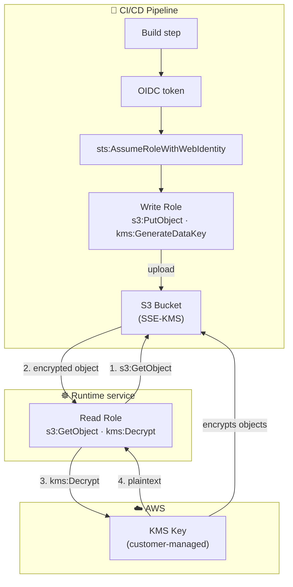
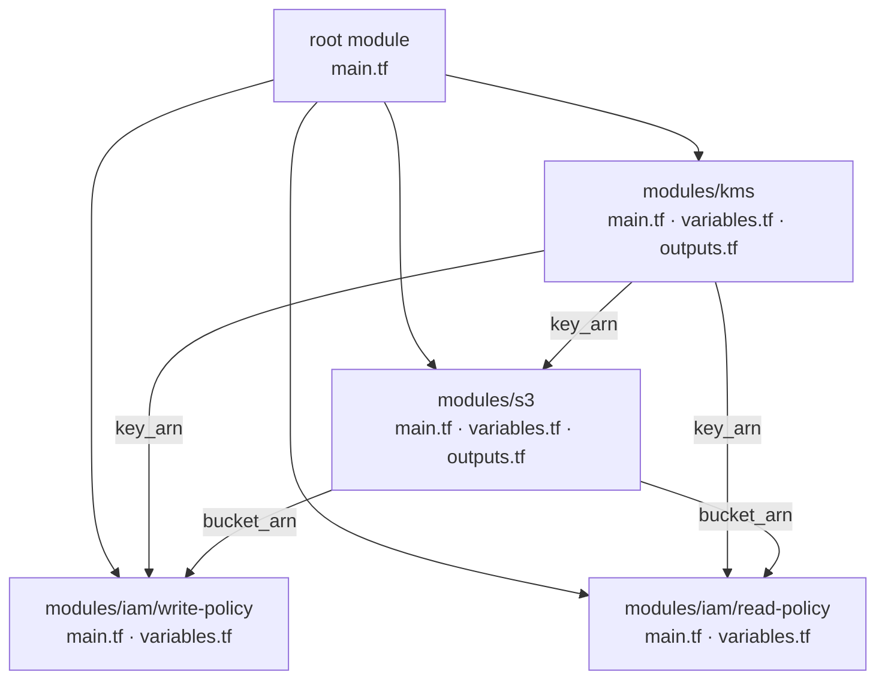
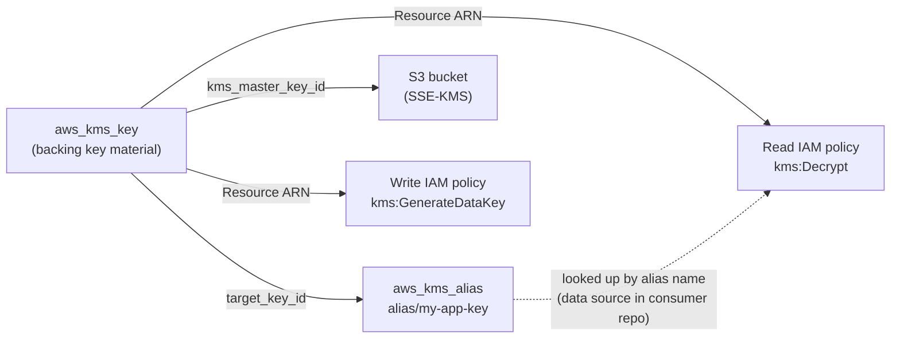
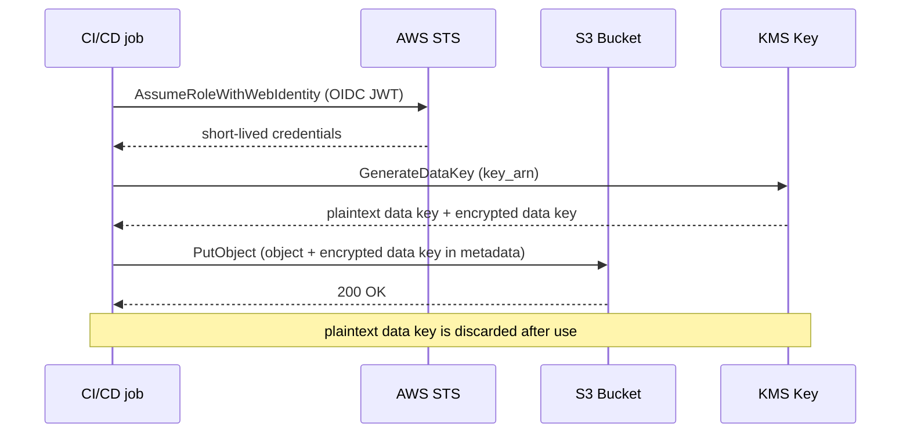
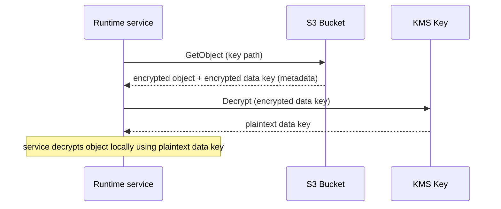
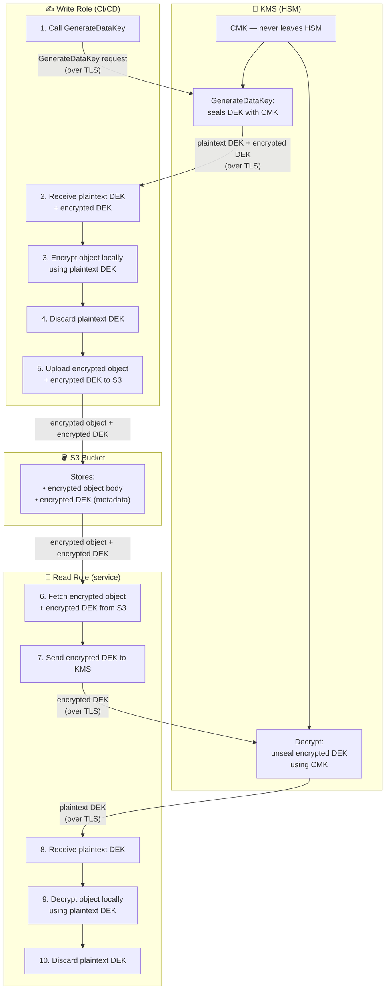
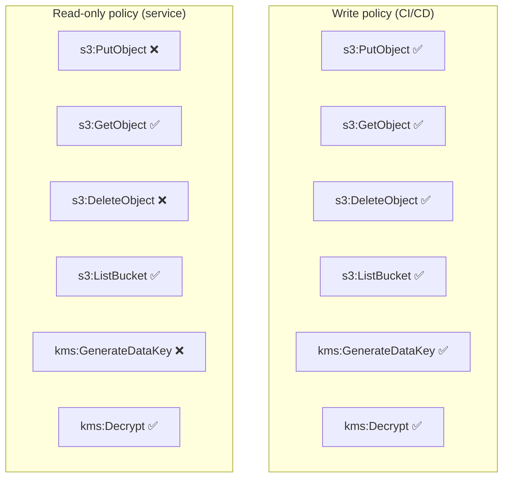
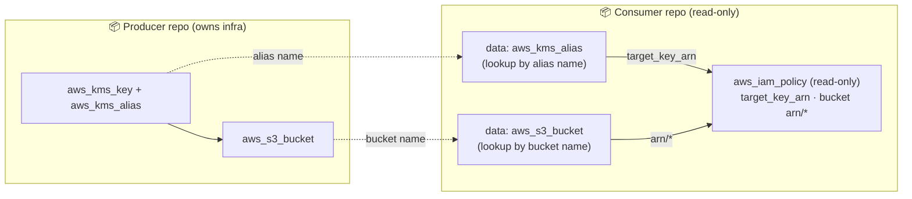

In this notes we are going to build a complete, secure S3 setup from scratch — a **customer-managed KMS key** for encryption, a dedicated **CI/CD write role** that uploads objects, and a separate **read-only role** for any service that needs to consume those objects at runtime. By the end we will have a full, auditable encryption and access story for anything you store in S3.

## Why store things in S3?

Before we dive into the Terraform, it is worth taking a moment to think about what actually belongs in S3 and why. S3 is designed for durably storing arbitrary blobs of data at practically unlimited scale. A few patterns come up again and again:

- **Static frontend assets** — compiled JavaScript bundles, CSS, HTML files, images and fonts. Your CDN or web server pulls them on demand, and S3 keeps them available even across deployments.
- **Build artefacts** — a CI pipeline builds a release, uploads it under a versioned prefix like `versions/<git-sha>/`, then a pointer file like `latest/main.txt` is updated on merge. Consumers always know where to find the latest stable build.
- **Raw data and backups** — database dumps, log exports, ML training sets. Lifecycle rules automatically expire old objects so you pay only for what you actually need.
- **Shared configuration or templates** — HTML email templates, report layouts, config files that multiple services read. Writing them once from a CI job and reading them from many places is cleaner than baking them into container images.

The common thread is: one producer writes, one or more consumers read, and you want that boundary to be enforced at the IAM level — not just by convention.

## Architecture overview

The diagram below shows the high-level two-role pattern we will build. CI/CD assumes a write role via OIDC and pushes objects. At runtime, a service assumes a read-only role and fetches those same objects. KMS sits in the middle and is required for both sides.



The key insight is that **neither role is the other**. The write role cannot read arbitrary objects without `s3:GetObject` on the consumer side, and the read role cannot write or overwrite objects. This is the principle of least privilege applied at the bucket level.

## Terraform module structure

We will organise everything into three modules: `kms`, `s3`, and `iam`. Here is what the folder structure looks like:



The `kms` module is created first and its outputs flow into everything else. Nothing in the IAM or S3 modules hardcodes a key ID — they always receive it as an input.

## KMS Key module

The first thing we need is the key itself. Let's create a `modules/kms` module:

```hcl
# modules/kms/main.tf

resource "aws_kms_key" "this" {
  description             = var.description
  deletion_window_in_days = 30
  enable_key_rotation     = true
}

resource "aws_kms_alias" "this" {
  name          = "alias/${var.alias_name}"
  target_key_id = aws_kms_key.this.id
}
```

```hcl
# modules/kms/variables.tf

variable "description" {
  type        = string
  description = "Human-readable description for the key"
}

variable "alias_name" {
  type        = string
  description = "Alias without the alias/ prefix"
}
```

```hcl
# modules/kms/outputs.tf

output "key_arn" {
  value = aws_kms_key.this.arn
}

output "key_id" {
  value = aws_kms_key.this.id
}

output "alias_name" {
  value = aws_kms_alias.this.name
}
```

A few things to note here:

- `enable_key_rotation = true` — AWS automatically rotates the backing key material every year. Old ciphertext still decrypts, new encryptions use the fresh material.
- `deletion_window_in_days = 30` — you cannot delete a KMS key immediately. This gives you a month to catch accidents.
- The alias (`alias/my-app-key`) is what consumers look up by name rather than by the opaque key ID.

The diagram below shows how the key and alias relate, and which downstream resources depend on them:



## S3 bucket module with SSE-KMS

Now we upgrade the bucket from our previous notes to use the KMS key instead of AES-256:

```hcl
# modules/s3/main.tf

resource "aws_s3_bucket" "this" {
  bucket        = var.bucket_name
  force_destroy = true
}

resource "aws_s3_bucket_public_access_block" "this" {
  bucket = aws_s3_bucket.this.id

  block_public_acls       = true
  block_public_policy     = true
  ignore_public_acls      = true
  restrict_public_buckets = true
}

resource "aws_s3_bucket_versioning" "this" {
  bucket = aws_s3_bucket.this.id

  versioning_configuration {
    status = "Enabled"
  }
}

resource "aws_s3_bucket_server_side_encryption_configuration" "this" {
  bucket = aws_s3_bucket.this.bucket

  rule {
    apply_server_side_encryption_by_default {
      sse_algorithm     = "aws:kms"
      kms_master_key_id = var.kms_key_arn
    }
    bucket_key_enabled = true
  }
}

resource "aws_s3_bucket_lifecycle_configuration" "this" {
  bucket = aws_s3_bucket.this.id

  rule {
    id     = "expire-old-objects"
    status = "Enabled"

    filter {}

    expiration {
      days = 90
    }

    noncurrent_version_expiration {
      noncurrent_days = 30
    }

    abort_incomplete_multipart_upload {
      days_after_initiation = 7
    }
  }
}
```

```hcl
# modules/s3/variables.tf

variable "bucket_name" {
  type        = string
  description = "Name of the S3 bucket"
}

variable "kms_key_arn" {
  type        = string
  description = "ARN of the KMS key used to encrypt objects"
}
```

```hcl
# modules/s3/outputs.tf

output "bucket_arn" {
  value = aws_s3_bucket.this.arn
}

output "bucket_name" {
  value = aws_s3_bucket.this.id
}
```

The change from the previous notes is in the encryption block. We swapped `sse_algorithm = "AES256"` for `sse_algorithm = "aws:kms"` and pointed it at our key ARN. `bucket_key_enabled = true` is a performance and cost optimisation — instead of calling KMS for every single object, S3 generates a short-lived bucket-level data key and uses that for a batch of objects. You still get KMS-managed encryption, but with far fewer API calls.

The diagram below shows what happens at the moment of an upload — the two KMS calls the writer role must make:



And the read side — what the runtime service does to get the plaintext back:



## How the encryption key is stored and shared

Before writing the IAM policies, it is worth understanding exactly what happens to the encryption key at every step — because this is the part most people get wrong.

There are actually **two keys** involved, not one:

**The KMS master key (CMK)** — this key never leaves KMS's hardware security module (HSM). Ever. Not even to you. KMS only exposes *operations* on it — you ask KMS to encrypt or decrypt something, and KMS does it internally and gives you back the result. The CMK is never transmitted over any network.

**The data encryption key (DEK)** — this is a one-time symmetric key that KMS generates for you on request via `GenerateDataKey`. It is what actually encrypts the object. KMS returns it in two forms: plaintext (to use right now) and encrypted (sealed with the CMK, safe to store permanently). The plaintext copy is used in memory to encrypt the object locally, then thrown away. The encrypted copy is stored in the S3 object metadata alongside the object.

So to answer the natural question — does the encrypted object travel over the network in plaintext? No. The object is always transmitted encrypted. The plaintext DEK exists only briefly in memory on the writer's side, then is discarded. On the read side, KMS does not decrypt the whole object — it only decrypts the small encrypted DEK and returns the plaintext DEK, and then your service decrypts the object locally. The heavy lifting never touches KMS.

The security guarantee is that even if someone intercepted the network traffic between your service and S3, all they would get is the encrypted object and the encrypted DEK — both are useless without the CMK, which never left KMS's hardware.



The reason KMS hands back the plaintext DEK rather than decrypting the whole object itself is efficiency and scope separation: the object could be gigabytes — you don't want to send that to KMS. KMS only ever touches the tiny DEK (~32 bytes). This pattern is called **envelope encryption** and it is the foundation of how S3, EBS, RDS, and most other AWS services handle encryption at rest.

### What if a third party intercepts the encrypted DEK?

The encrypted DEK is stored in the S3 object metadata and travels over the network — so it is fair to ask whether intercepting it would let an attacker decrypt the object. The answer is no, and this is the elegant part of the design.

The encrypted DEK is useless on its own. To unseal it you must call `kms:Decrypt` on the KMS API, and KMS will only perform that operation if the caller's AWS credentials have explicit `kms:Decrypt` permission on that specific CMK. An attacker who intercepts the encrypted DEK has a blob of ciphertext and no way to turn it into a plaintext key without valid IAM credentials.

That means there are three things an attacker would need simultaneously to read your data:

1. The encrypted object (from S3)
2. The encrypted DEK (from the S3 object metadata)
3. AWS credentials with `kms:Decrypt` on the CMK

Items 1 and 2 travel over TLS-encrypted connections and could theoretically be captured in transit. Item 3 never travels over any network — it lives in IAM and is enforced inside AWS's control plane. Without all three, the data is unreadable.

This is also why the two-role separation matters beyond just tidiness. Even if the runtime service's read credentials are stolen, an attacker gets `kms:Decrypt` and `s3:GetObject` — they can read existing objects, but they cannot write new ones, cannot re-encrypt under a different key, and cannot touch the CMK itself. The blast radius is bounded to read access on that bucket and nothing more.

## IAM policies

This is where the separation of concerns becomes concrete. We create two policies: one for the writer (CI/CD) and one for the reader (runtime service).

### Write policy

```hcl
# modules/iam/write-policy/main.tf

resource "aws_iam_policy" "write" {
  name        = "${var.name_prefix}-s3-write-policy"
  description = "Allow CI/CD to upload objects and generate data keys"

  policy = jsonencode({
    Version = "2012-10-17"
    Statement = [
      {
        Sid    = "AllowS3Write"
        Effect = "Allow"
        Action = [
          "s3:PutObject",
          "s3:DeleteObject",
          "s3:GetObject",
          "s3:ListBucket"
        ]
        Resource = [
          var.bucket_arn,
          "${var.bucket_arn}/*"
        ]
      },
      {
        Sid    = "AllowKMSWrite"
        Effect = "Allow"
        Action = [
          "kms:GenerateDataKey",
          "kms:Decrypt",
          "kms:DescribeKey"
        ]
        Resource = [var.kms_key_arn]
      }
    ]
  })
}
```

### Read-only policy

```hcl
# modules/iam/read-policy/main.tf

resource "aws_iam_policy" "read" {
  name        = "${var.name_prefix}-s3-read-policy"
  description = "Allow services to fetch encrypted objects from S3"

  policy = jsonencode({
    Version = "2012-10-17"
    Statement = [
      {
        Sid    = "AllowS3Read"
        Effect = "Allow"
        Action = [
          "s3:GetObject",
          "s3:ListBucket"
        ]
        Resource = [
          var.bucket_arn,
          "${var.bucket_arn}/*"
        ]
      },
      {
        Sid    = "AllowKMSDecrypt"
        Effect = "Allow"
        Action = [
          "kms:Decrypt",
          "kms:DescribeKey"
        ]
        Resource = [var.kms_key_arn]
      }
    ]
  })
}
```

Notice that the read policy has no `s3:PutObject` or `kms:GenerateDataKey`. A service holding this policy cannot write to the bucket or encrypt new data — it can only retrieve and decrypt what is already there.

Here is a side-by-side comparison of the two policies so the difference is obvious at a glance:



## Wiring it together in the root module

```hcl
# main.tf

module "kms" {
  source      = "./modules/kms"
  description = "Encryption key for app static assets"
  alias_name  = "my-app-static-assets-key"
}

module "app_bucket" {
  source      = "./modules/s3"
  bucket_name = "my-app-static-assets-${var.env}"
  kms_key_arn = module.kms.key_arn
}

module "ci_write_policy" {
  source      = "./modules/iam/write-policy"
  name_prefix = "my-app-ci"
  bucket_arn  = module.app_bucket.bucket_arn
  kms_key_arn = module.kms.key_arn
}

module "service_read_policy" {
  source      = "./modules/iam/read-policy"
  name_prefix = "my-app-service"
  bucket_arn  = module.app_bucket.bucket_arn
  kms_key_arn = module.kms.key_arn
}
```

Each of these policies is then attached to the appropriate role — the CI/CD OIDC role gets `ci_write_policy`, and the service's execution role (e.g. an ECS task role or a Kubernetes IRSA role) gets `service_read_policy`.

## Cross-repo consumption with data sources

A common real-world pattern is that the bucket and KMS key live in one repository and the consuming service lives in another. Rather than hardcoding ARNs, the consumer repo can look them up by name at plan time using data sources:



```hcl
# In the consumer repo

data "aws_kms_alias" "app_assets" {
  name = "alias/my-app-static-assets-key"
}

data "aws_s3_bucket" "app_assets" {
  bucket = "my-app-static-assets-${var.env}"
}

resource "aws_iam_policy" "read" {
  name = "my-service-s3-read"

  policy = jsonencode({
    Version = "2012-10-17"
    Statement = [
      {
        Effect   = "Allow"
        Action   = ["s3:GetObject", "s3:ListBucket"]
        Resource = [
          data.aws_s3_bucket.app_assets.arn,
          "${data.aws_s3_bucket.app_assets.arn}/*"
        ]
      },
      {
        Effect   = "Allow"
        Action   = ["kms:Decrypt", "kms:DescribeKey"]
        Resource = [data.aws_kms_alias.app_assets.target_key_arn]
      }
    ]
  })
}
```

This way the producing repo owns the bucket and key, and the consuming repo owns nothing about them — it just declares what it needs. The boundary is clean and auditable.

## Apply and verify

```bash
terraform init
terraform apply --auto-approve
```

You can verify the encryption is actually working by uploading a test object and inspecting its metadata:

```bash
# Upload a test file
aws s3 cp test.txt s3://my-app-static-assets-dev/test.txt

# Inspect server-side encryption
aws s3api head-object \
  --bucket my-app-static-assets-dev \
  --key test.txt \
  --query "ServerSideEncryption,SSEKMSKeyId"

# Output:
# [
#   "aws:kms",
#   "arn:aws:kms:us-east-1:123456789012:key/..."
# ]
```

If you see `aws:kms` and the key ARN, the encryption is working correctly. An object encrypted with AES-256 would show `AES256` instead.

## Destroying the resources

When you are done experimenting, keep in mind that KMS keys have a mandatory waiting period before deletion. First destroy everything else:

```bash
terraform destroy --auto-approve
```

The KMS key will enter the pending deletion state with a 30-day window. If you need to cancel a deletion during that window:

```bash
aws kms cancel-key-deletion --key-id <key-id>
```

And to empty the bucket before destroy (AWS will refuse to delete a non-empty bucket):

```bash
aws s3 rm s3://my-app-static-assets-dev --recursive
```

Then run `terraform destroy` again.

## Conclusion

We now have a complete, layered security story for S3: a customer-managed KMS key with automatic rotation, a bucket that enforces SSE-KMS on every object, a write policy scoped to CI/CD, and a read-only policy for runtime consumers. The two roles never overlap — CI can upload but a compromised service credential cannot overwrite data, and a stolen read credential cannot write anything new. This separation is worth the extra few lines of Terraform. In the next notes, we will look at how to wire this pattern into a real CI/CD pipeline using OIDC so that no long-lived credentials are ever stored.

