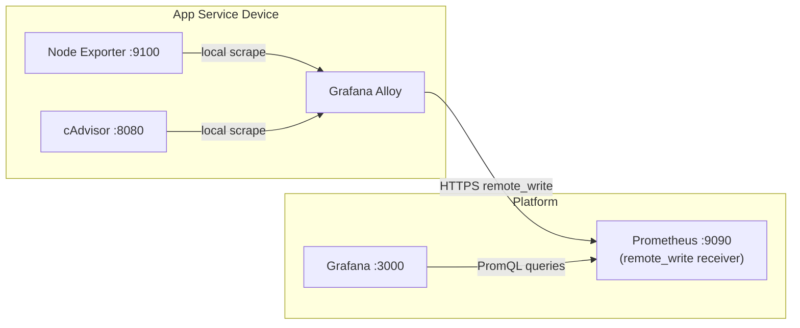

**Previous:** [Distributed Metrics with Grafana Alloy](./v0-11b-grafana-alloy-agent)

The previous guide gave you host-level metrics from every device — CPU, memory, disk, network — flowing through Grafana Alloy and into a central Prometheus over a push-based pipeline. That tells you *the device is at 80% memory*. What it doesn't tell you is **which container is using it.**

This guide adds **cAdvisor** (Container Advisor, by Google) to each device. cAdvisor is the de-facto standard for per-container metrics on Linux — and the good news is that it slots straight into the pipeline you already have. No new platform services, no new networking, no new auth. Just one more container on each device and one more scrape block in Alloy's config.



**What this tutorial covers:**
- Why cAdvisor needs Alloy as a forwarder (it's pull-only)
- Adding cAdvisor as a Docker container alongside Alloy
- A second scrape block in `config.alloy` — same `remote_write`, same labels
- A new `iac-toolbox cadvisor` command group: `init`, `install`, `uninstall`
- Verifying container metrics in Prometheus and Grafana

**Time to complete:** 5 minutes (one CLI command after the previous guide is done)

## Github Repository

All configuration and Ansible roles are available in https://github.com/IaC-Toolbox/iac-toolbox-raspberrypi. The cAdvisor integration was added in PR #59.

## Why cAdvisor Needs Alloy

cAdvisor itself is **pull-only**. It exposes a `/metrics` endpoint on port 8080 and that's it — there is no `remote_write`, no built-in push, no agent mode. In a greenfield design you'd debate forwarders, but in our world the forwarder already exists: **Grafana Alloy is on every device.** We just add a second scrape job to its config.

The result is a pipeline where Alloy multiplexes two scrape jobs into the same outbound stream:

```
OLD (Alloy + Node Exporter only)         NEW (Alloy + Node Exporter + cAdvisor)
────────────────────────────────         ─────────────────────────────────────

Node Exporter :9100                      Node Exporter :9100 ─┐
      │                                                       │
      ▼                                  cAdvisor :8080  ─────┤
Grafana Alloy                                                 ▼
      │                                                Grafana Alloy
      ▼ HTTPS remote_write                                    │
Platform Prometheus                                           ▼ HTTPS remote_write
                                                       Platform Prometheus
```

What changes vs. the previous tutorial:
- **+1 service on each device:** cAdvisor, running in Docker.
- **+1 scrape block** in `config.alloy.j2`.
- **0 changes** to the platform Prometheus or Grafana — the metrics arrive on the same `remote_write` endpoint with new metric names (`container_cpu_*`, `container_memory_*`, etc.).

## Why cAdvisor in Docker (and Node Exporter Native)

The previous tutorial established a rule: **Node Exporter runs natively** because it needs full access to host `/proc` and `/sys`. Containerised, it would only see the container's namespaced view of those filesystems and report misleading numbers.

cAdvisor has the **opposite** profile. It's *designed* to run in a container with a specific set of read-only mounts. The host filesystems it needs (`/`, `/var/run`, `/sys`, `/var/lib/docker`) get bind-mounted in, and that's the upstream-recommended deployment. There's no native binary to manage, no systemd unit per architecture, no per-OS packaging. Docker also matches Alloy's deployment style on devices, so the "infra services on a device" surface area stays uniform: Docker for everything except Node Exporter.

| Component       | Runs on        | Deployment       | Why                                    |
| --------------- | -------------- | ---------------- | -------------------------------------- |
| `node_exporter` | Each device    | Native binary    | Needs host `/proc` and `/sys`          |
| `cadvisor`      | Each device    | Docker container | Designed for containerised deployment  |
| `grafana-alloy` | Each device    | Docker container | Consistent multi-OS deployment         |

## Networking: Two Containers, One Network

cAdvisor and Alloy talk to each other on the device only — no inbound exposure. There are two ways to wire them up:

1. **Bind cAdvisor to `127.0.0.1:8080`** and have Alloy scrape `host.docker.internal:8080`. Works, but relies on `host.docker.internal` being available in every container.
2. **Put cAdvisor and Alloy on the same Docker network** and have Alloy scrape `cadvisor:8080`. Cleaner DNS, no host-gateway tricks.

I went with option 2. Define a `monitoring` Docker network on each device — mirroring the platform pattern from the previous tutorial — have Alloy's compose create it, and have cAdvisor's compose join as `external: true`:

```yaml
# Alloy's docker-compose.yml — creates the network
services:
  grafana-alloy:
    networks:
      - monitoring
networks:
  monitoring:
    name: monitoring
    driver: bridge

# cAdvisor's docker-compose.yml — joins the existing network
services:
  cadvisor:
    networks:
      - monitoring
networks:
  monitoring:
    external: true
```

Same deploy-order rule as the platform: Alloy first (creates the network), cAdvisor second (joins it). Re-running the Alloy role before the cAdvisor role keeps that order automatic.

cAdvisor still publishes `127.0.0.1:8080` on the host, but only for `curl`-based debugging. Alloy reaches it via Docker DNS at `cadvisor:8080`.

## What You Need

Before starting:
- The previous tutorial completed — `iac-toolbox metrics-agent install` already run on each device, Alloy healthy.
- Docker running on each device (Node Exporter and cAdvisor only make sense if there are containers to measure).
- Linux ARM64 or AMD64. cAdvisor on macOS is awkward — Docker Desktop runs containers in a Linux VM, the volume mounts don't apply, and v1 doesn't support it.

## Step 1: Enable cAdvisor

The new `cadvisor init` command writes a single line to `iac-toolbox.yml`:

```bash
iac-toolbox cadvisor init
```

The Ink wizard confirms and writes:

```yaml
# iac-toolbox.yml
cadvisor:
  enabled: true
```

That's the entire config surface. cAdvisor has no auth, no remote_write URL of its own (it pushes through Alloy), and no instance label of its own (it inherits the same `ansible_hostname` as Node Exporter). Everything else is hardcoded sensible defaults in the Ansible role.

## Step 2: Install

```bash
iac-toolbox cadvisor install
```

This invokes `install.sh --cadvisor`, which runs the new `cadvisor.yml` Ansible playbook. The playbook does two things in order:

1. **Re-runs the `grafana-alloy` role** (idempotent). This is what gets the cAdvisor scrape block into `config.alloy` and ensures the `monitoring` network exists before cAdvisor starts.
2. **Runs the new `cadvisor` role** — pulls the cAdvisor image, templates `docker-compose.yml`, runs `docker compose up -d`, polls `/healthz`.

```yaml
# ansible-configurations/playbooks/cadvisor.yml
- import_playbook: common.yml

- name: Deploy cAdvisor
  hosts: all
  become: false
  roles:
    - role: grafana-alloy
      when: grafana_alloy is defined and grafana_alloy.enabled
      # Re-runs the Alloy role to apply the monitoring network + cadvisor scrape block
      # before starting the cAdvisor container. All tasks are idempotent.

    - role: cadvisor
      when: cadvisor is defined and cadvisor.enabled
```

A pre-flight guard in the CLI checks Alloy's `/-/ready` endpoint before invoking Ansible. If Alloy isn't running, you get a clear error pointing at `iac-toolbox metrics-agent install` rather than a confusing scrape failure later.

## What Gets Deployed

### On Each Device: cAdvisor

```yaml
# ~/.iac-toolbox/cadvisor/docker-compose.yml
services:
  cadvisor:
    image: gcr.io/cadvisor/cadvisor:v0.49.1
    container_name: cadvisor
    restart: always
    privileged: true
    devices:
      - /dev/kmsg
    ports:
      - "127.0.0.1:8080:8080"
    volumes:
      - /:/rootfs:ro
      - /var/run:/var/run:ro
      - /sys:/sys:ro
      - /var/lib/docker/:/var/lib/docker:ro
      - /dev/disk/:/dev/disk:ro
    networks:
      - monitoring

networks:
  monitoring:
    external: true
```

A few non-obvious choices:

- **`v0.49.1` is pinned, not `latest`.** `:latest` has bitten me on ARM before — image pulls succeed, container exits immediately with no helpful log. Pin and forget.
- **`/dev/kmsg` is mapped explicitly.** On Raspberry Pi, without it cAdvisor starts but logs warnings and some cgroup metrics are missing. Took me half an hour to figure that out the first time.
- **`privileged: true`** is the upstream-recommended default. Required on most kernels for full cgroup metric coverage. A future feature could expose this as a toggle for security-conscious users willing to accept missing metrics.
- **Port `127.0.0.1:8080` only.** cAdvisor leaks per-container info that's useful for an attacker — never expose it on a public interface.

### On Each Device: The Updated Alloy Config

The `config.alloy.j2` template now has a second scrape block, gated by the same `cadvisor.enabled` flag:

```sh
// existing — Node Exporter
prometheus.scrape "node_exporter" {
  targets = [{
    __address__ = "host.docker.internal:9100",
    instance    = "{{ grafana_alloy.instance_name | default(ansible_hostname) }}",
    job         = "node_exporter",
  }]
  scrape_interval = "15s"
  forward_to = [prometheus.relabel.node_exporter_compat.receiver]
}


// NEW — cAdvisor
prometheus.scrape "cadvisor" {
  targets = [{
    __address__ = "cadvisor:8080",
    instance    = "{{ grafana_alloy.instance_name | default(ansible_hostname) }}",
    job         = "cadvisor",
  }]
  scrape_interval = "15s"
  forward_to = [prometheus.remote_write.platform.receiver]
}


// existing — unchanged
prometheus.remote_write "platform" {
  endpoint {
    url = "{{ grafana_alloy.alloy_remote_write_url }}"
  }
}
```

Two things to notice:

- The cAdvisor scrape forwards **directly** to `prometheus.remote_write.platform.receiver`, bypassing the `prometheus.relabel "node_exporter_compat"` block. The relabel block exists to rename macOS-specific Node Exporter metric names; cAdvisor metrics don't need that translation, so they skip it.
- The `instance` and `job` labels are set explicitly, for the same reasons we set them on Node Exporter — they're the labels community dashboards filter on, and Alloy's defaults will silently break those dashboards (more on that below).

## The Three Labelling Rules — Same Story, New Scrape Job

The previous tutorial spent real time on the `instance` / `nodename` / `job` labelling pitfalls. Every one of them applies to cAdvisor too. If you skip them, container metrics show up in Prometheus but every Grafana dashboard panel reads "No data."

**Rule 1: `instance` must equal the system hostname.** Same as Node Exporter. Both scrape blocks use the same expression — `{{ grafana_alloy.instance_name | default(ansible_hostname) }}` — which means cAdvisor and Node Exporter metrics share an `instance` value for any given host. A dashboard variable that filters on `instance="$node"` works identically for both.

**Rule 2: `job` must be set explicitly to `"cadvisor"`.** Without it, Alloy attaches the component path (`prometheus.scrape.cadvisor`) as the job label, and any dashboard that filters on `job="cadvisor"` returns nothing.

**Rule 3: `scrape_interval` must be set explicitly.** Grafana computes `$__rate_interval` from the scrape interval it knows about. For metrics arriving via `remote_write`, the central Prometheus has no scrape config of its own — Alloy's setting is the only source of truth. Without an explicit `scrape_interval`, `rate()` queries on `container_cpu_usage_seconds_total` and friends silently break.

I'm repeating these because they're easy to forget, and the failure mode (panels silently empty) is exactly the kind of thing that makes you doubt your install when actually the metrics are fine in Prometheus.

## Step 3: Verify Metrics Are Arriving

### Check cAdvisor on a Device

```bash
# Container running?
docker ps | grep cadvisor

# Healthcheck
curl http://localhost:8080/healthz
# → ok

# Sanity-check a metric
curl -s http://localhost:8080/metrics | grep container_cpu_usage_seconds_total | head -3
```

You should see one series per container running on the host.

### Check Alloy Picked It Up

Alloy has a UI on port 12345 that shows every active component:

```bash
curl http://localhost:12345/-/ready
# → Alloy is ready.
```

Open `http://localhost:12345/components` in a browser if you want a visual — `prometheus.scrape.cadvisor` should be listed and green.

### Check Prometheus on the Platform

```bash
# Container metrics arriving?
curl "http://localhost:9090/api/v1/query?query=up{job=\"cadvisor\"}"

# Per-container CPU
curl "http://localhost:9090/api/v1/query?query=rate(container_cpu_usage_seconds_total[1m])"
```

You should see `up{job="cadvisor", instance="<hostname>"} = 1`. If that returns empty but `up{job="node_exporter"}` works, the cAdvisor side of the pipeline is broken — start with the troubleshooting section below.

### Check in Grafana

cAdvisor metrics use names like `container_cpu_usage_seconds_total`, `container_memory_usage_bytes`, `container_network_receive_bytes_total`, and `container_fs_usage_bytes`. To see them on a dashboard, import a community cAdvisor dashboard:

1. **Dashboards** → **Import** → enter ID `14282` (cAdvisor exporter)
2. Select the **Prometheus** datasource that was provisioned by the previous tutorial.
3. The dashboard's `instance` variable will populate with your devices.

I deliberately kept dashboard import as a separate manual step rather than auto-provisioning it from the Grafana role. Dashboards are taste — different teams want different views — and adding one to the Ansible role would couple the platform install to a specific community dashboard ID. Easy to add later if it becomes painful.

## The CLI Surface

Three commands, mirroring the `metrics-agent` pattern:

```bash
iac-toolbox cadvisor init       # writes cadvisor.enabled: true to iac-toolbox.yml
iac-toolbox cadvisor install    # runs the cadvisor.yml playbook
iac-toolbox cadvisor uninstall  # stops and removes the cAdvisor container
```

`init` has no prompts because there's nothing to prompt for. The wizard confirms what's about to happen, writes the flag, and tells you what to run next:

```sh
┌  IaC-Toolbox — cAdvisor Setup
│
◆  cAdvisor will be added to your Grafana Alloy metrics pipeline.
│  Per-container CPU, memory, network, and filesystem metrics will be
│  available in Prometheus alongside your existing Node Exporter data.
│
◇  cAdvisor enabled
│  cadvisor.enabled    true    → iac-toolbox.yml
│
│  ℹ  To install cAdvisor, run:
│
│     iac-toolbox cadvisor install
│
└
```

`install` does the pre-flight Alloy health check, runs Ansible, then polls cAdvisor's `/healthz` and Alloy's `/-/ready` to confirm everything came back up healthy. If Alloy isn't running, you get a guard error rather than a confusing failure deep in the playbook.

## Adding cAdvisor to a New Device

Same zero-touch pattern as before. To bring up cAdvisor on `device-04`:

1. Add it to the inventory's `[app_services]` group (if it's not there already).
2. Run `iac-toolbox metrics-agent install` against that device — Alloy comes up.
3. Run `iac-toolbox cadvisor install` against that device — cAdvisor comes up, Alloy gets its scrape block, metrics start flowing.

Within 60 seconds the new device's containers appear in Prometheus, no platform changes.

## Troubleshooting

### `up{job="cadvisor"}` is empty in Prometheus

Work from the device outward — the first failure is where to focus.

```bash
# 1. cAdvisor container running on the device?
docker ps | grep cadvisor

# 2. cAdvisor responding to its health endpoint?
curl http://localhost:8080/healthz

# 3. Alloy can resolve the cadvisor hostname?
docker exec grafana-alloy wget -qO- http://cadvisor:8080/healthz

# 4. Alloy components healthy?
curl http://localhost:12345/-/ready
```

If step 3 fails, the two containers aren't on the same Docker network. Run `docker network inspect monitoring` and check that both `grafana-alloy` and `cadvisor` are listed as members.

### Container Started but `/dev/kmsg` Warnings in Logs

```bash
docker logs cadvisor 2>&1 | grep kmsg
```

If you see `Could not configure a source for OOM detection`, the `/dev/kmsg` device mapping in the compose file isn't taking effect. On Raspberry Pi this is most often because the container started before the device existed (rare) or because the kernel doesn't expose `/dev/kmsg` (very rare on default Pi OS). Restart the container; if it persists, check `ls -l /dev/kmsg` on the host.

### Grafana Dashboard Shows "No Data" but Metrics Are in Prometheus

Same diagnostic as Node Exporter Full from the previous tutorial — check the labels.

```bash
# On the platform — confirm the labels are what the dashboard expects
curl -s "http://localhost:9090/api/v1/query?query=up{job=\"cadvisor\"}" \
  | python3 -m json.tool | grep -E '"instance"|"job"'
```

If `job` shows as `prometheus.scrape.cadvisor` instead of `cadvisor`, your Alloy config isn't setting the job label explicitly — re-run the `grafana-alloy` role.

If `instance` doesn't match what the dashboard's `instance` variable selected, you've set `instance_name` to a friendly name somewhere. The fix is to remove it and let it default to `ansible_hostname`. (Same trap, same fix as the Node Exporter post.)

### `rate()` Queries Return No Data, Instant Queries Work Fine

This is the `$__rate_interval` issue from the previous tutorial, recurring for cAdvisor metrics. Check the Alloy config has `scrape_interval = "15s"` set on the `prometheus.scrape "cadvisor"` block. If it's missing, Grafana computes `$__rate_interval` as zero for these metrics and `rate()` returns nothing. Confirm in Grafana Explore by running the same query with a fixed range — `rate(container_cpu_usage_seconds_total[2m])` — if that returns data but the dashboard panel doesn't, `scrape_interval` is the missing piece.

### High Cardinality in Prometheus

cAdvisor pushes meaningfully more series than Node Exporter — one set per container per metric. On a device with many short-lived containers (CI runners, batch jobs), this adds up. The compose file already passes `--store_container_labels=false` and `--docker_only=true` as cardinality defaults; if you need to go further, the role exposes a list of `--disable_metrics` flags you can set in `iac-toolbox.yml`. Drop `process`, `tcp`, `udp`, and `network` if you don't query them.

## Summary

You added per-container observability to the push pipeline you built in the previous tutorial, with no platform-side changes.

**What you accomplished:**
- cAdvisor running as a Docker container on each device, healthchecked at `/healthz`
- Alloy's `config.alloy` extended with a second scrape block, multiplexing cAdvisor and Node Exporter into the same outbound `remote_write` stream
- A `monitoring` Docker network on each device, joining Alloy and cAdvisor without exposing cAdvisor on the host network
- Three new CLI commands (`cadvisor init`, `cadvisor install`, `cadvisor uninstall`) following the same pattern as `metrics-agent`

**Key files deployed:**

On each device:
- `~/.iac-toolbox/cadvisor/docker-compose.yml` — cAdvisor compose definition
- `~/.iac-toolbox/alloy/config.alloy` — updated with the cAdvisor scrape block

On the platform:
- Nothing. The `--web.enable-remote-write-receiver` flag and the provisioned Prometheus datasource were already in place.

**Access:**
- **cAdvisor metrics** (on device): `http://localhost:8080/metrics`
- **cAdvisor health** (on device): `http://localhost:8080/healthz`
- **Alloy components UI** (on device): `http://localhost:12345/components`
- **Container metrics in Prometheus** (on platform): `up{job="cadvisor"}`
- **Suggested Grafana dashboard**: ID `14282` (cAdvisor exporter)

**What makes this different from running cAdvisor standalone:**
- No second forwarder to deploy and maintain — Alloy was already there
- No new auth or TLS to configure — remote_write secrets live in Alloy's existing config
- Same `instance` label across host and container metrics, so dashboards can correlate them on one device
- Same zero-touch device-onboarding flow: inventory change + one command

---

**Previous:** [Distributed Metrics with Grafana Alloy](./v0-11b-grafana-alloy-agent) | **Next:** [Logs with Loki](./v0-14-logs-with-loki)
